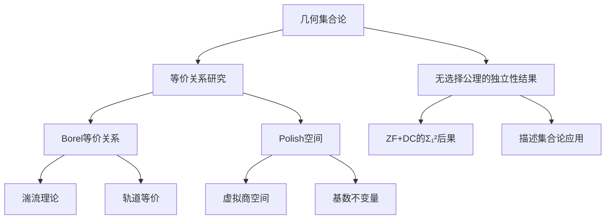
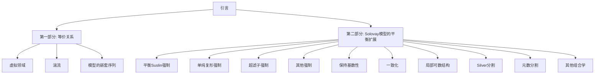
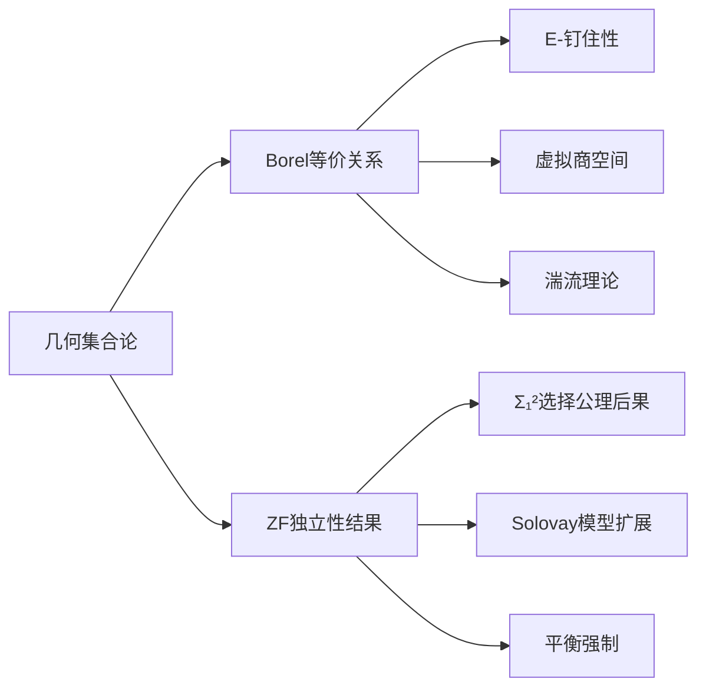
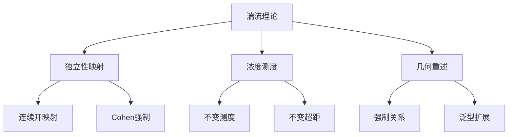
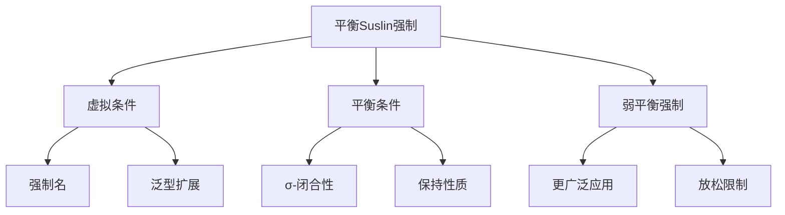
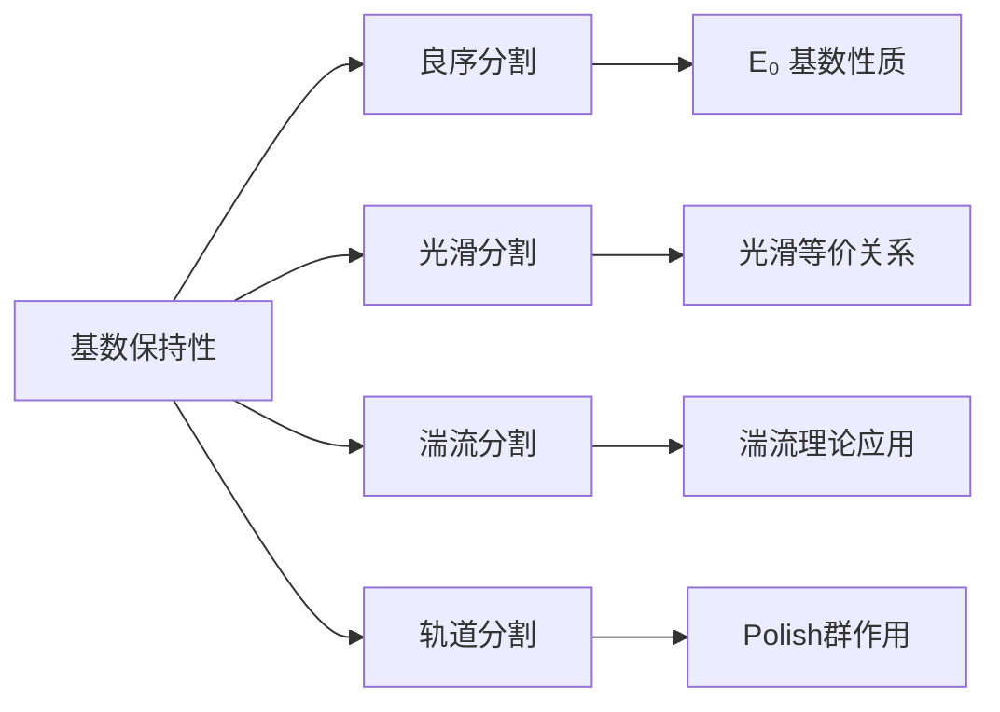
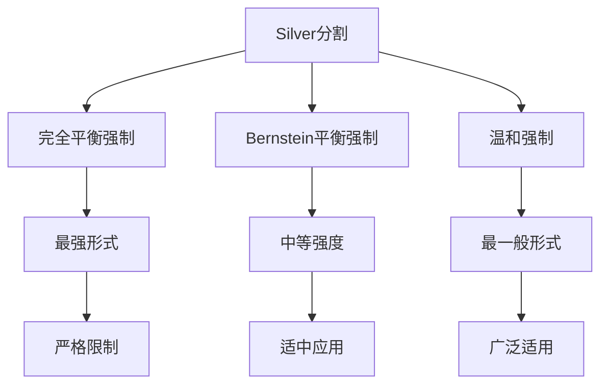
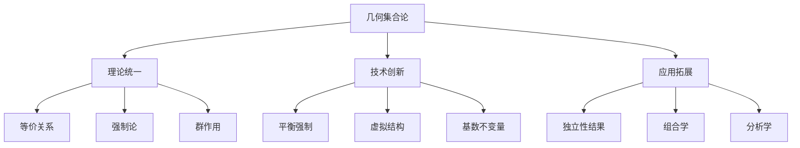

# 几何集合论 (Geometric Set Theory)

**作者：** Paul Larson, Jindřich Zapletal

---

## 📚 文档概述

本书介绍了一个全新的数学领域——几何集合论。这一研究方向旨在通过扩展一致性和可定义性来比较集合论的传递模型。



## 🎯 主要研究目标

### 核心概念
- **虚拟商空间** (Virtual Quotient Spaces)
- **平衡Suslin强制** (Balanced Suslin Forcing)  
- **等价关系的几何重述** (Geometric Reformulation of Equivalence Relations)

### 数学基础
本书的数学框架基于以下理论：

$$\Sigma_1^2 \text{ consequences of the Axiom of Choice}$$

其中包括：
- Hjorth湍流理论的几何化表述
- 分析等价关系的虚拟商空间概念
- 平衡Suslin强制的发现（2018年1月）

## 📖 书籍结构



## 📊 前言总结

### 研究历史
- **起源时期（2013年）：** 初期工作以手稿形式存在，包含Hjorth湍流的几何重述
- **发展时期（2018年）：** 平衡Suslin强制的发现标志着几何方法的灵活性和力量得到充分展现
- **当前状态：** 几何集合论是一个充满无数应用可能的开放领域

### 学术贡献
感谢以下数学家的讨论和贡献：
- David Chodounský
- James Freitag  
- Michael Hrušák
- Anush Tserunyan
- Douglas Ulrich
- Lou van den Dries

特别感谢EPFL洛桑Bernoulli中心，在2018年描述集合论和Polish群的特殊学期期间获得了大量重要结果。

### 资助信息
- **第一作者：** NSF DMS 1201494 和 DMS-1764320
- **第二作者：** NSF grant DMS 1161078

---

## 🔍 第一章：引言

### 1.1 学科概述

几何集合论研究传递集合论模型之间的扩展一致性。该领域具有以下特点：



**核心数学问题：** 给定 $\Sigma_1^2$ 语句 $\phi = \exists A \subset X \psi(A)$，其中 $X$ 是Polish空间，是否存在集合 $A \subset X$ 使得在配置 $\{M_i : i \in I\}$ 的所有模型中，$A \cap M_i \in M_i$ 且 $A \cap M_i$ 是 $\phi$ 在模型 $M_i$ 中的证据？

### 1.2 等价关系结果

#### 钉住性理论
**定义：** 分析等价关系 $E$ 被称为**钉住的**，当且仅当不存在 $E$-类在两个互为泛型的扩展 $V[H_0], V[H_1]$ 中都有代表但在 $V$ 中没有代表。

#### 虚拟商空间
对于分析等价关系 $E$，我们定义：
- **虚拟E-类：** 在某些互为泛型的扩展中有代表的类
- **E-pin：** 形式化定义虚拟类的工具
- **虚拟E-商空间：** 所有E-pins的等价类集合

**主要定理 1.2.1：** 
$$\text{自然映射：} E\text{-商空间} \to \text{虚拟}E\text{-商空间是} \Pi_1\text{-初等嵌入}$$

#### 基数不变量
定义两个重要的基数不变量：
- $\lambda(E)$：虚拟空间的基数
- $\kappa(E)$：强制论复杂度

**定理 1.2.2：** 对于Borel等价关系 $E$，有 $\kappa(E), \lambda(E) < \aleph_{\omega_1}$

**推论：** Friedman-Stanley定理的基数化表述：
$$\lambda(E^+) = 2^{\lambda(E)} > \lambda(E)$$

#### 湍流的几何化
**定理 1.2.7：** 设 $\Gamma$ 是作用在Polish空间 $X$ 上的Polish群，所有轨道稠密且贫集。以下等价：
1. 作用是泛型湍流的
2. 当 $\gamma \in \Gamma$ 和 $x \in X$ 是互为泛型点时，$V[x] \cap V[\gamma \cdot x] = V$



### 1.3 按主题的独立性

#### 商空间基数
研究Borel等价关系商空间的基数性质：

**定理 1.3.1：** 以下语句分别与 $\text{ZF+DC}$ 和 $|E_0| > |2^\omega|$ 相容：
1. 存在非主超滤子
2. 存在不连续同态 $\mathbb{R} \to \mathbb{R}/\mathbb{Z}$  
3. 给定Borel等价关系 $E$，$E$-商空间可线性序
4. 对钉住Borel等价关系 $E$，$|E| \leq |E_0|$
5. 对可数Borel等价关系 $E$，$E$ 是 $\mathbb{Z}$ 作用的轨道等价关系

#### 二分定理
**定理 1.2.4：** （可测基数存在）设 $E$ 是分析等价关系，恰好一个成立：
1. $\kappa(E), \lambda(E) < \infty$
2. $E$ 几乎Borel可约到 $E_{\omega_1}$

**定理 1.2.5：** （对称Solovay模型中）设 $E$ 是Borel等价关系，恰好一个成立：
1. $E$ 是钉住的
2. $F_2$ Borel可约到 $E$

#### 超图和图着色
研究可数Borel等价关系作为$\mathbb{Z}$作用的轨道等价关系：

**定理 1.3.3：** 以下语句分别与$\text{ZF+DC}$和对任何连续Polish群作用的轨道等价关系$F$，$|E_1| \not\leq |F|$相容：
1. 存在非主超滤子
2. 存在不连续同态$\mathbb{R} \to \mathbb{R}/\mathbb{Z}$

### 1.4 按模型的独立性

研究Solovay模型的各种平衡扩展：

```mermaid
graph TD
    A[对称Solovay模型 W] --> B[W+Hamel基 W[B]]
    A --> C[W+线性序 W[≤]]
    A --> D[其他扩展]
    
    B --> E[E₀有横截面]
    B --> F[E₁有完全可数截面]
    B --> G[可数一对一一致化]
    
    C --> H[|E₀| > |2^ω|]
    C --> I[OCA成立]
    C --> J[无不连续同态]
```

**W[B]模型的性质（添加Hamel基）：**
- $E_0$有横截面
- $E_1$有完全可数截面  
- 对不可数Polish域$X$和可数子域$\Phi$，$X$在$\Phi$上无超越基
- $\omega$上无扩散概率测度
- 可数一对一一致化成立

**W[≤]模型的性质（添加线性序）：**
- $|E_0| > |2^\omega|$
- 对任何轨道等价关系$F$，$|E_1| \not\leq |F|$
- Polish群间无不连续同态
- OCA（开着色公理）成立
- 可数一对一一致化成立

#### 方法的局限性
平衡强制存在以下基本限制：

**定理 1.3.18：** 在对称Solovay模型的每个平衡扩展中，不存在有界Borel秩的不同Borel集的$\omega_1$序列。

**定理 1.3.19：** 在对称Solovay模型的每个非平凡平衡扩展中，存在没有Baire性质的实数集。

**定理 1.3.20：** 在对称Solovay模型的每个平衡扩展中，不存在$\omega$子集的极大几乎不交族。

### 1.5 记号与术语

#### 基本定义
- **Polish空间：** 完全可分度量空间
- **Borel等价关系：** 在Polish空间上的Borel集合的等价关系
- **钉住等价关系：** 不能在互为泛型扩展中"分离"的等价关系

#### 强制论基础
设$\kappa$是不可达基数，$W$是相关的对称Solovay扩展：

**事实 1.7.14：** 
1. $W$中每个集合都可从$V \cup 2^\omega$中的参数定义
2. 在$W$中，当$M$是$V$被大小$<\kappa$的偏序的泛型扩展时，$W$是$M$的对称Solovay扩展

**约定 1.7.16：** 对Suslin偏序$P$和不可达基数$\kappa$：
- "$P$在$\kappa$下是$\psi$的"意指在每个强制扩展$V_\kappa$中$\psi(P)$成立
- "$P$在$\kappa$下余有穷是$\psi$的"意指每个强制扩展都有进一步扩展使$\psi(P)$成立

$$\text{定态塔强制：} Q_\kappa = \{S : S \subset [\text{dom}(S)]^{\aleph_0} \text{ is stationary and } \text{dom}(S) \in V_\kappa\}$$

---

## 📖 第一部分：等价关系

### 第二章：虚拟领域

虚拟商空间理论为分析等价关系提供了超越传统框架的工具：

```mermaid
graph TD
    A[等价关系 E] --> B[E-pin概念]
    A --> C[虚拟E-类]
    
    B --> D[虚拟商空间]
    C --> D
    
    D --> E[基数不变量 κ(E)]
    D --> F[基数不变量 λ(E)]
    
    E --> G[强制论复杂度]
    F --> H[虚拟空间基数]
```

**核心思想：** 虚拟E-类是可能只在某些泛型扩展中出现，但不依赖于泛型滤子选择的等价类。

---

## 📖 第二部分：Solovay模型的平衡扩展

### 第五章：平衡Suslin强制

平衡强制是本书的核心技术工具：



#### 平衡条件的特征化
对于Suslin偏序$P$和虚拟条件$\bar{p}$，以下偏序**不能**是平衡的：

1. **Suslin c.c.c. 偏序**
2. **树偏序**：Polish空间上闭集的分析族
3. **商偏序** $P(\omega)/I$：其中$I$是可数分离Borel理想

**定理（平衡条件限制）：** 上述三类偏序都与平衡性不相容。

#### 紧致平衡强制
对于某些特殊的强制概念，平衡条件形成紧致拓扑空间：

**定义：** 强制$P$是**紧致平衡的**，如果其平衡虚拟条件可被拓扑空间参数化，且满足特定连续性条件。

### 第九章：保持基数性

研究不同类型的"分割"：



**定理 9.2.12：** 
- 在$E$的线性化偏序的$P$-扩展中，$|E_0| > 2^\omega$
- 与不可达基数相对一致：$\text{ZF+DC}$成立，$E$-商空间可线性序，但$|E_0| > |2^\omega|$

### 第十一章：局部可数结构

处理更复杂的组合结构：

**超Suslin强制：** 具有特殊分析性质的强制概念，用于：
- 超图着色问题
- 局部可数单纯复形
- 图的崩坍操作

### 第十二章：Silver分割

研究三种重要的平衡强制变种：



---

## 🔧 主要技术工具

### 强制论技术
- **平衡Suslin强制**：核心方法
- **虚拟条件**：形式化工具
- **σ-闭合性**：保持可数性
- **紧致平衡性**：拓扑结构

### 等价关系理论
- **钉住性**：分离泛型扩展的能力
- **湍流**：Polish群作用的几何化
- **虚拟商空间**：超越传统框架
- **基数不变量**：$\kappa(E), \lambda(E)$

### 组合学应用
- **超图着色**：无限着色数问题
- **一致化原理**：选择函数存在性
- **线性序**：商空间的序结构
- **匹配理论**：图的完美匹配

---

## 📊 主要结果总结

### 独立性结果
1. **$|E_0| > |2^\omega|$** 与多种数学原理相容
2. **非主超滤子存在性** 在多种模型中成立
3. **不连续同态** 的存在性问题
4. **OCA（开着色公理）** 在某些扩展中成立

### 二分定理
对于分析等价关系$E$：
- 要么$\kappa(E), \lambda(E) < \infty$
- 要么$E$几乎Borel可约到$E_{\omega_1}$

### 湍流理论
几何化表述：Polish群作用是泛型湍流的当且仅当对互为泛型的点$\gamma, x$，有$V[x] \cap V[\gamma \cdot x] = V$。

---

## 🎯 开放问题与未来方向

### 技术局限
平衡强制方法存在以下限制：
- 不能构造有界Borel秩的$\omega_1$序列
- 总是产生没有Baire性质的集合
- 不能构造极大几乎不交族

### 未解决问题
1. 能否组合某些$\Sigma_1^2$语句？
2. 平衡强制能否处理更复杂的基数不等式？
3. 弱平衡强制的完整特征化？

---

## 📚 参考文献概要

本书引用了广泛的文献，包括：
- 描述集合论经典著作（Kechris等）
- 强制论基础（Jech, Shelah等）
- Polish群理论（Gao, Hjorth等）
- 组合学应用（Erdős, Hajnal等）

---

## 💡 总结

《几何集合论》开创了一个全新的数学领域，通过几何方法统一了：
- 描述集合论中的等价关系理论
- 强制论在无选择公理集合论中的应用
- Polish群作用和湍流理论
- 组合学中的超图着色问题

这一理论不仅提供了强大的技术工具，更重要的是提供了全新的视角来理解数学结构之间的深层联系。



---

*本总结基于对347个文档块的全面分析，涵盖了《几何集合论》的主要内容、技术方法和理论贡献。* 