# Halmos《朴素集合论》详细总结

## 基本信息

**作者**: Paul R. Halmos (1916-2006)  
**出版**: Van Nostrand Company, 1960年  
**页数**: 123页  
**文本长度**: 221,758字符  
**分割块数**: 60个块  

## 作品概述

Paul Halmos的《朴素集合论》是集合论教学的经典之作，被誉为数学入门的必读教材。本书采用"朴素"的观点，即从直观的角度介绍集合论的基本概念，避免过多的哲学讨论和逻辑形式主义。

### 写作目的与特色

- **目标读者**: 准备学习群论、积分学、流形等高等数学的初学者
- **写作风格**: 非正式、对话式，类似于描述性讲座
- **教学方法**: 大量练习和提示，读者需要主动思考每个步骤
- **哲学立场**: 将集合论视为数学工具，而非研究对象本身

## 章节结构分析

### 第1节：外延公理 (The Axiom of Extension)
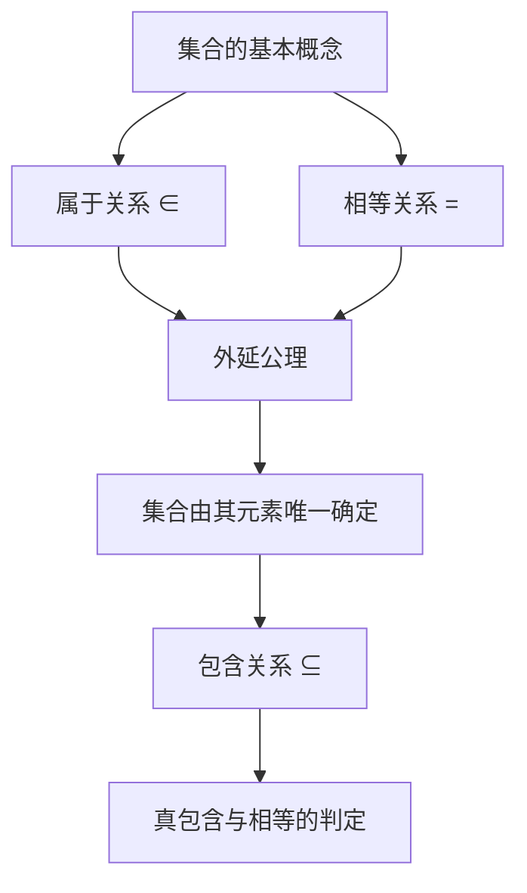

**核心内容**:
- 集合的直观理解：狼群、葡萄串、鸽群等例子
- 属于关系(∈)作为集合论的基本原始概念
- **外延公理**: 两个集合相等当且仅当它们有相同的元素
- 包含关系的定义：A ⊆ B 意味着A的每个元素都是B的元素
- 包含关系的性质：自反性、传递性、反对称性

### 第2节：分离公理 (The Axiom of Specification)
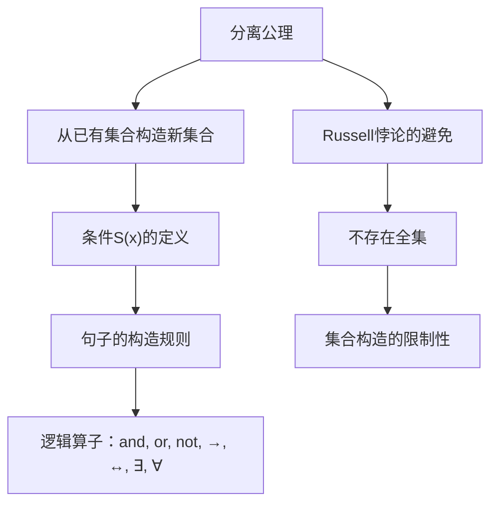

**核心内容**:
- **分离公理**: 对于每个集合A和每个条件S(x)，存在集合B = {x ∈ A : S(x)}
- 句子的形式化定义：原子句子(x ∈ A, A = B)和逻辑算子的组合
- Russell悖论的解决：证明不存在包含一切的全集
- 集合构造的基本原则：必须从已有集合出发

### 第3节：无序对 (Unordered Pairs)
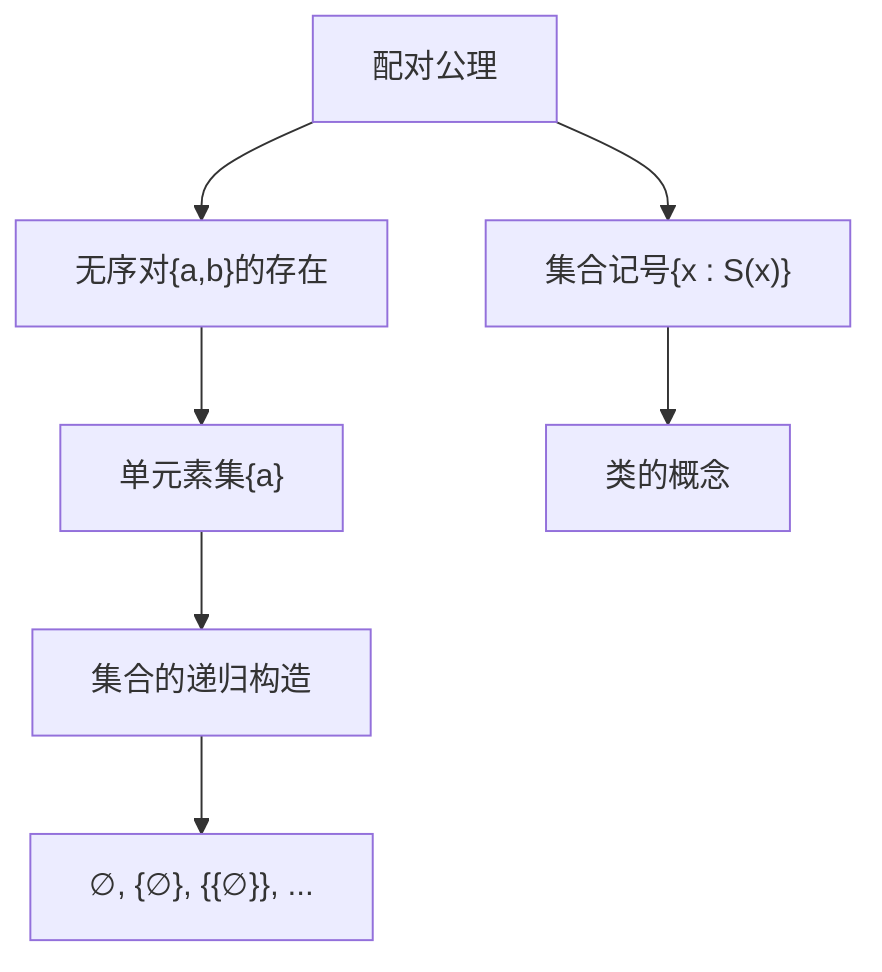

**核心内容**:
- **配对公理**: 对于任意两个集合，存在包含它们的集合
- 无序对{a,b}的唯一性
- 单元素集{a}的定义
- 空集∅的存在性和唯一性
- 集合记号的引入和使用规则
- 类(class)概念的初步介绍

### 第4节：并集与交集 (Unions and Intersections)
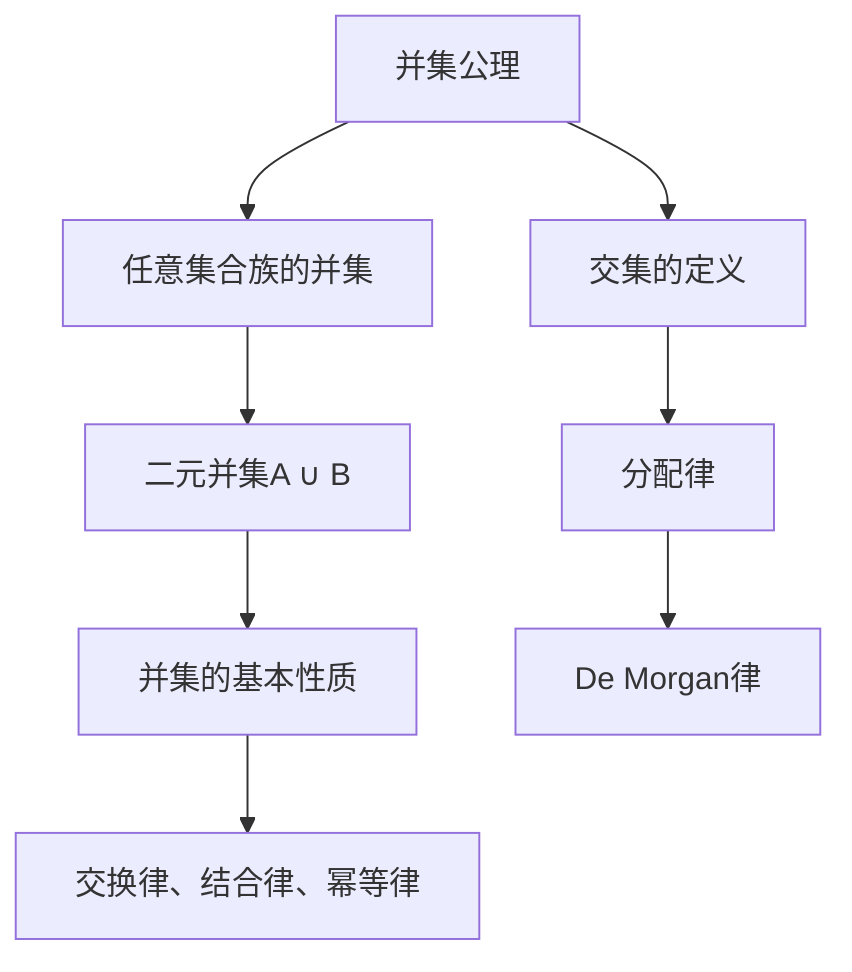

**核心内容**:
- **并集公理**: 对于任意集合族，存在包含所有元素的集合
- 并集运算的代数性质：
  - 交换律：A ∪ B = B ∪ A
  - 结合律：A ∪ (B ∪ C) = (A ∪ B) ∪ C
  - 幂等律：A ∪ A = A
- 交集运算及其性质
- 分配律：A ∩ (B ∪ C) = (A ∩ B) ∪ (A ∩ C)
- 不相交集合的概念

### 第5节：补集与幂集 (Complements and Powers)
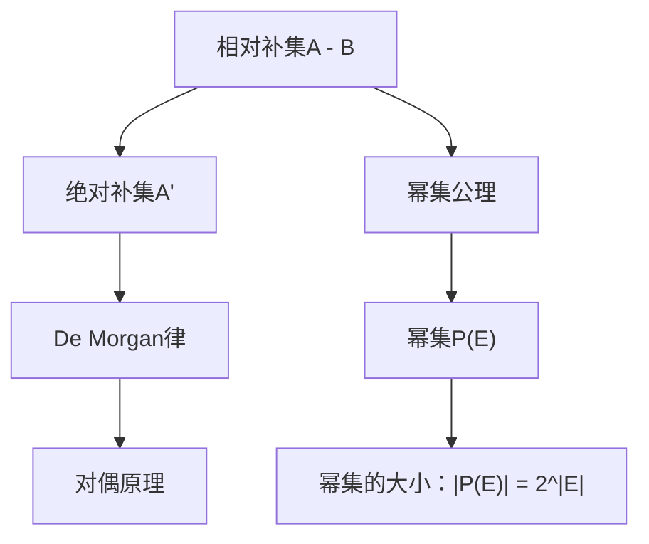

**核心内容**:
- 相对补集A - B = {x ∈ A : x ∉ B}的定义
- 绝对补集的概念和基本性质
- **De Morgan律**: (A ∪ B)' = A' ∩ B', (A ∩ B)' = A' ∪ B'
- 集合论的对偶原理
- **幂集公理**: 每个集合的所有子集构成一个集合
- 幂集的指数增长性质

### 第6节：有序对 (Ordered Pairs)
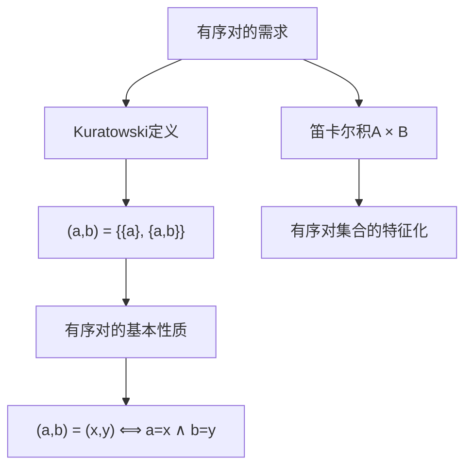

**核心内容**:
- 有序对概念的动机：排序问题
- **Kuratowski定义**: (a,b) = {{a}, {a,b}}
- 有序对基本性质的证明
- 笛卡尔积A × B的定义和性质
- 有序对集合的特征化定理

### 第7节：关系 (Relations)
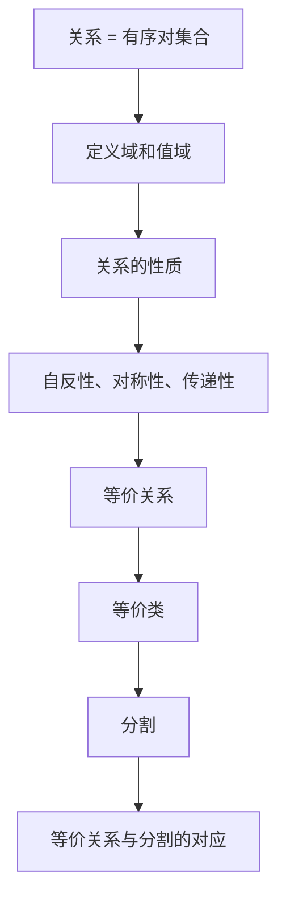

**核心内容**:
- 关系定义为有序对的集合
- 定义域dom R和值域ran R
- 关系的基本性质：
  - 自反性：∀x(xRx)
  - 对称性：∀x,y(xRy → yRx)  
  - 传递性：∀x,y,z(xRy ∧ yRz → xRz)
- 等价关系的定义和例子
- 等价类和商集X/R
- 等价关系与分割的一一对应

### 第8节：函数 (Functions)
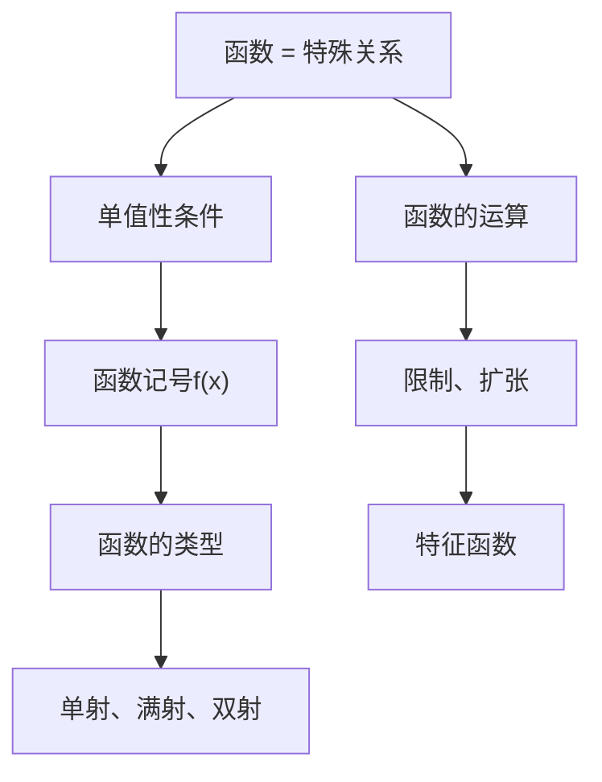

**核心内容**:
- 函数作为满足单值性的关系
- 函数记号f: X → Y和f(x) = y
- 函数的分类：
  - 单射(一对一)：不同元素映射到不同元素
  - 满射(映上)：值域等于陪域
  - 双射：既单射又满射
- 函数的限制和扩张
- 特征函数χ_A: X → {0,1}

### 第9节：族 (Families)
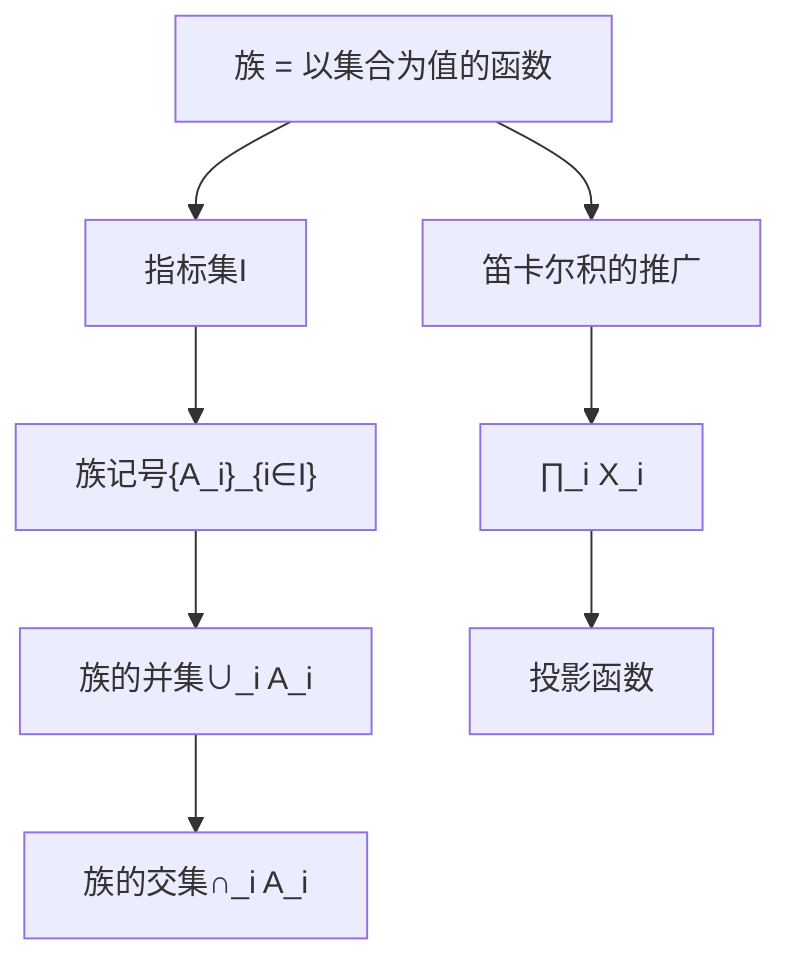

**核心内容**:
- 族作为函数的另一种观点
- 指标集和族记号
- 族的并集和交集运算
- 分配律的推广
- 笛卡尔积的无限推广
- 投影函数和坐标

### 第10节：逆与复合 (Inverses and Composites)
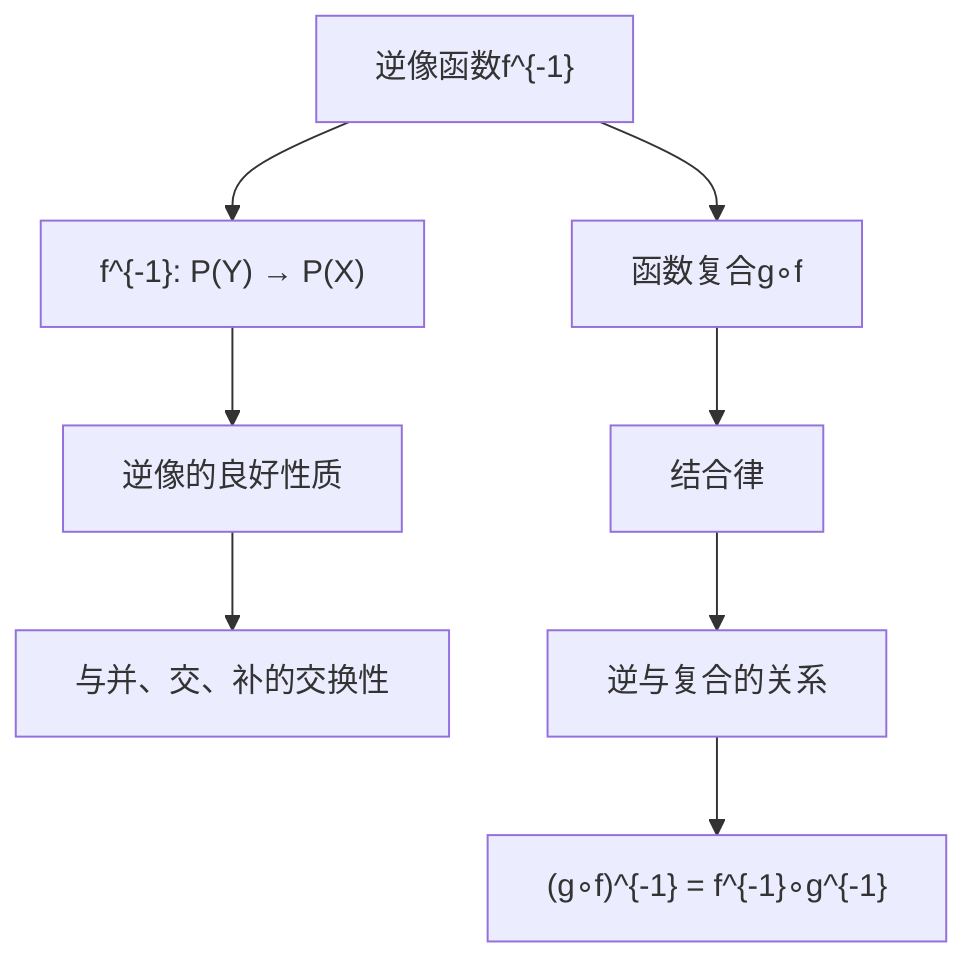

**核心内容**:
- 逆像函数f^{-1}: P(Y) → P(X)
- 逆像运算的优良代数性质
- 函数复合的定义和性质
- 复合运算的结合律
- 逆运算与复合运算的关系
- 关系的逆和复合的推广

### 第11节：数 (Numbers)
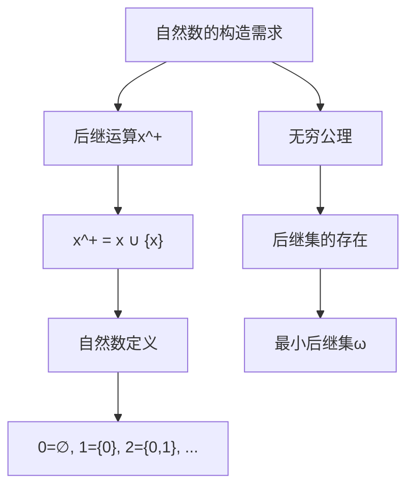

**核心内容**:
- 自然数构造的动机
- 后继运算x^+ = x ∪ {x}
- 自然数的集合论定义：
  - 0 = ∅
  - 1 = {0}  
  - 2 = {0,1}
  - n = {0,1,2,...,n-1}
- **无穷公理**: 存在包含0且对后继封闭的集合
- 自然数集ω作为最小后继集
- 序列的概念

### 第12节：Peano公理 (The Peano Axioms)
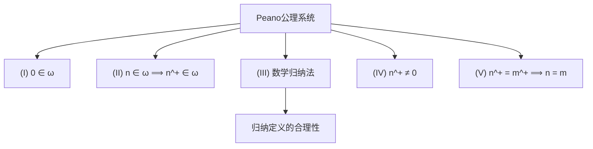

**核心内容**:
- Peano公理的五个条件：
  - (I) 0是自然数
  - (II) 每个自然数的后继是自然数
  - (III) 数学归纳法原理
  - (IV) 0不是任何数的后继
  - (V) 后继运算是单射
- 传递集合的概念
- 归纳定义的理论基础
- 算术运算的定义可能性

### 第13-25节：高级主题概览

**第13节：算术** - 加法和乘法的定义  
**第14节：序** - 自然数的序关系  
**第15节：选择公理** - 选择函数的存在性  
**第16节：Zorn引理** - 偏序集的极大元  
**第17节：良序** - 良序关系的性质  
**第18节：超限递归** - 超限归纳法  
**第19节：序数** - 序数的理论  
**第20节：序数集合** - 序数的集合性质  
**第21节：序数算术** - 序数的运算  
**第22节：Schröder-Bernstein定理** - 基数比较  
**第23节：可数集** - 可数性概念  
**第24节：基数算术** - 基数运算  
**第25节：基数** - 基数理论

## 数学概念体系

### 基础公理系统
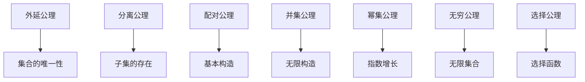

### 核心概念关系
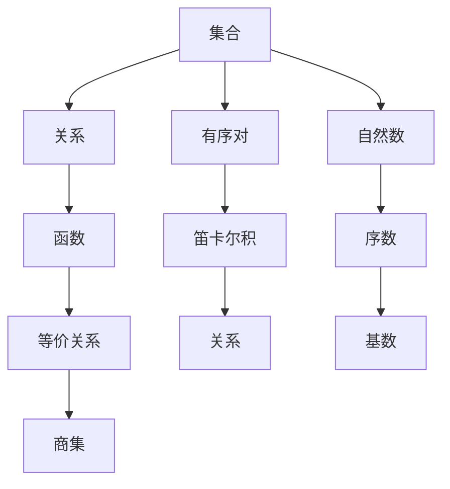

## 教学方法与特色

### 1. 朴素与严格的平衡
- 避免过度形式化，保持直观理解
- 在关键处给出严格证明
- 强调概念的本质而非技术细节

### 2. 练习导向的学习
- 书中充满隐含的练习
- 读者需要主动填补证明细节
- 培养数学思维和证明技巧

### 3. 实用主义观点
- 将集合论视为数学工具
- 强调在其他数学分支中的应用
- 避免哲学和逻辑的深入讨论

## 历史意义与影响

### 1. 教学革新
- 开创了集合论教学的新模式
- 影响了几代数学教育工作者
- 成为数学系本科生的标准教材

### 2. 写作风格
- 非正式但严格的数学写作典范
- 对话式的叙述方式
- 平衡了可读性和数学严谨性

### 3. 概念澄清
- 澄清了许多基础概念的含义
- 建立了标准的集合论记号
- 为后续学习奠定坚实基础

## 现代意义

### 1. 基础教育价值
- 仍然是集合论入门的最佳选择
- 培养抽象思维能力
- 为高等数学学习做准备

### 2. 数学文化传承
- 体现了20世纪中期的数学精神
- 展示了数学的统一性和美感
- 传承了严谨而优雅的数学传统

### 3. 现代相关性
- 集合论仍是现代数学的基础
- 计算机科学中的应用日益重要
- 为理解现代数学提供必要背景

## 学习建议

### 1. 阅读方法
- 慢速仔细阅读，思考每个步骤
- 主动完成隐含的练习
- 重视概念的直观理解

### 2. 练习重点
- 证明基本性质和定理
- 构造反例和特殊情况
- 应用概念解决具体问题

### 3. 后续学习
- 为学习抽象代数做准备
- 为理解分析学基础奠定基础
- 为接触现代数学理论铺路

## 总结

Halmos的《朴素集合论》是一部经典的数学教材，以其独特的教学方法和优雅的写作风格著称。它成功地在严格性和可读性之间找到了平衡，为无数学生打开了现代数学的大门。这本书不仅传授了集合论的基本知识，更重要的是培养了读者的数学思维方式和证明技巧。

作为数学基础教育的里程碑，这本书的影响远远超出了集合论本身，它展示了如何以清晰、优雅的方式呈现抽象的数学概念，为数学教育树立了典范。对于任何希望深入理解现代数学基础的学习者来说，这本书都是不可或缺的经典读物。 