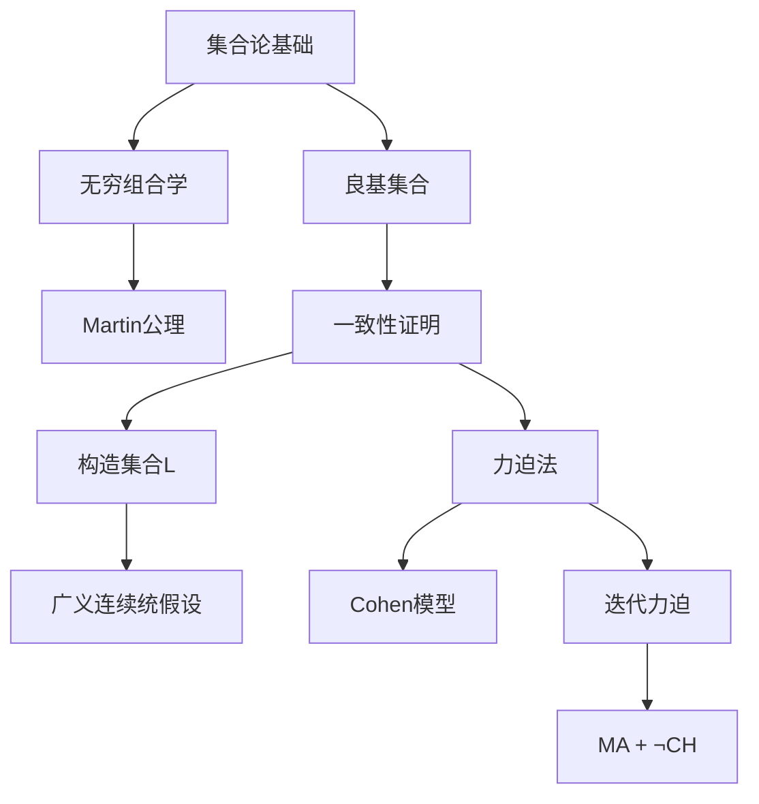
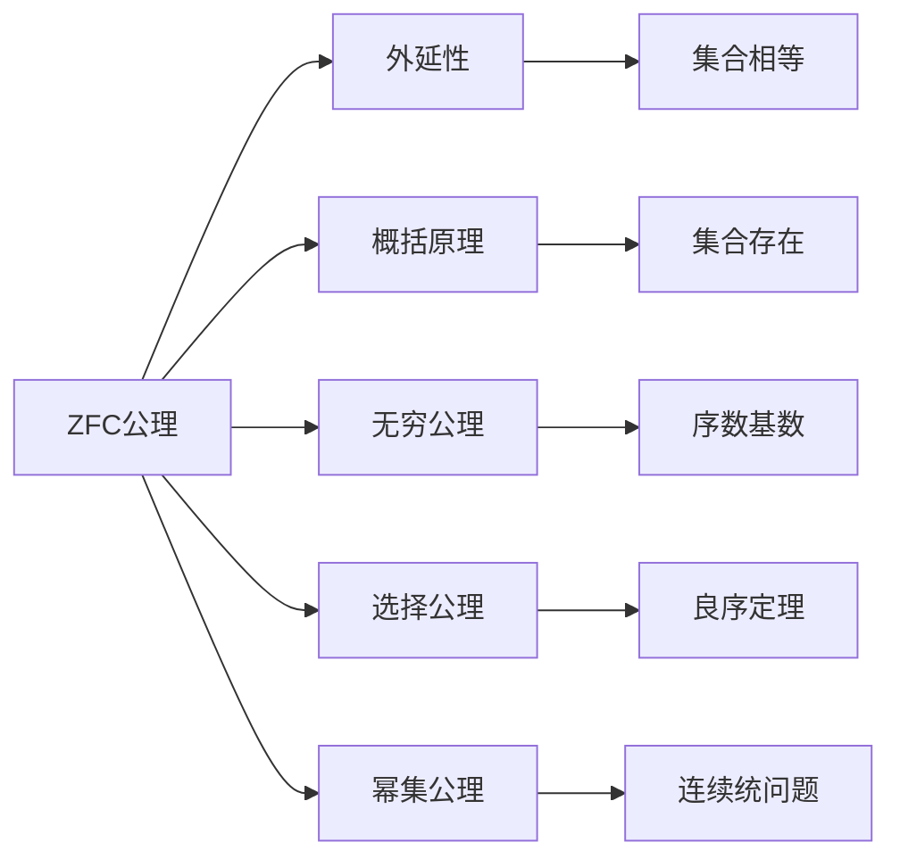
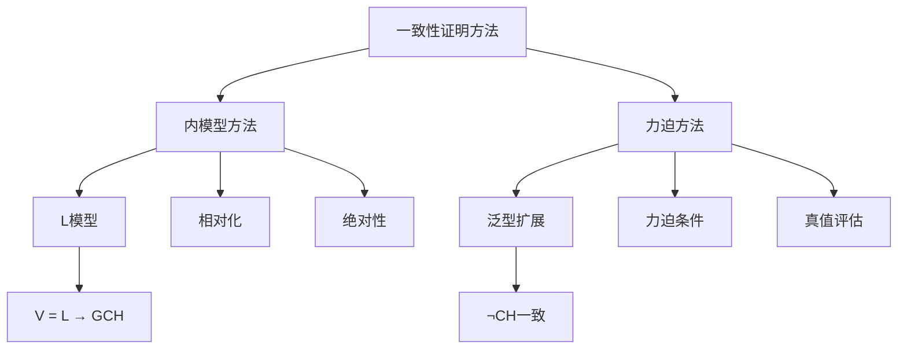
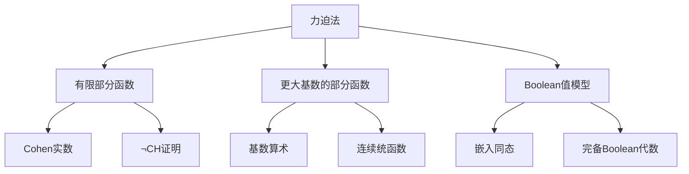
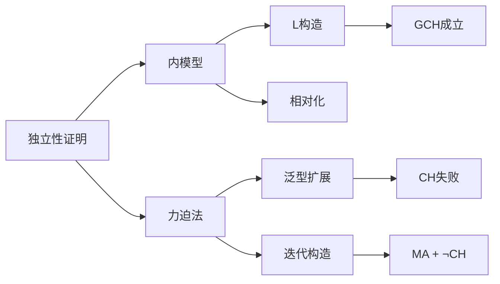

# 集合论：独立性证明导论 (Set Theory: An Introduction to Independence Proofs)

**作者：** Kenneth Kunen (University of Texas, Austin)  
**出版社：** North-Holland (Elsevier Science Publishers)  
**首版：** 1980年  

---

## 📚 教材概述

本书是轴集合论中相对一致性证明的入门教材，专为集合论研究生课程设计。Kenneth Kunen的这部经典教材旨在让数学家能够理解和应用集合论中的独立性证明方法。

## 🎯 核心主题

### 独立性结果的研究目标
集合论是数学的基础，所有数学概念都用集合和隶属关系来定义。本书研究**ZFC**（Zermelo-Fraenkel集合论加选择公理）无法确定的问题。

**独立性定义：** 语句 φ 独立于ZFC当且仅当 φ 和 ¬φ 都不能从ZFC证明，等价于 ZFC + φ 和 ZFC + ¬φ 都是一致的。

### 著名的独立性结果
- **连续统假设 (CH)**：$2^{\aleph_0} = \aleph_1$
- **Martin公理 (MA)**：可数链条件偏序的泛型性质
- **Suslin假设**：关于Suslin树的存在性
- **组合原理 ◊ 和 ◊***：精细结构理论中的组合原理

## 📖 章节结构

### 第一章：集合论基础
讨论ZFC公理系统的逻辑背景，但不包括基础公理。

**主要内容：**
- 为什么需要公理？
- 形式逻辑的必要性  
- 数学哲学
- 外延性和概括原理
- 关系、函数和良序
- 序数理论
- 类和递归
- 基数理论
- 实数理论

**重要定理：**
- $\mathbb{R}$ 的构造和性质
- 基数算术的基本法则：$\kappa + \lambda = \kappa \cdot \lambda = \max(\kappa, \lambda)$（无穷基数）
- 序数的超限归纳法

### 第二章：无穷组合学
介绍组合集合论的特殊主题，为后续章节提供组合引理。

**核心概念：**
- **几乎不交集和拟不相交集**
- **Martin公理 (MA)**：$\text{MA} + \neg\text{CH}$
- **Suslin问题**：是否存在不可数的Suslin树？
- **树结构理论**
- **滤子理论**
- **组合原理 ◊ 和 ◊***

**Martin公理表述：**
对于满足可数链条件的偏序 $P$ 和可数的稠密子集族 $\{D_n : n \in \omega\}$，存在泛型滤子 $G$ 与每个 $D_n$ 相交。

### 第三章：良基集合
专门讨论**基础公理**（正则性公理）。

**主要结果：**
- 良基集合的性质
- 良基关系理论
- 基础公理的作用
- 良基关系上的归纳和递归

**基础公理：** $\forall x(x \neq \emptyset \rightarrow \exists y \in x(y \cap x = \emptyset))$

### 第四章：简单一致性证明
发展产生一致性证明的基本方法。

**核心技术：**
- **内模型 (Inner Models)**
- **相对化 (Relativization)**  
- **绝对性 (Absoluteness)**
- **反射定理 (Reflection Theorems)**

**绝对性定理：** 对于 $\Sigma_1$ 和 $\Pi_1$ 公式，在传递模型间具有绝对性。

### 第五章：定义可定义性
在ZFC内形式化逻辑上的可定义性概念。

**关键概念：**
- 形式化可定义性
- 序数可定义集合
- $\text{OD}$ 类的性质

### 第六章：构造集合
建立**广义连续统假设 (GCH)** 的一致性。

**Gödel构造宇宙 $L$：**
$$L = \bigcup_{\alpha} L_\alpha$$

其中：
- $L_0 = \emptyset$
- $L_{\alpha+1} = \text{Def}(L_\alpha)$（$L_\alpha$上可定义的子集）
- $L_\lambda = \bigcup_{\alpha < \lambda} L_\alpha$（极限序数处）

**主要结果：**
- $L$ 是ZFC的模型
- 在 $L$ 中，$\text{AC}$ 和 $\text{GCH}$ 成立
- 组合原理 $◊$ 和 $◊^*$ 在 $L$ 中为真

**GCH在L中：** $\forall \alpha(2^{\aleph_\alpha} = \aleph_{\alpha+1})^L$

### 第七章：力迫法
介绍Cohen的力迫技术，证明CH和相关基数算术语句的一致性。

**力迫的基本概念：**
- **泛型扩展**：$V[G]$，其中 $G$ 是泛型滤子
- **力迫条件**：$p$ 和 $q$ 的相容性
- **力迫关系**：$p \Vdash \phi(\tau)$

**Cohen模型构造：**
使用有限部分函数 $\mathbb{P} = \{p : p \text{ 是 } \omega_2 \to 2 \text{ 的有限函数}\}$

**主要结果：**
- $\text{ZFC} + \neg\text{CH}$ 一致
- 基数算术的独立性
- $2^{\aleph_0}$ 可以是任何正则基数

### 第八章：迭代力迫
涵盖迭代力迫和 $\text{MA} + \neg\text{CH}$ 的一致性。

**迭代力迫的类型：**
- **积力迫 (Product Forcing)**
- **有限支撑迭代**
- **可数支撑迭代**
- **Easton力迫**

**Martin公理的一致性：**
构造模型使得 $\text{MA} + \neg\text{CH}$ 成立，通过可数支撑迭代实现。

**Easton定理：** 对于正则基数的连续统函数，在很大程度上是任意的。

## 🔍 教学特色

### 前提条件
- **集合论基础**：von Neumann序数和基数的基本性质
- **数学成熟度**：一般拓扑或测度论中集合论应用的理解
- **逻辑背景**：弹性的形式逻辑要求

### 使用建议
- 不需要从头到尾阅读
- 第二章材料到第六章末才使用
- 练习从常规验证到材料的额外发展
- 较难练习用星号标记

## 🎯 历史意义与影响

这本教材：
- 首次系统地介绍了力迫法技术
- 使独立性证明方法对更广泛的数学家群体可及
- 建立了现代集合论教学的标准
- 影响了几代集合论学者

## 📊 技术总结

### 主要一致性结果
1. **$\text{ZFC} + \text{GCH}$** 一致（通过 $L$ 模型）
2. **$\text{ZFC} + \neg\text{CH}$** 一致（通过Cohen力迫）
3. **$\text{ZFC} + \text{MA} + \neg\text{CH}$** 一致（通过迭代力迫）

### 关键技术方法

---

*本总结基于Kenneth Kunen《集合论：独立性证明导论》的前50页OCR提取内容。这是一部在现代集合论发展中具有里程碑意义的教材，为理解集合论中的独立性现象提供了基础。* 