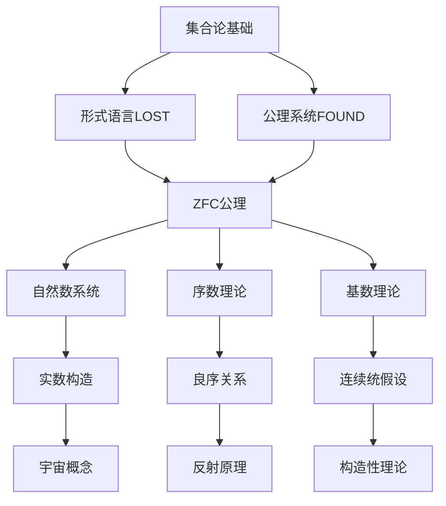
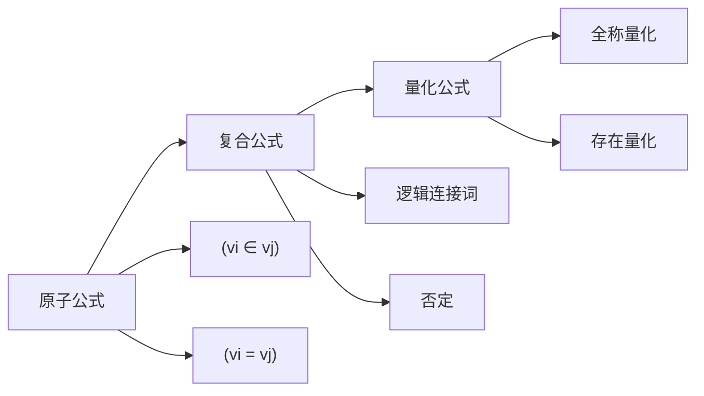
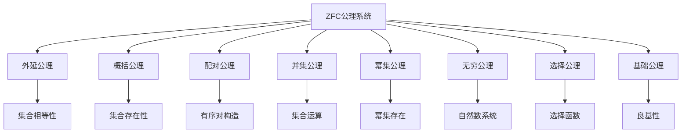

# 集合论导论 (An Introduction to Set Theory)

**作者：** Professor William A. R. Weiss  
**机构：** University of Toronto  
**版本：** 2008年10月2日版本  
**页数：** 119页  

---

## 📚 教材概述

这是一本研究生水平的集合论教材，由多伦多大学William Weiss教授编写。该教材从基础的形式逻辑开始，系统地介绍了现代公理集合论的核心概念和方法。



## 🎯 核心主题

### 集合论的地位
**"集合论是无穷的真正研究"** - 这句话概括了集合论的本质。集合论不仅研究无穷本身，更是现代数学的基础语言和框架。

### 三个基本问题
教材开篇提出了三个看似简单但实际困难的问题：

1. **比较原理**：对任意两个集合 $X$ 和 $Y$，要么存在从 $X$ 到 $Y$ 的单射，要么存在从 $Y$ 到 $X$ 的单射
2. **Schröder-Bernstein定理**：如果存在 $X \to Y$ 和 $Y \to X$ 的单射，则存在 $X \to Y$ 的双射
3. **连续统假设**：对实数的任意子集 $X$，要么存在 $\mathbb{R} \to X$ 的单射，要么存在 $X \to \mathbb{Q}$ 的单射

## 📖 章节结构

### 第0章：引言 (Introduction)
介绍集合论的重要性和基本问题。

**Richard悖论的讨论：**
考虑"能用少于20个英文单词描述的数"的集合。这个集合必须是有限的，但存在最小的不能用少于20个词描述的自然数，而这个描述本身只用了14个词，产生矛盾。

**教训：** 不是每个有描述的对象集合都构成一个集合。

### 第1章：LOST - 形式语言的构造
构造适合描述集合的形式语言。

**语言符号：**
- **变量**：$v_0, v_1, v_2, \ldots$
- **等号**：$=$
- **隶属符号**：$\in$
- **逻辑连接词**：$\land, \lor, \neg, \to, \leftrightarrow$
- **量词**：$\forall, \exists$
- **括号**：$(, )$

**原子公式：**
- $(v_i \in v_j)$
- $(v_i = v_j)$

**公式的归纳定义：**
1. 原子公式是公式
2. 如果 $\Phi$ 是公式，则 $(\neg\Phi)$ 是公式
3. 如果 $\Phi, \Psi$ 是公式，则 $(\Phi \land \Psi), (\Phi \lor \Psi), (\Phi \to \Psi), (\Phi \leftrightarrow \Psi)$ 是公式
4. 如果 $\Phi$ 是公式，$v_i$ 是变量，则 $(\forall v_i)\Phi, (\exists v_i)\Phi$ 是公式



**变量的约束与自由：**
- **约束变量**：出现在量词作用域内的变量
- **自由变量**：不被量词约束的变量
- **替换规则**：避免变量捕获的精确替换程序

### 第2章：FOUND - 可读性与约定
使形式语言更加可读。

**简化约定：**
1. 使用任意字母作为变量
2. 自由省略括号，使用方括号
3. 用英文表达逻辑连接词
4. 引入有界量词：$(\forall x \in t)\Phi$ 和 $(\exists x \in t)\Phi$

**重要缩写：**
- **包含关系**：$s \subseteq t$ 表示 $(\forall x)(x \in s \to x \in t)$
- **集合运算**：
  - 并集：$s \cup t = \{x : x \in s \lor x \in t\}$
  - 交集：$s \cap t = \{x : x \in s \land x \in t\}$
  - 差集：$s \setminus t = \{x : x \in s \land x \notin t\}$
- **有序对**：$\langle s,t \rangle = \{\{s\}, \{s,t\}\}$
- **笛卡尔积**：$s \times t = \{p : \exists x \exists y (x \in s \land y \in t \land p = \langle x,y \rangle)\}$

**Russell悖论的解决：**
$$\neg\exists z \, z = \{x : x \notin x\}$$

这不是悖论，而是定理。类 $\{x : x \notin x\}$ 只是一个描述，不必对应存在的集合。

### 第3章：集合论公理 (The Axioms of Set Theory)
建立ZFC公理系统。

**ZFC公理列表：**

1. **外延公理 (Extensionality)**：
   $$\forall x \forall y [(\forall z (z \in x \leftrightarrow z \in y)) \to x = y]$$

2. **概括公理模式 (Comprehension Schema)**：
   $$\forall \vec{w} \forall t \exists s \forall x [x \in s \leftrightarrow (x \in t \land \Phi(x, \vec{w}))]$$

3. **配对公理 (Pairing)**：
   $$\forall x \forall y \exists z [x \in z \land y \in z]$$

4. **并集公理 (Union)**：
   $$\forall x \exists y \forall z [z \in y \leftrightarrow \exists w (w \in x \land z \in w)]$$

5. **幂集公理 (Power Set)**：
   $$\forall x \exists y \forall z [z \in y \leftrightarrow z \subseteq x]$$

6. **无穷公理 (Infinity)**：
   $$\exists x [\emptyset \in x \land \forall y (y \in x \to y \cup \{y\} \in x)]$$

7. **选择公理 (Choice)**：
   $$\forall x [(\forall y \in x \, y \neq \emptyset) \land (\forall y, z \in x \, (y \neq z \to y \cap z = \emptyset)) \to \exists f \forall y \in x \, f(y) \in y]$$



### 第4章：自然数 (The Natural Numbers)
在集合论中构造自然数系统。

**von Neumann自然数定义：**
- $0 = \emptyset$
- $1 = \{0\} = \{\emptyset\}$
- $2 = \{0, 1\} = \{\emptyset, \{\emptyset\}\}$
- $n+1 = n \cup \{n\}$

**自然数集合 $\omega$：**
$$\omega = \{0, 1, 2, 3, \ldots\}$$

**归纳原理：**
对于性质 $\Phi(n)$，如果：
1. $\Phi(0)$ 成立
2. $\forall n (\Phi(n) \to \Phi(n+1))$

则 $\forall n \in \omega \, \Phi(n)$

**递归定理：**
给定集合 $a$ 和函数 $g$，存在唯一函数 $f: \omega \to V$ 使得：
- $f(0) = a$
- $f(n+1) = g(f(n))$

### 第5章：序数 (The Ordinal Numbers)
扩展自然数概念到超限序数。

**序数的定义：**
集合 $\alpha$ 是序数当且仅当：
1. $\alpha$ 是传递的：$\forall x \in \alpha \, x \subseteq \alpha$
2. $\alpha$ 被 $\in$ 关系良序

**序数算术：**
- **后继序数**：$\alpha + 1 = \alpha \cup \{\alpha\}$
- **极限序数**：不是后继序数的序数
- **序数加法**：$\alpha + \beta$ 通过超限递归定义
- **序数乘法**：$\alpha \cdot \beta$ 通过超限递归定义

**超限归纳法：**
对于性质 $\Phi(\alpha)$，如果：
1. $\Phi(0)$ 成立
2. $\forall \alpha (\Phi(\alpha) \to \Phi(\alpha + 1))$
3. 对极限序数 $\lambda$，$(\forall \alpha < \lambda \, \Phi(\alpha)) \to \Phi(\lambda)$

则 $\forall \alpha \, \Phi(\alpha)$

### 第6章：关系与序 (Relations and Orderings)
研究各种序关系。

**序关系的类型：**
- **偏序**：自反、反对称、传递
- **线性序**：偏序且任意两元素可比
- **良序**：线性序且每个非空子集有最小元

**Zorn引理：**
如果偏序集的每个链都有上界，则存在极大元。

### 第7章：基数 (Cardinality)
研究集合的大小。

**基数的定义：**
集合 $X$ 的基数 $|X|$ 是最小的与 $X$ 等势的序数。

**基数算术：**
- $\kappa + \lambda = |\kappa \cup \lambda|$（当 $\kappa \cap \lambda = \emptyset$）
- $\kappa \cdot \lambda = |\kappa \times \lambda|$
- $\kappa^\lambda = |{}^\lambda\kappa|$（从 $\lambda$ 到 $\kappa$ 的函数集合）

**Cantor定理：**
$$\forall X \, |X| < |P(X)|$$

**连续统假设 (CH)：**
$$2^{\aleph_0} = \aleph_1$$

### 第8章：实数的非实在性
讨论实数的集合论构造。

**实数构造方法：**
1. **Dedekind切割**
2. **Cauchy序列的等价类**

**要点：** 实数不是"真实"存在的对象，而是集合论构造的产物。

### 第9章：宇宙 (The Universe)
讨论集合论宇宙的结构。

**累积层次：**
- $V_0 = \emptyset$
- $V_{\alpha+1} = P(V_\alpha)$
- $V_\lambda = \bigcup_{\alpha < \lambda} V_\alpha$（极限序数）

**宇宙 $V$：**
$$V = \bigcup_{\alpha \in ON} V_\alpha$$

### 第10章：反射 (Reflection)
研究反射原理。

**反射定理：**
对于任何公式 $\Phi$，存在序数 $\alpha$ 使得：
$$\Phi \leftrightarrow \Phi^{V_\alpha}$$

### 第11章：初等子模型 (Elementary Submodels)
研究模型论方法在集合论中的应用。

### 第12章：构造性 (Constructibility)
介绍Gödel的构造宇宙 $L$。

**构造层次：**
- $L_0 = \emptyset$
- $L_{\alpha+1} = \text{Def}(L_\alpha)$
- $L_\lambda = \bigcup_{\alpha < \lambda} L_\alpha$

**构造公理 $V = L$：**
在构造宇宙中，选择公理和广义连续统假设都成立。

## 🔍 教学特色

### 教学方法
- **渐进式**：从直观概念到严格形式化
- **问题导向**：通过悖论和问题引入概念
- **实例丰富**：大量具体例子和练习

### 适用对象
- 研究生水平的集合论课程
- 需要逻辑学背景但不要求专门训练
- 适合数学、计算机科学、哲学专业学生

## 📊 技术总结

### 主要成果
1. **ZFC公理系统**的完整介绍
2. **序数和基数理论**的系统发展
3. **构造宇宙**的基本概念
4. **反射原理**的应用

### 重要定理

```mermaid
graph LR
    A[重要定理] --> B[Russell悖论]
    A --> C[Cantor定理]
    A --> D[Schröder-Bernstein定理]
    A --> E[反射定理]
    
    B --> F[¬∃z z = {x : x ∉ x}]
    C --> G[∀X |X| < |P(X)|]
    D --> H[双射存在性]
    E --> I[公式的相对化]
```

---

*本总结基于William A. R. Weiss教授《集合论导论》(2008年版)的完整119页内容。这是一本优秀的集合论入门教材，平衡了严格性和可读性，为理解现代集合论提供了坚实基础。* 