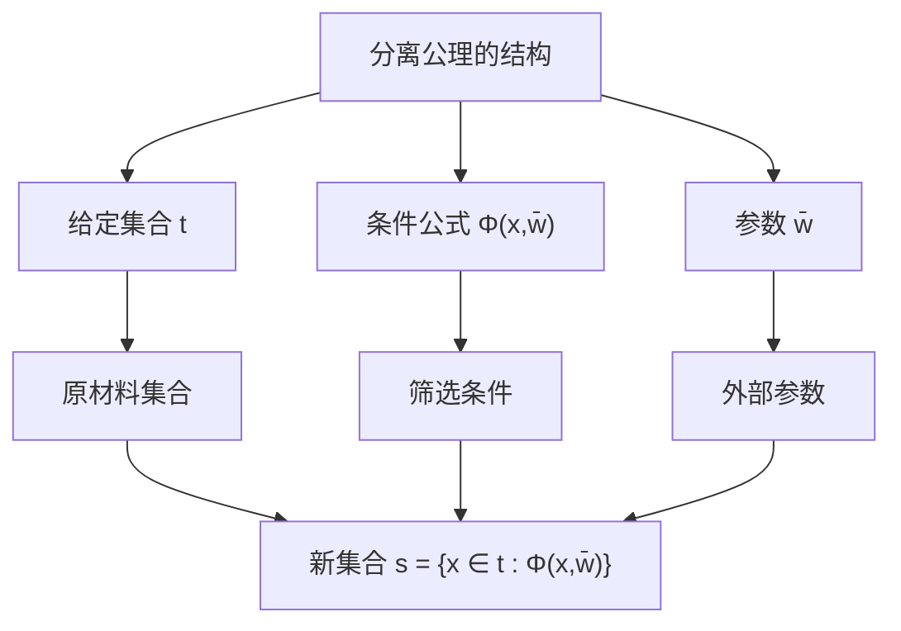
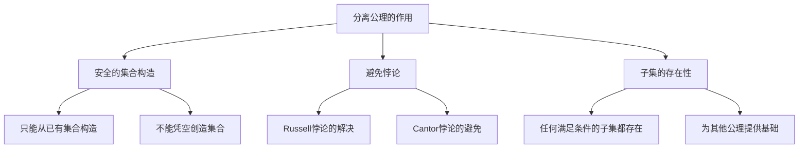
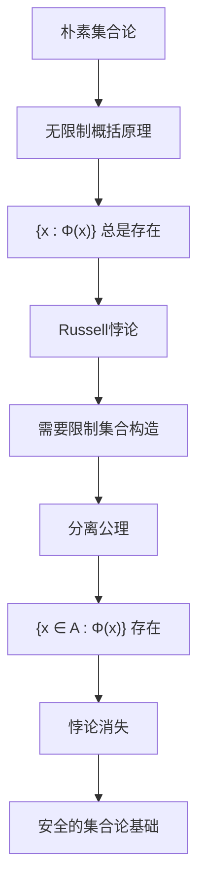
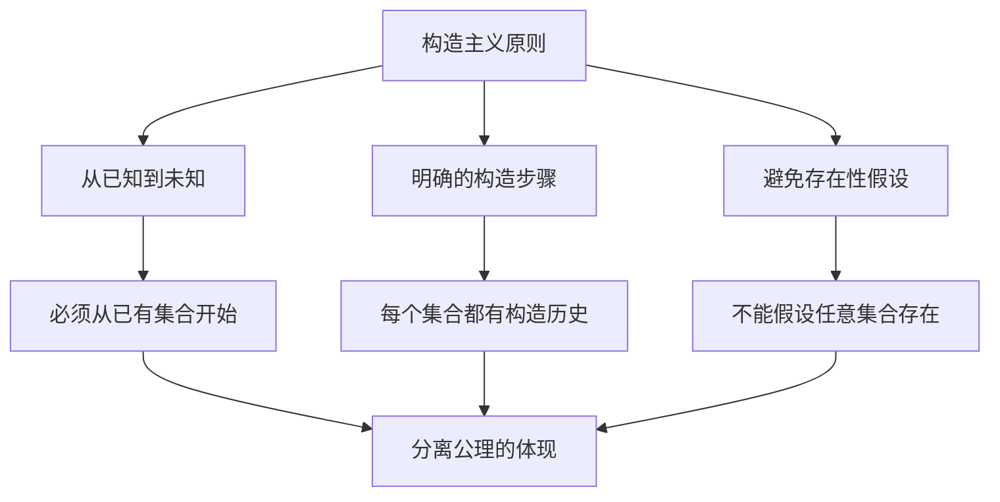
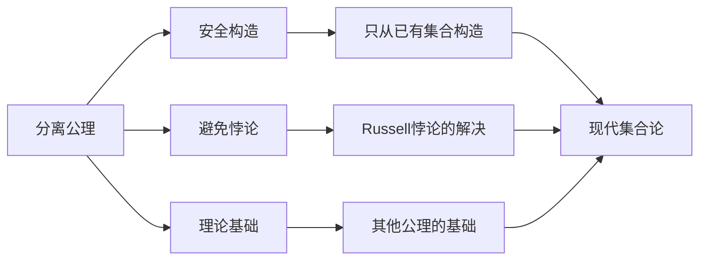

# 分离公理详解：集合论的核心构造原理

## 📚 基于集合论知识库的深度分析

**文档创建时间**: 2025年  
**知识来源**: Halmos《朴素集合论》、Weiss《集合论导论》、Kunen《集合论》、Larson & Zapletal《几何集合论》  
**主题**: 分离公理的完整理论分析

---

## 🎯 核心问题

**问题**: 什么是分离公理？它在集合论中起什么作用？

**答案**: 分离公理（也称概括公理）是ZFC公理系统的核心，它规定了如何从已有集合中"分离"出满足特定条件的子集，是集合构造的基本原理。

---

## 1. **分离公理的基本定义**

### 1.1 Halmos的直观表述

基于Halmos《朴素集合论》，分离公理的表述是：

> **分离公理** (Axiom of Specification): 对于每个集合A和每个条件S(x)，存在集合B，其元素恰好是A中满足条件S(x)的那些元素。

**符号表示**:
$$B = \{x \in A : S(x)\}$$

**读法**: "B是A中所有满足条件S(x)的x组成的集合"

### 1.2 现代形式化表述

在ZFC公理系统中，分离公理被表述为**公理模式**：

**概括公理模式** (Comprehension Schema):
$$\forall \vec{w} \forall t \exists s \forall x [x \in s \leftrightarrow (x \in t \land \Phi(x, \vec{w}))]$$

**解释**:
- $\vec{w} = w_1, w_2, ..., w_n$ 是参数
- $t$ 是给定的集合
- $\Phi(x, \vec{w})$ 是任意公式
- $s$ 是要构造的新集合

### 1.3 德语名称的含义

Halmos提到分离公理的德语名称是**Aussonderungsaxiom**：
- **Aussonderung** = 分离、筛选
- **Axiom** = 公理

这个名称很好地体现了公理的本质：从大集合中"分离"出满足条件的子集。

---

## 2. **分离公理的核心作用**

### 2.1 集合构造的基本机制

分离公理是**所有集合构造的基础**：

### 2.2 与其他公理的关系

**基础地位**: 分离公理为其他构造性公理提供理论基础

**例子**:
- **空集的存在**: $\emptyset = \{x \in A : x \neq x\}$（对任意集合A）
- **交集的定义**: $A \cap B = \{x \in A : x \in B\}$
- **差集的定义**: $A \setminus B = \{x \in A : x \notin B\}$

### 2.3 条件的形式化

**什么是"条件"？**

在Halmos的朴素表述中，条件S(x)是"句子"。在现代形式化中：

**条件的构成要素**:
1. **原子公式**: $x \in y$, $x = y$
2. **逻辑连接词**: $\land, \lor, \neg, \to, \leftrightarrow$
3. **量词**: $\forall, \exists$
4. **变量**: 自由变量和约束变量

**例子**:
- $\Phi(x) \equiv x \in y$ （x属于某个固定集合y）
- $\Phi(x) \equiv \exists z(z \in x \land z \in y)$ （x与y有公共元素）
- $\Phi(x) \equiv \forall z(z \in x \to z \in y)$ （x是y的子集）

---

## 3. **Russell悖论与分离公理**

### 3.1 Russell悖论的经典形式

**悖论描述**: 考虑"所有不包含自身的集合"组成的集合：
$$R = \{x : x \notin x\}$$

**悖论推理**:
- 如果 $R \in R$，则根据R的定义，$R \notin R$
- 如果 $R \notin R$，则根据R的定义，$R \in R$
- 矛盾！

### 3.2 分离公理如何解决Russell悖论

**关键洞察**: 分离公理**不允许**无限制的集合构造

**正确的表述**:
$$\neg\exists z \, z = \{x : x \notin x\}$$

这**不是悖论**，而是**定理**！它说明类 $\{x : x \notin x\}$ 不对应任何存在的集合。

**分离公理的限制**:
- 只能从**已有集合**中分离
- 不能凭空构造集合
- 形式：$\{x \in A : x \notin x\}$（必须有A）

### 3.3 从Russell悖论到分离公理

**历史意义**:
- Russell悖论（1901）暴露了朴素集合论的问题
- Zermelo（1908）提出分离公理作为解决方案
- 这标志着现代公理集合论的诞生

---

## 4. **分离公理的具体应用**

### 4.1 基本集合的构造

**空集的构造**:
$$\emptyset = \{x \in A : x \neq x\}$$

对任意集合A，这个构造都给出空集。

**证明唯一性**: 由外延公理，所有这样构造的集合都相等。

**单元素集的构造**:
如果 $a \in A$，则：
$$\{a\} = \{x \in A : x = a\}$$

### 4.2 集合运算的定义

**交集**:
$$A \cap B = \{x \in A : x \in B\}$$

**差集**:
$$A \setminus B = \{x \in A : x \notin B\}$$

**对称差**:
$$A \triangle B = (A \setminus B) \cup (B \setminus A)$$

### 4.3 复杂条件的例子

**质数集合**（在自然数集合ω中）:
$$P = \{n \in \omega : n > 1 \land \forall k \in \omega (k|n \to k = 1 \lor k = n)\}$$

**偶数集合**:
$$E = \{n \in \omega : \exists m \in \omega (n = 2 \cdot m)\}$$

**有限集合的集合**（在某个幂集中）:
$$\text{Fin}(A) = \{X \in \mathcal{P}(A) : \exists n \in \omega (|X| = n)\}$$

---

## 5. **分离公理的理论性质**

### 5.1 公理模式的特点

**无穷多个公理**: 分离公理实际上是**公理模式**，对每个公式$\Phi$都有一个对应的公理实例。

**为什么是模式？**
- 不可能列举所有可能的公式
- 需要对语言的每个公式都有对应的分离原理
- 这保证了理论的完整性

### 5.2 分离公理的强度

**相对较弱**: 分离公理本身不能构造"新"的集合，只能构造子集。

**需要其他公理配合**:
- **配对公理**: 构造 $\{a, b\}$
- **并集公理**: 构造 $\bigcup \mathcal{F}$
- **幂集公理**: 构造 $\mathcal{P}(A)$
- **无穷公理**: 保证无穷集合存在

### 5.3 分离公理的必要性

**定理**: 没有分离公理，ZFC的其他公理无法证明基本的子集存在性。

**例子**: 即使有配对公理，也无法证明 $\{a\} \subseteq \{a, b\}$ 作为集合存在。

---

## 6. **分离公理的哲学意义**

### 6.1 构造主义观点

**核心思想**: 集合必须通过明确的构造过程获得

### 6.2 与柏拉图主义的对比

**柏拉图主义观点**: 所有集合都"存在"于某个数学宇宙中

**分离公理的立场**: 只有通过构造过程才能确认集合的存在

**实际意义**: 分离公理体现了**谨慎的存在论**

### 6.3 可预测性原则

**Halmos的观点**: 分离公理体现了"可预测性"

- 给定集合A和条件S(x)
- 结果集合B是**完全确定的**
- 没有任意性或模糊性

---

## 7. **分离公理的现代发展**

### 7.1 在不同集合论中的地位

**ZFC**: 分离公理是基础公理之一

**NBG**: 类概括公理的限制形式

**MK**: 更强的概括原理

**构造性集合论**: 强调构造过程的可计算性

### 7.2 计算机科学中的应用

**类型论**: 分离类型的构造

**程序验证**: 规范的形式化

**数据库理论**: 查询语言的语义

### 7.3 逻辑学中的研究

**模型论**: 分离公理在不同模型中的行为

**证明论**: 分离公理的证明强度

**递归论**: 可计算的分离条件

---

## 8. **分离公理的技术细节**

### 8.1 自由变量的处理

**重要限制**: 在公理模式中，公式$\Phi$不能包含变量$s$作为自由变量

**原因**: 避免自指和循环定义

**例子**: 
- ✅ 合法: $\{x \in A : x \in B\}$
- ❌ 非法: $\{x \in A : x \in s\}$（其中s是要构造的集合）

### 8.2 参数的作用

**参数$\vec{w}$的意义**: 允许条件依赖于外部对象

**例子**:
$$\{x \in A : x \in B\}$$

这里B是参数，条件是"$x \in B$"

### 8.3 替换与分离的关系

**替换公理**: 更强的构造原理
$$\forall x \in A \, \exists! y \, \Phi(x,y) \Rightarrow \exists B \, \forall y (y \in B \leftrightarrow \exists x \in A \, \Phi(x,y))$$

**关系**: 替换公理可以推导出分离公理，但反之不成立

---

## 9. **分离公理的教学意义**

### 9.1 概念理解的关键

**从直觉到形式化**:
1. 直觉：从大集合中"挑选"元素
2. 形式化：逻辑公式的精确表述
3. 应用：具体集合的构造

### 9.2 常见误解

**误解1**: 分离公理可以构造任意集合
- **正确**: 只能构造已有集合的子集

**误解2**: 条件可以是任意的"性质"
- **正确**: 条件必须是形式语言中的公式

**误解3**: Russell悖论说明集合论是矛盾的
- **正确**: Russell悖论推动了公理集合论的发展

### 9.3 学习建议

**循序渐进**:
1. 理解直觉概念
2. 掌握符号表示
3. 练习具体应用
4. 理解理论意义

---

## 10. **分离公理的练习和例子**

### 10.1 基础练习

**练习1**: 用分离公理构造以下集合
1. $A \cap B \cap C$
2. $\{x \in \mathbb{N} : x \text{ 是完全平方数}\}$
3. $\{f \in F : f \text{ 是单射}\}$（其中F是函数集合）

**练习2**: 证明以下等式
1. $A \setminus (B \cup C) = (A \setminus B) \cap (A \setminus C)$
2. $A \cap (B \setminus C) = (A \cap B) \setminus C$

### 10.2 高级应用

**例子1**: 构造所有有限子集
$$\text{Fin}(A) = \{X \in \mathcal{P}(A) : \exists n \in \omega \, |X| = n\}$$

**例子2**: 构造所有单射函数
$$\text{Inj}(A,B) = \{f \in B^A : \forall x,y \in A (f(x) = f(y) \to x = y)\}$$

### 10.3 理论问题

**问题1**: 为什么需要公理模式而不是单个公理？

**问题2**: 分离公理与选择公理有什么关系？

**问题3**: 在没有无穷公理的情况下，分离公理能构造哪些集合？

---

## 11. **总结**

### 11.1 分离公理的核心要点

**关键特征**:
1. **限制性**: 只能构造子集，不能凭空创造
2. **普遍性**: 适用于任何公式条件
3. **基础性**: 为集合论提供构造机制
4. **安全性**: 避免了已知的悖论

### 11.2 历史和现代意义

**历史意义**:
- 解决了Russell悖论
- 奠定了现代公理集合论基础
- 体现了数学严格化的趋势

**现代意义**:
- 计算机科学中的类型构造
- 逻辑学中的模型构造
- 数学基础的哲学讨论

### 11.3 学习要点

**理解层次**:
1. **直觉理解**: 从大集合中筛选元素
2. **符号掌握**: $\{x \in A : \Phi(x)\}$ 的含义
3. **应用能力**: 构造具体的集合
4. **理论认识**: 在ZFC系统中的地位

**实践建议**:
- 多做具体的集合构造练习
- 理解与其他公理的关系
- 思考哲学和基础问题
- 关注现代应用和发展

---

## 📚 参考文献

1. **Halmos, Paul R.** *Naive Set Theory*. Van Nostrand Company, 1960.
2. **Weiss, William A. R.** *Set Theory: An Introduction*. University of Toronto.
3. **Kunen, Kenneth.** *Set Theory: An Introduction to Independence Proofs*. North-Holland, 1980.
4. **Zermelo, Ernst.** "Untersuchungen über die Grundlagen der Mengenlehre I." *Mathematische Annalen*, 1908.
5. **Russell, Bertrand.** "Mathematical Logic as Based on the Theory of Types." *American Journal of Mathematics*, 1908.

---

## 📝 文档说明

- **创建目的**: 全面分析分离公理的定义、作用和意义
- **知识来源**: 基于四个重要集合论文献的综合分析
- **适用读者**: 数学系学生、逻辑学研究者、集合论学习者
- **技术水平**: 需要基础的集合论和逻辑学知识

---

*本文档基于完整的集合论知识库创建，提供了从直觉理解到形式化理论的完整分析路径，是理解现代集合论基础的重要资源。* 