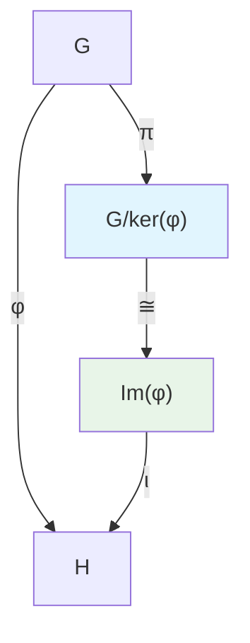

# 同态映射完整学习指南

## 目录
1. [基本概念与定义](#1-基本概念与定义)
2. [同态映射的分类](#2-同态映射的分类)
3. [重要性质与定理](#3-重要性质与定理)
4. [各种代数结构中的同态](#4-各种代数结构中的同态)
5. [同态基本定理](#5-同态基本定理)
6. [范畴论视角](#6-范畴论视角)
7. [具体例子与计算](#7-具体例子与计算)
8. [应用与意义](#8-应用与意义)
9. [学习要点总结](#9-学习要点总结)
10. [练习题与思考](#10-练习题与思考)

---

## 1. 基本概念与定义

### 1.1 同态映射的核心思想

**同态映射（Homomorphism）** 是保持代数结构的映射，它是现代抽象代数的核心概念之一。

#### 词源分析
- **Homo-**：希腊语，意为"相同的"
- **-morphism**：希腊语，意为"形状、结构"
- **合意**：保持相同结构的映射

#### 基本直观
同态映射的本质是：**运算与映射可以交换顺序**
```
f(a ○ b) = f(a) ○' f(b)
```
其中 ○ 是源结构的运算，○' 是目标结构的运算。

### 1.2 一般定义

设 (A, ○) 和 (B, ○') 是两个代数结构，映射 f: A → B 称为**同态映射**，当且仅当：

对于任意 a, b ∈ A，都有：
```
f(a ○ b) = f(a) ○' f(b)
```

### 1.3 术语体系

#### 基本术语
- **同态（Homomorphism）**：保持运算的映射
- **单同态（Monomorphism）**：单射的同态映射
- **满同态（Epimorphism）**：满射的同态映射
- **同构（Isomorphism）**：双射的同态映射
- **自同态（Endomorphism）**：从结构到自身的同态
- **自同构（Automorphism）**：从结构到自身的同构

#### 中英文对照
| 中文 | 英文 | 记号 |
|------|------|------|
| 同态 | Homomorphism | f: A → B |
| 单同态 | Monomorphism | A ↣ B |
| 满同态 | Epimorphism | A ↠ B |
| 同构 | Isomorphism | A ≅ B |
| 自同态 | Endomorphism | f: A → A |
| 自同构 | Automorphism | A ≅ A |

---

## 2. 同态映射的分类

### 2.1 按映射性质分类

#### 单同态（Monomorphism）
- **定义**：单射的同态映射
- **性质**：保持元素的可区分性
- **例子**：整数环到有理数域的嵌入 ℤ ↪ ℚ

#### 满同态（Epimorphism）
- **定义**：满射的同态映射
- **性质**：目标结构中每个元素都有原像
- **例子**：整数到模n整数的自然映射 ℤ ↠ ℤ/nℤ

#### 同构（Isomorphism）
- **定义**：双射的同态映射
- **性质**：完全保持代数结构
- **例子**：复数的指数形式与三角形式 ℂ* ≅ ℝ+ × S¹

### 2.2 按结构关系分类

#### 自同态（Endomorphism）
- **定义**：从代数结构到自身的同态
- **集合**：End(A) = {f: A → A | f是同态}
- **结构**：End(A) 通常形成一个环或半群

#### 自同构（Automorphism）
- **定义**：从代数结构到自身的同构
- **集合**：Aut(A) = {f: A → A | f是同构}
- **结构**：Aut(A) 形成一个群

### 2.3 特殊同态

#### 平凡同态
- **零同态**：将所有元素映射到零元素
- **常同态**：将所有元素映射到同一元素

#### 包含同态
- **子结构嵌入**：子群到群的包含映射
- **自然嵌入**：标准的结构保持包含

---

## 3. 重要性质与定理

### 3.1 基本性质

#### 性质1：单位元的保持
如果 A 有单位元 e_A，B 有单位元 e_B，则同态 f: A → B 满足：
```
f(e_A) = e_B
```

#### 性质2：逆元的保持
对于可逆元素 a ∈ A，如果 f: A → B 是同态，则：
```
f(a⁻¹) = [f(a)]⁻¹
```

#### 性质3：幂运算的保持
对于任意 a ∈ A 和正整数 n：
```
f(aⁿ) = [f(a)]ⁿ
```

### 3.2 核与像

#### 核（Kernel）
```
ker(f) = {a ∈ A | f(a) = e_B}
```

**重要性质**：
- ker(f) 是 A 的正规子群
- f 是单射 ⟺ ker(f) = {e_A}

#### 像（Image）
```
Im(f) = {f(a) | a ∈ A}
```

**重要性质**：
- Im(f) 是 B 的子结构
- f 是满射 ⟺ Im(f) = B

### 3.3 同态的复合

#### 定理：同态的复合仍是同态
如果 f: A → B 和 g: B → C 都是同态，则复合 g∘f: A → C 也是同态。

**证明思路**：
```
(g∘f)(a₁ ○ a₂) = g(f(a₁ ○ a₂))
                = g(f(a₁) ○' f(a₂))
                = g(f(a₁)) ○'' g(f(a₂))
                = (g∘f)(a₁) ○'' (g∘f)(a₂)
```

---

## 4. 各种代数结构中的同态

### 4.1 群同态

#### 定义
设 (G, ·) 和 (H, *) 是两个群，映射 φ: G → H 是群同态，当且仅当：
```
φ(a · b) = φ(a) * φ(b)，对所有 a, b ∈ G
```

#### 重要例子
1. **指数映射**：φ: (ℝ, +) → (ℝ⁺, ·)，φ(x) = eˣ
2. **行列式**：det: GL_n(ℝ) → ℝ*
3. **模运算**：π: ℤ → ℤ/nℤ，π(a) = a mod n

#### 群同态基本定理
对于群同态 φ: G → H：
```
G/ker(φ) ≅ Im(φ)
```

### 4.2 环同态

#### 定义
设 (R, +, ·) 和 (S, +, ·) 是两个环，映射 f: R → S 是环同态，当且仅当：
1. f(a + b) = f(a) + f(b)
2. f(a · b) = f(a) · f(b)
3. f(1_R) = 1_S（如果环有单位元）

#### 重要例子
1. **自然映射**：ℤ → ℤ/nℤ
2. **包含映射**：ℤ ↪ ℚ ↪ ℝ ↪ ℂ
3. **求值映射**：ℝ[x] → ℝ，f(x) ↦ f(a)

### 4.3 域同态

#### 特殊性质
- 域同态必定是单射（除了零映射）
- 域的自同构群具有重要的几何意义

#### 重要例子
1. **复共轭**：ℂ → ℂ，z ↦ z̄
2. **Frobenius自同态**：有限域中的 x ↦ xᵖ

### 4.4 向量空间同态（线性映射）

#### 定义
设 V, W 是域 F 上的向量空间，映射 T: V → W 是线性映射，当且仅当：
1. T(u + v) = T(u) + T(v)
2. T(cv) = cT(v)

#### 矩阵表示
每个有限维线性映射都可以用矩阵表示。

---

## 5. 同态基本定理

### 5.1 第一同构定理（基本定理）

#### 群版本
设 φ: G → H 是群同态，则：
```
G/ker(φ) ≅ Im(φ)
```

#### 环版本
设 f: R → S 是环同态，则：
```
R/ker(f) ≅ Im(f)
```

#### 几何直观
这个定理说明：商掉核后，源结构与像结构同构。



### 5.2 第二同构定理

#### 陈述
设 H 是群 G 的子群，N 是 G 的正规子群，则：
```
H/(H ∩ N) ≅ HN/N
```

### 5.3 第三同构定理

#### 陈述
设 N ⊆ M 都是群 G 的正规子群，则：
```
(G/N)/(M/N) ≅ G/M
```

---

## 6. 范畴论视角

### 6.1 范畴中的同态

在范畴论中，同态映射就是态射（morphism），它们满足：

#### 复合律
态射可以复合：f: A → B, g: B → C ⟹ g∘f: A → C

#### 结合律
(h∘g)∘f = h∘(g∘f)

#### 单位律
每个对象都有恒等态射

### 6.2 函子保持同态

函子 F: 𝒞 → 𝒟 将一个范畴中的同态映射到另一个范畴中的同态。

### 6.3 自然变换

自然变换提供了不同函子之间的"同态"。

---

## 7. 具体例子与计算

### 7.1 群同态例子

#### 例子1：指数映射
```
φ: (ℝ, +) → (ℝ⁺, ·)
φ(x) = eˣ

验证：φ(x + y) = e^(x+y) = eˣ · eʸ = φ(x) · φ(y) ✓
```

#### 例子2：行列式
```
det: GL₂(ℝ) → ℝ*
det([a b; c d]) = ad - bc

验证：det(AB) = det(A)det(B) ✓
```

### 7.2 环同态例子

#### 例子1：求值映射
```
ev_a: ℝ[x] → ℝ
ev_a(f(x)) = f(a)

验证：
ev_a(f + g) = (f + g)(a) = f(a) + g(a) = ev_a(f) + ev_a(g) ✓
ev_a(fg) = (fg)(a) = f(a)g(a) = ev_a(f) · ev_a(g) ✓
```

### 7.3 计算技巧

#### 验证同态的步骤
1. 检查运算保持性
2. 检查单位元映射
3. 计算核和像
4. 应用同态定理

---

## 8. 应用与意义

### 8.1 代数几何中的应用

#### 坐标环同态
代数簇间的态射对应于坐标环间的同态。

#### Spec函子
将交换环映射到素谱，建立代数与几何的联系。

### 8.2 数论中的应用

#### 模运算
同余关系通过自然同态 ℤ → ℤ/nℤ 实现。

#### 类域论
利用同态研究代数数域的扩张。

### 8.3 拓扑学中的应用

#### 基本群同态
连续映射诱导基本群间的同态。

#### 同调理论
同调群之间的同态反映拓扑空间的性质。

### 8.4 物理学中的应用

#### 对称性
物理系统的对称性通过群同态描述。

#### 规范理论
规范变换形成群，其表示理论依赖于同态。

---

## 9. 学习要点总结

### 9.1 核心概念
- **结构保持**：同态的本质是保持代数运算
- **分类体系**：单、满、双射同态的层次关系
- **核与像**：刻画同态性质的重要工具

### 9.2 重要定理
- **同态基本定理**：G/ker(φ) ≅ Im(φ)
- **同构定理族**：第一、二、三同构定理
- **拉格朗日定理**：|G| = |H| · [G:H]

### 9.3 学习方法
1. **从具体到抽象**：先掌握具体例子
2. **图形化理解**：使用交换图表
3. **计算验证**：通过计算加深理解
4. **联系应用**：理解同态在各领域中的作用

### 9.4 常见误区
- **混淆同态与同构**：同态不一定可逆
- **忽略单位元**：忘记验证单位元的映射
- **核的计算错误**：核是正规子群，不是普通子集

---

## 10. 练习题与思考

### 10.1 基础练习

#### 练习1：验证同态
证明 φ: ℂ* → ℝ⁺, φ(z) = |z| 是群同态。

#### 练习2：计算核与像
对于同态 π: ℤ → ℤ₁₂, π(n) = n mod 12，计算 ker(π) 和 Im(π)。

#### 练习3：同构判定
判断 (ℚ, +) 与 (ℚ⁺, ·) 是否同构。

### 10.2 进阶练习

#### 练习4：自同构群
计算循环群 ℤₙ 的自同构群 Aut(ℤₙ)。

#### 练习5：环同态
构造一个从 ℤ[x] 到 ℤ₅ 的非平凡环同态。

#### 练习6：线性代数联系
证明：n×n 可逆矩阵群 GL_n(ℝ) 到正实数乘法群的行列式映射是群同态。

### 10.3 思考题

#### 思考1：哲学意义
同态映射在数学统一性中扮演什么角色？

#### 思考2：范畴论联系
如何从范畴论角度理解"所有数学都是同态"这一观点？

#### 思考3：计算机科学
同态在计算机科学（特别是函数式编程）中有什么应用？

---

## 参考文献与延伸阅读

### 经典教材
1. **Hungerford, T.W.** - *Algebra* (Springer, 1974)
2. **Dummit, D.S. & Foote, R.M.** - *Abstract Algebra* (Wiley, 2003)
3. **Mac Lane, S.** - *Categories for the Working Mathematician* (Springer, 1971)

### 中文参考
1. **聂灵沼, 丁石孙** - 《代数学引论》
2. **张禾瑞** - 《近世代数基础》
3. **冯克勤** - 《代数数论》

### 在线资源
1. **nLab**: https://ncatlab.org/nlab/show/homomorphism
2. **Wikipedia**: Category Theory, Abstract Algebra
3. **Stack Exchange**: Mathematics Q&A

---

## 学习时间规划建议

### 第一周：基础概念
- 理解同态的定义和直观
- 掌握群同态的基本例子
- 练习核与像的计算

### 第二周：理论深化
- 学习同态基本定理
- 理解同构定理族
- 掌握环同态和域同态

### 第三周：应用拓展
- 范畴论视角
- 具体领域中的应用
- 解决综合性问题

### 第四周：综合提升
- 解决复杂练习题
- 阅读相关论文
- 思考开放性问题

---

*本学习指南涵盖了同态映射的核心概念、重要理论和实际应用。建议结合具体计算和证明来加深理解，并注意不同代数结构中同态概念的统一性和特殊性。* 