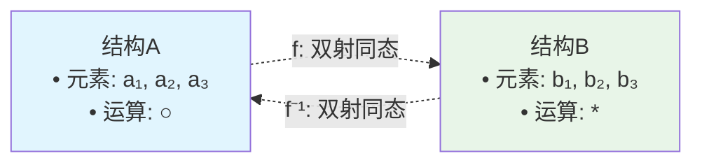
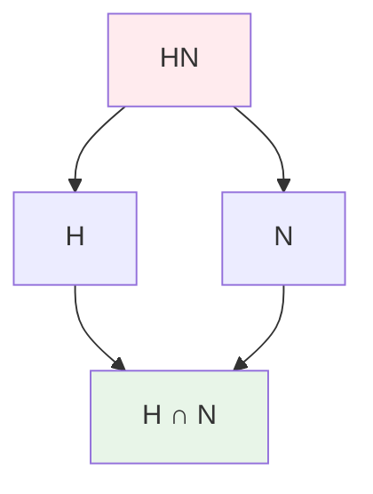

# 同构映射深度学习指南
## Isomorphism: 数学结构的完美对应

---

## 目录
1. [同构的本质与直观](#1-同构的本质与直观)
2. [同构的严格定义](#2-同构的严格定义)
3. [同构的基本性质](#3-同构的基本性质)
4. [各种结构中的同构](#4-各种结构中的同构)
5. [同构的判定方法](#5-同构的判定方法)
6. [重要的同构定理](#6-重要的同构定理)
7. [经典同构例子](#7-经典同构例子)
8. [同构不变量](#8-同构不变量)
9. [同构的构造方法](#9-同构的构造方法)
10. [同构在现代数学中的地位](#10-同构在现代数学中的地位)
11. [深度练习与思考](#11-深度练习与思考)

---

## 1. 同构的本质与直观

### 1.1 什么是同构？

**同构（Isomorphism）**是数学中最重要的概念之一，它描述了两个数学结构在本质上"完全相同"的关系。

#### 词源深度分析
- **Iso-**：希腊语 ἴσος (isos)，意为"相等的、相同的"
- **-morphism**：希腊语 μορφή (morphe)，意为"形状、结构"
- **完整含义**：具有相同结构的映射

### 1.2 哲学层面的理解

#### 柏拉图主义视角
同构体现了数学对象的"理念"层面：
- **形式与内容的分离**：同构的结构具有相同的"数学本质"
- **抽象与具体的统一**：不同的具体实现可能有相同的抽象结构

#### 结构主义观点
- **结构决定本质**：数学对象的本质在于其结构关系
- **内容无关性**：具体元素是什么不重要，重要的是关系模式

### 1.3 直观图像



**核心思想**：同构意味着可以建立完美的"字典"，将一个结构中的所有信息无损地翻译到另一个结构中。

---

## 2. 同构的严格定义

### 2.1 一般定义

设 (A, ○) 和 (B, *) 是两个代数结构，映射 f: A → B 称为**同构映射**，当且仅当：

1. **f 是双射**：既是单射又是满射
2. **f 是同态**：f(a ○ b) = f(a) * f(b) 对所有 a, b ∈ A 成立
3. **f⁻¹ 是同态**：f⁻¹(c * d) = f⁻¹(c) ○ f⁻¹(d) 对所有 c, d ∈ B 成立

### 2.2 等价表述

#### 表述1：逆映射存在且为同态
f: A → B 是同构 ⟺ 存在同态 g: B → A 使得：
- g ∘ f = id_A
- f ∘ g = id_B

#### 表述2：双射同态
f: A → B 是同构 ⟺ f 是双射且为同态

#### 表述3：范畴论表述
f: A → B 是同构 ⟺ f 是可逆态射

### 2.3 同构关系

#### 记号
- A ≅ B：A 与 B 同构
- A ≇ B：A 与 B 不同构

#### 同构关系的性质
1. **自反性**：A ≅ A（恒等映射是同构）
2. **对称性**：A ≅ B ⟹ B ≅ A（逆映射存在）
3. **传递性**：A ≅ B 且 B ≅ C ⟹ A ≅ C（同构复合）

**结论**：同构关系是等价关系，将所有代数结构划分为同构类。

---

## 3. 同构的基本性质

### 3.1 结构完全保持性

#### 运算保持
如果 f: A → B 是同构，则：
- f(a ○ b) = f(a) * f(b)（正向运算保持）
- f⁻¹(c * d) = f⁻¹(c) ○ f⁻¹(d)（逆向运算保持）

#### 特殊元素保持
- **单位元**：f(e_A) = e_B
- **零元**：f(0_A) = 0_B
- **逆元**：f(a⁻¹) = [f(a)]⁻¹

#### 子结构保持
- **子群对应**：H ≤ A ⟺ f(H) ≤ B
- **正规子群对应**：N ⊴ A ⟺ f(N) ⊴ B
- **商结构对应**：A/N ≅ B/f(N)

### 3.2 数值不变量保持

#### 群论中
- **阶**：|A| = |B|
- **元素的阶**：ord(a) = ord(f(a))
- **中心**：f(Z(A)) = Z(B)
- **换位子群**：f([A,A]) = [B,B]

#### 环论中
- **特征**：char(A) = char(B)
- **零因子**：a 是零因子 ⟺ f(a) 是零因子
- **单位**：a 可逆 ⟺ f(a) 可逆

### 3.3 复合与逆的性质

#### 同构的复合
如果 f: A → B 和 g: B → C 都是同构，则 g ∘ f: A → C 也是同构。

#### 同构的逆
如果 f: A → B 是同构，则 f⁻¹: B → A 也是同构。

---

## 4. 各种结构中的同构

### 4.1 群同构

#### 定义
群同构 φ: (G, ·) → (H, *) 满足：
- φ 是双射
- φ(a · b) = φ(a) * φ(b)

#### 重要例子
1. **指数同构**：(ℝ, +) ≅ (ℝ⁺, ·) 通过 x ↦ eˣ
2. **对数同构**：(ℝ⁺, ·) ≅ (ℝ, +) 通过 x ↦ ln x
3. **复数表示**：(ℂ*, ·) ≅ (ℝ⁺ × S¹, ·) 通过极坐标表示

#### 循环群的分类定理
- **有限循环群**：ℤ_n ≅ ℤ_m ⟺ n = m
- **无限循环群**：所有无限循环群都同构于 ℤ

### 4.2 环同构

#### 定义
环同构 f: (R, +, ·) → (S, +, ·) 满足：
- f 是双射
- f(a + b) = f(a) + f(b)
- f(a · b) = f(a) · f(b)
- f(1_R) = 1_S

#### 重要例子
1. **中国剩余定理**：ℤ/mnℤ ≅ ℤ/mℤ × ℤ/nℤ（当 gcd(m,n) = 1）
2. **复数构造**：ℂ ≅ ℝ[x]/(x² + 1)
3. **多项式环**：F[x,y] ≅ F[y,x]

### 4.3 域同构

#### 特殊性质
- 域同构保持所有域运算
- 有限域的同构：𝔽_pⁿ ≅ 𝔽_qᵐ ⟺ pⁿ = qᵐ

#### Galois理论中的同构
域扩张的自同构群称为Galois群，是代数数论的核心。

### 4.4 向量空间同构（线性同构）

#### 定义
线性同构 T: V → W 满足：
- T 是双射线性映射
- 存在逆映射 T⁻¹: W → V 也是线性的

#### 分类定理
有限维向量空间的同构分类：
```
V ≅ W ⟺ dim(V) = dim(W)
```

#### 矩阵表示
n 维向量空间都同构于 F^n。

### 4.5 拓扑空间同构（同胚）

#### 定义
同胚 f: X → Y 是连续双射，且 f⁻¹ 也连续。

#### 重要例子
- 开区间同胚：(0,1) ≅ ℝ
- 球面与立方体表面同胚

---

## 5. 同构的判定方法

### 5.1 必要条件检验

#### 基本数值不变量
1. **结构大小**：|A| = |B|
2. **运算表结构**：运算的基本性质
3. **特殊元素数量**：单位元、零元、幂等元等

#### 群论中的判定
1. **阶的分解**：群的阶必须相同
2. **元素阶的分布**：各阶元素的数量必须相同
3. **子群格结构**：子群的包含关系必须相同

### 5.2 构造性方法

#### 直接构造
1. **找到明显的双射**
2. **验证同态性质**
3. **检验逆映射的同态性**

#### 利用已知同构
1. **复合已知同构**
2. **利用同构定理**
3. **使用泛性质**

### 5.3 反例构造（证明不同构）

#### 找不变量差异
- 寻找一个结构具有而另一个不具有的性质
- 比较数值不变量

#### 具体例子
证明 ℤ₄ ≇ ℤ₂ × ℤ₂：
- ℤ₄ 有4阶元素，ℤ₂ × ℤ₂ 没有

---

## 6. 重要的同构定理

### 6.1 第一同构定理

#### 群版本
设 φ: G → H 是群同态，则：
```
G/ker(φ) ≅ Im(φ)
```

#### 环版本
设 f: R → S 是环同态，则：
```
R/ker(f) ≅ Im(f)
```

#### 几何解释
商掉核后得到的结构与像同构。

### 6.2 第二同构定理（钻石定理）

#### 陈述
设 H ≤ G，N ⊴ G，则：
```
H/(H ∩ N) ≅ HN/N
```

#### 图解


### 6.3 第三同构定理

#### 陈述
设 N ⊆ M 都是 G 的正规子群，则：
```
(G/N)/(M/N) ≅ G/M
```

#### 对应定理
G 的包含 N 的子群与 G/N 的子群一一对应。

---

## 7. 经典同构例子

### 7.1 数系中的同构

#### 复数的不同表示
1. **代数形式**：ℂ = {a + bi | a, b ∈ ℝ}
2. **矩阵表示**：ℂ ≅ {[a -b; b a] | a, b ∈ ℝ}
3. **极坐标形式**：ℂ* ≅ ℝ⁺ × S¹

#### 有理数的构造
ℚ ≅ (ℤ × ℤ*)/~，其中 (a,b) ~ (c,d) ⟺ ad = bc

### 7.2 几何中的同构

#### 仿射变换
n 维仿射空间的自同构群是仿射变换群。

#### 投影几何
射影平面的自同构是射影变换。

### 7.3 代数结构的同构

#### 矩阵环同构
M_n(F) ≅ End(F^n)（n×n 矩阵环同构于 n 维向量空间的自同态环）

#### 群环同构
对于有限群 G：ℂ[G] ≅ ⊕ᵢ M_{nᵢ}(ℂ)

### 7.4 函数空间的同构

#### 多项式空间
F[x] 的 n 次多项式子空间同构于 F^{n+1}

#### 连续函数空间
C([0,1]) 在不同拓扑下可能同构也可能不同构

---

## 8. 同构不变量

### 8.1 什么是同构不变量

**同构不变量**是在同构映射下保持不变的性质或数值。

#### 重要性
- 用于区分不同构的结构
- 用于分类数学对象
- 提供结构的本质特征

### 8.2 群论中的不变量

#### 基本不变量
1. **群的阶**：|G|
2. **元素的阶分布**：各阶元素的数量
3. **中心的阶**：|Z(G)|
4. **换位子群的阶**：|[G,G]|

#### 高级不变量
1. **同态群**：Hom(G, H)
2. **上同调群**：H^n(G, M)
3. **K-理论不变量**

### 8.3 环论中的不变量

#### 基本不变量
1. **环的特征**：char(R)
2. **单位群**：R*
3. **零因子集合**
4. **幂零根**：nil(R)

#### 交换环的不变量
1. **Krull维数**：dim(R)
2. **素理想的高度**
3. **正则性**

### 8.4 几何不变量

#### 拓扑不变量
1. **基本群**：π₁(X)
2. **同调群**：H_n(X)
3. **Euler特征数**：χ(X)

#### 微分几何不变量
1. **曲率**
2. **示性类**
3. **指标定理**

---

## 9. 同构的构造方法

### 9.1 直接构造法

#### 步骤
1. **定义映射**：f: A → B
2. **证明双射性**：单射 + 满射
3. **验证同态性**：运算保持
4. **检验逆映射**：f⁻¹ 也是同态

#### 例子：指数映射
构造 φ: (ℝ, +) → (ℝ⁺, ·)，φ(x) = eˣ
- 双射性：exp 严格单调递增
- 同态性：e^{x+y} = e^x · e^y

### 9.2 泛性质方法

#### 自由对象
利用自由群、自由环等的泛性质构造同构。

#### 商对象
通过适当的等价关系构造同构。

### 9.3 范畴论方法

#### 函子同构
利用函子的性质构造同构。

#### 自然同构
通过自然变换构造同构族。

### 9.4 递归构造

#### 归纳法
对结构的复杂度进行归纳构造。

#### 极限过程
通过极限过程构造无限结构的同构。

---

## 10. 同构在现代数学中的地位

### 10.1 结构数学的基础

#### Klein的Erlangen纲领
几何学是研究在某个变换群作用下的不变量。

#### Bourbaki学派
数学是研究结构的科学，同构是结构等价的标准。

### 10.2 范畴论中的同构

#### 对象的等价性
在范畴中，对象通过同构关系等价。

#### 函子的同构
函子之间的同构（自然同构）是范畴论的核心概念。

### 10.3 代数几何中的同构

#### 概形的同构
代数几何中的基本概念。

#### 层的同构
层论中的重要概念。

### 10.4 拓扑学中的同构

#### 同伦等价
比同胚更弱但更灵活的等价关系。

#### 同调同构
代数拓扑的核心工具。

---

## 11. 深度练习与思考

### 11.1 基础练习

#### 练习1：验证同构
证明 ℂ ≅ ℝ²（作为ℝ-向量空间）。

#### 练习2：构造同构
构造 ℤ₆ ≅ ℤ₂ × ℤ₃ 的显式同构。

#### 练习3：不同构证明
证明 ℚ ≇ ℝ（作为ℚ-向量空间）。

### 11.2 进阶练习

#### 练习4：矩阵群同构
证明 SL₂(ℝ) 的中心同构于 ℤ₂。

#### 练习5：多项式环同构
研究 F[x,y] 与 F[u,v] 的同构，其中 u = x+y, v = xy。

#### 练习6：拓扑群同构
证明 SO(2) ≅ S¹（作为拓扑群）。

### 11.3 研究性问题

#### 问题1：分类问题
分类所有阶为 12 的群，并确定哪些是同构的。

#### 问题2：函数域同构
研究代数函数域 F(x) 与 F(t) 的同构问题。

#### 问题3：无限维情形
研究无限维向量空间的同构分类问题。

### 11.4 哲学思考

#### 思考1：数学实在论
同构关系对数学对象的"存在性"意味着什么？

#### 思考2：结构主义
如何理解"数学就是研究结构"这一观点？

#### 思考3：计算复杂性
判定两个结构是否同构的计算复杂性如何？

---

## 12. 同构理论的前沿发展

### 12.1 高阶范畴论

#### ∞-范畴中的同构
同伦类型论中的等价关系。

#### 高阶同构
n-范畴中的 n-同构概念。

### 12.2 计算机科学中的应用

#### 图同构问题
计算复杂性理论中的重要问题。

#### 程序等价性
程序语义学中的同构概念。

### 12.3 物理学中的对称性

#### 规范理论
物理理论中的规范同构。

#### 量子群
量子力学中的对称性结构。

---

## 总结：同构的深层意义

同构不仅仅是一个技术概念，它体现了数学的几个核心思想：

### 🔍 **抽象的力量**
同构让我们看到表面不同的对象可能有相同的本质结构。

### 🌉 **统一的视角**
通过同构，不同领域的数学概念可以统一理解。

### 🎯 **分类的工具**
同构关系是数学对象分类的基本工具。

### 💡 **洞察的源泉**
识别同构往往带来深刻的数学洞察。

**最终思考**：在某种意义上，整个数学都可以看作是在寻找和研究各种同构关系。正如数学家所说："上帝创造了自然数，其余都是人的工作"——而这个"工作"的很大一部分，就是发现和构造各种同构。

---

## 参考文献

### 经典教材
1. **Mac Lane, S. & Birkhoff, G.** - *Algebra* (3rd ed., AMS Chelsea, 1999)
2. **Hungerford, T.W.** - *Algebra* (Springer GTM 73, 1974)
3. **Rotman, J.J.** - *An Introduction to the Theory of Groups* (4th ed., Springer GTM 148, 1995)

### 现代观点
1. **Awodey, S.** - *Category Theory* (2nd ed., Oxford Logic Guides 52, 2010)
2. **Riehl, E.** - *Category Theory in Context* (Dover, 2016)
3. **Leinster, T.** - *Basic Category Theory* (Cambridge Studies in Advanced Mathematics 143, 2014)

### 中文参考
1. **丘维声** - 《抽象代数基础》
2. **聂灵沼，丁石孙** - 《代数学引论》
3. **冯克勤** - 《代数数论》

---

*同构是数学美的体现——它揭示了看似不同的事物之间的深层统一性。掌握同构理论，就是掌握了理解数学本质的一把钥匙。* 