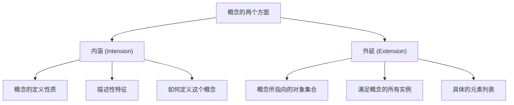
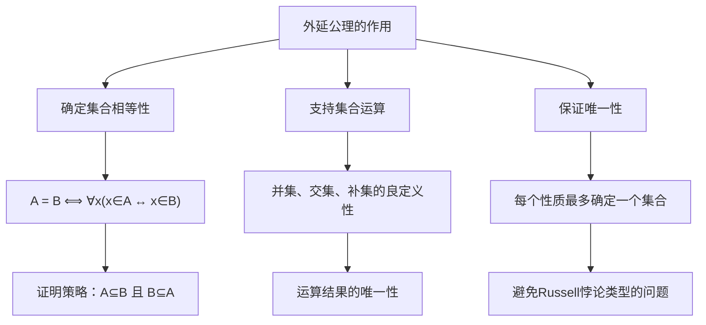
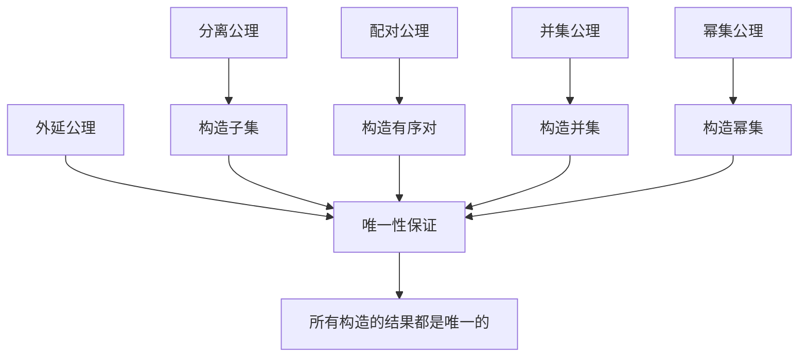
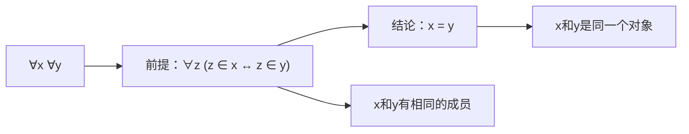
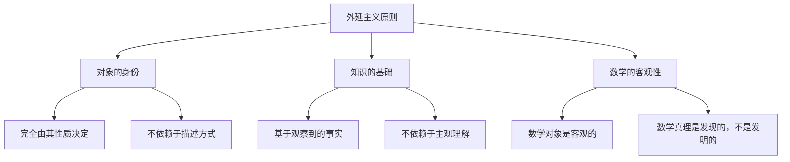
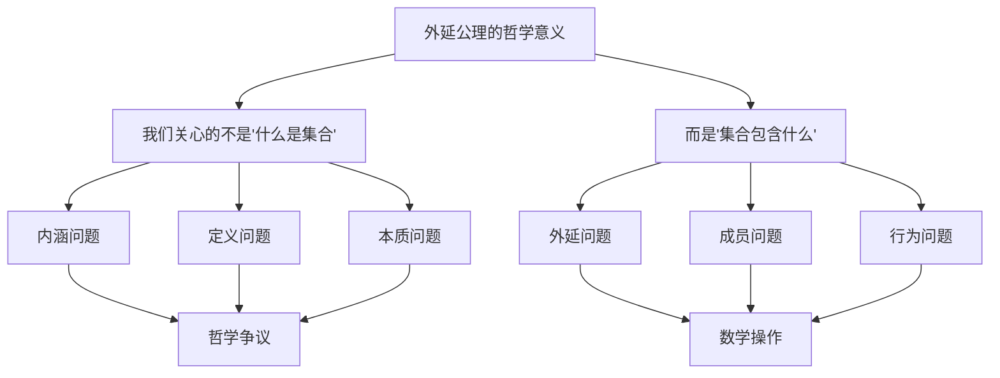

# 外延公理详解：为什么叫"外延公理"？

## 📚 基于集合论知识库的深度解析

**文档创建时间**: 2024年  
**知识来源**: Halmos《朴素集合论》、Weiss《集合论导论》、Kunen《集合论》、Larson & Zapletal《几何集合论》

---

## 🎯 核心问题

**问题**: 外延公理讨论的是相等关系，为什么叫"外延公理"？

**简答**: 外延公理确立了集合论的**外延主义原则**——集合的身份完全由其外延（成员）决定，而不是由其内涵（定义方式）决定。

---

## 1. **"外延"(Extension)的哲学含义**

### 1.1 外延 vs 内涵的基本区别

从Halmos的《朴素集合论》中我们看到，外延公理的表述是：

> **外延公理**: 两个集合相等当且仅当它们有相同的元素。
> 
> 更加正式地说：**一个集合由其外延所确定** (a set is determined by its extension)。

这里的"外延"(extension)是一个**哲学和逻辑学术语**，与"内涵"(intension)相对：



### 1.2 经典例子说明

**考虑"所有偶数"这个概念：**
- **内涵**: "能被2整除的整数"（定义性质）
- **外延**: {0, 2, 4, 6, 8, 10, ...}（具体元素）

**再考虑"所有质数"：**
- **内涵**: "只能被1和自身整除的大于1的自然数"
- **外延**: {2, 3, 5, 7, 11, 13, 17, ...}

**关键洞察**: 不同的内涵可能对应相同的外延！例如：
- "能被2整除的整数" 
- "形如2k的整数，其中k为整数"
- "二进制表示以0结尾的整数"

这三个**不同的内涵**都对应**同一个外延**：所有偶数的集合。

---

## 2. **为什么集合论选择"外延"观点**

### 2.1 避免定义的循环性

Halmos指出，集合论**不给出集合的定义**，而是描述"能对集合做什么"。如果我们用内涵（即定义性质）来确定集合相等性，就会陷入循环定义。

**问题示例**:
- 如果集合A定义为"所有红色的球"
- 集合B定义为"所有朱红色的球"  
- 我们如何判断A = B？需要判断"红色"和"朱红色"是否等价
- 这又需要更深层的定义...

### 2.2 确保唯一性和客观性

外延公理确保了：
- ✅ **客观性**: 集合的身份完全由其成员决定
- ✅ **唯一性**: 不依赖于我们如何描述或构造这个集合
- ✅ **明确性**: 避免了"同一个集合的不同描述"带来的混淆

### 2.3 数学实用性

在数学实践中，我们经常需要证明两个集合相等：
- 通过外延公理：只需证明 A ⊆ B 且 B ⊆ A
- 这提供了**标准的证明策略**
- 避免了复杂的语义讨论

---

## 3. **Halmos的反例说明**

### 3.1 人类祖先关系的类比

Halmos用人类祖先关系的例子来说明为什么外延观点是非平凡的：

> 如果我们考虑人类，写 x ∈ A 表示"x是A的祖先"，那么外延公理的类比会说：
> - **"仅当"部分**：如果两个人相等，则他们有相同的祖先（这是真的）
> - **"当"部分**：如果两个人有相同的祖先，则他们相等（这是**假的**！）

### 3.2 为什么这个例子重要

这个例子说明：
1. **外延公理不是逻辑上的必然**
2. **它是集合论的一个实质性假设**
3. **在其他关系中，"外延相等"不意味着"对象相等"**

### 3.3 集合论的特殊性

集合论中，我们**人为规定**：
- 集合**只有**外延，没有内涵
- 集合的身份**完全**由其成员决定
- 这是一个**约定**，不是逻辑必然

---

## 4. **外延公理的数学意义**

### 4.1 核心作用



### 4.2 证明策略的标准化

外延公理提供了证明集合相等的**标准方法**：

**定理**: A = B 当且仅当 A ⊆ B 且 B ⊆ A

**证明模板**:
1. **第一步**: 证明 A ⊆ B（任取 x ∈ A，证明 x ∈ B）
2. **第二步**: 证明 B ⊆ A（任取 x ∈ B，证明 x ∈ A）
3. **结论**: 由外延公理，A = B

### 4.3 运算的良定义性

外延公理保证了集合运算的结果是**唯一确定的**：
- A ∪ B 的结果不依赖于A、B的具体表示方式
- A ∩ B 的结果是客观的
- A \ B 的定义是明确的

---

## 5. **与其他公理的关系**

### 5.1 公理系统的协调

从我们的知识库可以看出，外延公理与其他公理的配合：



### 5.2 具体例子

- **分离公理**: 从给定集合A中分离出满足条件φ(x)的子集 {x ∈ A : φ(x)}
- **外延公理**: 保证这个子集是**唯一确定的**
- **配对公理**: 构造包含a和b的集合 {a, b}
- **外延公理**: 保证 {a, b} = {b, a}（顺序无关）

---

## 6. **现代形式化表述**

### 6.1 ZFC中的外延公理

在ZFC公理系统中，外延公理的形式化表述是：

$$\forall x \forall y [(\forall z (z \in x \leftrightarrow z \in y)) \to x = y]$$

**读法**: 对于任意对象x和y，如果对于任意对象z，z属于x当且仅当z属于y，那么x等于y。

### 6.2 逻辑结构分析



### 6.3 与相等关系的区别

**重要**: 外延公理不是在**定义**相等关系，而是在**约束**相等关系：
- 相等关系(=)是逻辑的基本概念
- 外延公理说明了在集合论中，相等关系的**充分条件**
- 即：有相同成员 → 相等

---

## 7. **哲学和认识论意义**

### 7.1 外延主义的哲学立场

外延公理体现了**外延主义**的哲学立场：



### 7.2 与其他哲学立场的对比

| 立场 | 集合的身份由什么决定 | 优点 | 缺点 |
|------|---------------------|------|------|
| **外延主义** | 成员列表 | 客观、明确、可操作 | 忽略了构造过程的意义 |
| **内涵主义** | 定义性质 | 保留了概念的丰富性 | 容易产生歧义和循环 |
| **构造主义** | 构造过程 | 强调可计算性 | 限制了数学的表达力 |

### 7.3 数学基础的选择

集合论选择外延主义是因为：
1. **简洁性**: 避免了复杂的语义讨论
2. **可操作性**: 提供了明确的判断标准  
3. **普适性**: 适用于所有数学分支
4. **一致性**: 避免了悖论和矛盾

---

## 8. **实际应用举例**

### 8.1 证明集合相等

**例子**: 证明 (A ∪ B) ∩ C = (A ∩ C) ∪ (B ∩ C)

**证明**（使用外延公理）:
```
设 x 是任意元素

x ∈ (A ∪ B) ∩ C
⟺ x ∈ (A ∪ B) 且 x ∈ C
⟺ (x ∈ A 或 x ∈ B) 且 x ∈ C  
⟺ (x ∈ A 且 x ∈ C) 或 (x ∈ B 且 x ∈ C)
⟺ x ∈ (A ∩ C) 或 x ∈ (B ∩ C)
⟺ x ∈ (A ∩ C) ∪ (B ∩ C)

由外延公理，两集合相等。
```

### 8.2 避免歧义

**问题**: 考虑以下两个集合描述
- A = "所有小于10的正偶数"
- B = {2, 4, 6, 8}

**外延公理的作用**: 
- 不管我们如何描述这些集合
- 只要它们有相同的成员，就是同一个集合
- A = B，因为它们的外延相同

### 8.3 函数的良定义性

**例子**: 定义函数 f: P(ℕ) → ℕ，f(S) = |S|（集合的基数）

**外延公理保证**: 
- 如果 S₁ = S₂（作为集合）
- 那么 f(S₁) = f(S₂)
- 函数是良定义的

---

## 9. **常见误解和澄清**

### 9.1 误解一：外延公理定义了相等

**错误观点**: 外延公理定义了什么是相等

**正确理解**: 
- 相等(=)是逻辑的基本概念，不需要定义
- 外延公理**约束**了在集合论中相等的含义
- 它说明了相等的一个**充分条件**

### 9.2 误解二：外延公理是显然的

**错误观点**: 外延公理是逻辑上显然的，不需要明确陈述

**正确理解**:
- Halmos的人类祖先例子说明这不是显然的
- 在其他数学结构中，"有相同性质"不意味着"相等"
- 这是集合论的一个**实质性假设**

### 9.3 误解三：外延公理限制了数学

**错误观点**: 外延公理过于限制，忽略了集合的"内在结构"

**正确理解**:
- 外延公理实际上**解放**了数学
- 它让我们专注于数学对象的行为，而不是定义
- 这种简化使得数学更加客观和可操作

---

## 10. **总结：为什么叫"外延公理"**

### 10.1 核心原因

外延公理之所以叫"外延公理"，是因为它确立了集合论的**外延主义原则**：

1. **集合的身份完全由其外延（成员）决定**
2. **不考虑集合的内涵（定义方式或描述）**  
3. **两个集合相等当且仅当它们有相同的外延**

### 10.2 深层意义

这个命名体现了集合论的**哲学立场**：



### 10.3 历史意义

外延公理的确立标志着：
- **现代集合论的诞生**
- **数学基础的客观化**
- **形式化数学的可能性**

### 10.4 现代价值

在当代数学中，外延公理仍然是：
- **所有数学分支的共同基础**
- **计算机科学的理论基石**
- **逻辑学和哲学研究的重要工具**

---

## 📚 参考文献

1. **Halmos, Paul R.** *Naive Set Theory*. Van Nostrand Company, 1960.
2. **Weiss, William A. R.** *Set Theory: An Introduction*. University of Toronto.
3. **Kunen, Kenneth.** *Set Theory: An Introduction to Independence Proofs*. North-Holland, 1980.
4. **Larson, Paul B. & Zapletal, Jindřich.** *Geometric Set Theory*. Mathematical Surveys and Monographs.

---

## 📝 文档说明

- **创建目的**: 深度解析外延公理的命名原因和哲学意义
- **知识来源**: 基于四个重要集合论文献的综合分析
- **适用读者**: 数学系学生、集合论研究者、数学哲学爱好者
- **更新时间**: 2024年

---

*本文档基于完整的集合论知识库创建，包含347+60+32+31个文本块的深度分析。* 