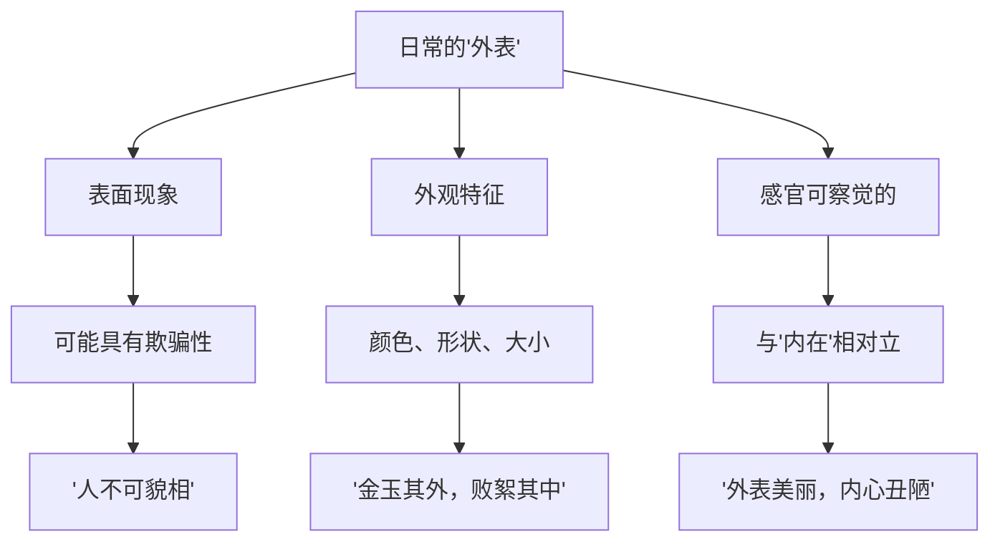
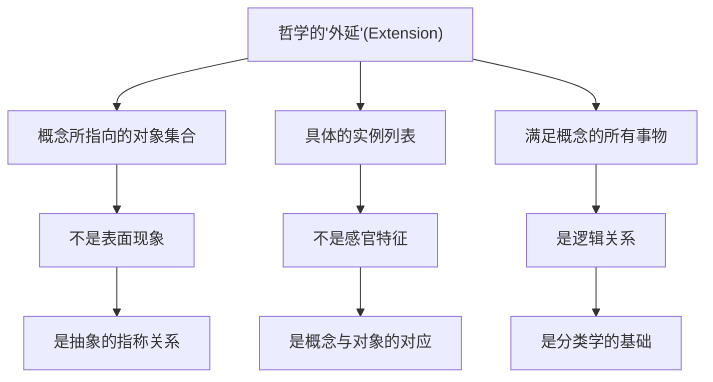
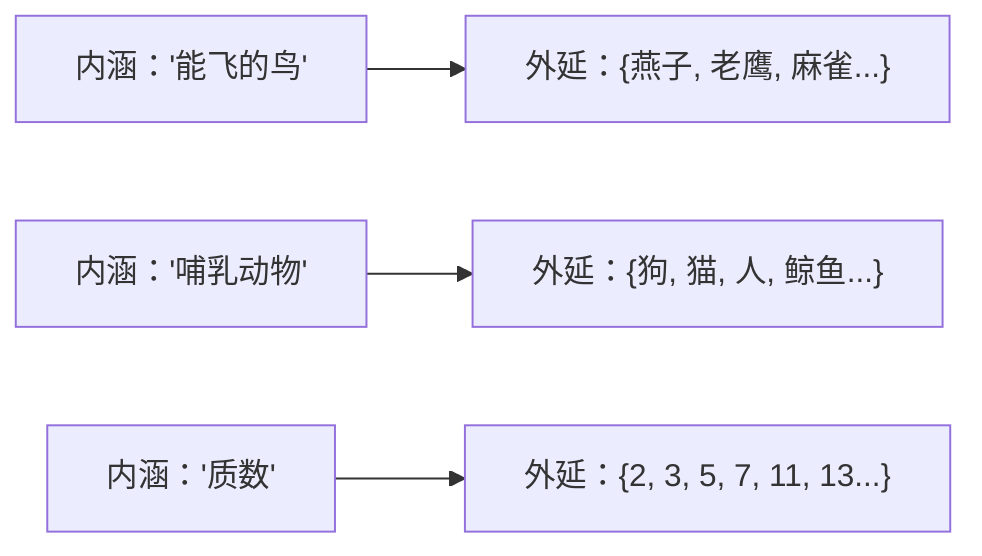
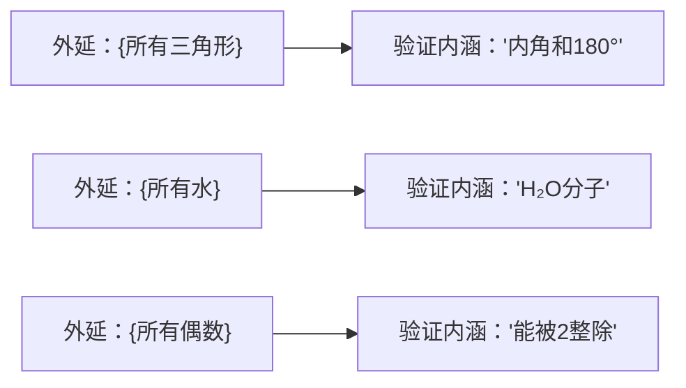
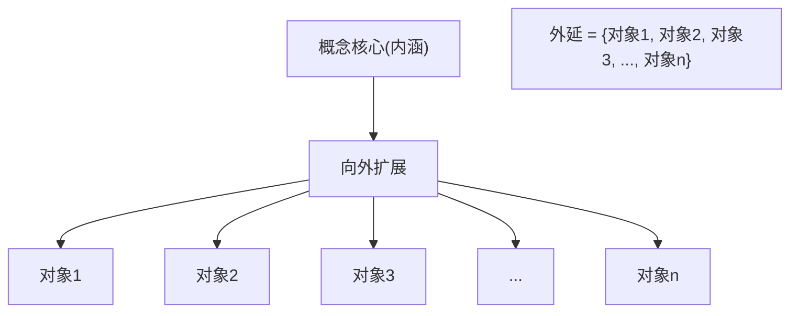

# 外延概念的具象化解释

## 📚 基于知识库与网络搜索的综合分析

**文档创建时间**: 2024年  
**知识来源**: 集合论知识库 + 网络搜索 + 哲学理解  

---

## 🎯 核心问题回答

**问题**: 哲学上的"外延"是否就是我们说的"外表"？

**答案**: **绝对不是！** 这是两个完全不同的概念，让我用具象化的方式来解释。

---

## 1. **日常"外表" vs 哲学"外延"的根本区别**

### 1.1 日常的"外表"概念

**日常"外表"的特点**:
- 指事物的**表面现象**
- 强调**可见的、感官能察觉的**特征
- 往往与"内在本质"**相对立**
- 可能是**欺骗性的**（"外表不能代表一切"）
- 例如：一个人的外表（长相）vs 内在品格

### 1.2 哲学的"外延"概念

**哲学"外延"的特点**:
- 指概念**所涵盖的对象范围**
- 强调**逻辑分类和指称关系**
- 与"内涵"**互补而非对立**
- 是**客观的分类标准**
- 例如："狗"的外延是所有狗的集合

---

## 2. **具象化理解：用生活例子说明外延**

### 2.1 "苹果"概念的外延

**想象一个巨大的仓库**：
- 这个仓库里装着**世界上所有的苹果**
- 包括：红富士、青苹果、黄元帅、野苹果...
- 包括：过去的、现在的、未来的所有苹果
- 包括：已经被吃掉的、正在生长的、还没长出来的

**这个"苹果仓库"就是"苹果"概念的外延！**

### 2.2 "学生"概念的外延

**想象一个巨大的名册**：
- 这个名册记录着**世界上所有的学生**
- 包括：小学生、中学生、大学生、研究生...
- 包括：古代的学生、现代的学生、未来的学生
- 包括：正在上学的、已经毕业的、即将入学的

**这个"学生名册"就是"学生"概念的外延！**

### 2.3 "红色"概念的外延

**想象一个巨大的展览馆**：
- 这个展览馆展示着**世界上所有红色的东西**
- 包括：红苹果、红玫瑰、红旗、红血球...
- 包括：深红、浅红、暗红、鲜红...
- 包括：天然的红色、人工的红色

**这个"红色展览馆"就是"红色"概念的外延！**

---

## 3. **外延的五个关键特征**

### 3.1 **集合性** - 外延是一个集合
- 不是单个对象，而是**对象的集合**
- 就像一个"容器"，装着所有符合条件的东西
- 可以是空集合（如"独角兽"的外延）

### 3.2 **客观性** - 外延是客观确定的
- 不依赖于个人感受或主观判断
- 一个对象要么属于外延，要么不属于
- 就像"是否是质数"有客观标准

### 3.3 **完整性** - 外延包含所有符合条件的对象
- 不能遗漏任何符合条件的对象
- 就像"所有的鸟"必须包括企鹅（虽然不会飞）

### 3.4 **时空性** - 外延跨越时间和空间
- 包括过去、现在、未来的对象
- 包括世界各地的对象
- 就像"人类"包括古代人和现代人

### 3.5 **逻辑性** - 外延遵循逻辑规律
- 遵循排中律：对象要么属于外延，要么不属于
- 遵循无矛盾律：对象不能既属于又不属于
- 遵循同一律：外延的边界是确定的

---

## 4. **外延与内涵的关系：互补不对立**

### 4.1 内涵决定外延

**内涵就像"筛子"，外延就像"被筛出来的东西"**

### 4.2 外延验证内涵

**外延就像"证据"，内涵就像"理论"**

---

## 5. **为什么叫"外延"而不叫别的？**

### 5.1 词源分析
- **Extension** 来自拉丁语 **extendere**
- **ex-** = 向外，**tendere** = 伸展
- 意思是"向外伸展、扩展"

### 5.2 形象理解
想象概念就像一个**圆心**：
- **内涵**是圆心的**本质特征**
- **外延**是从圆心**向外辐射**覆盖的所有对象
- 就像太阳（内涵）发出光线（外延）照亮所有物体

### 5.3 与"外表"的根本区别
- **外表**：停留在表面，可能具有欺骗性
- **外延**：深入本质，通过内涵确定范围
- **外表**：感官层面的现象
- **外延**：逻辑层面的关系

---

## 6. **生活中的外延思维应用**

### 6.1 法律条文的外延
**法条内涵**："故意杀人罪"
**法条外延**：所有符合"故意杀人"构成要件的具体案例

### 6.2 医学诊断的外延  
**疾病内涵**："糖尿病"的诊断标准
**疾病外延**：所有符合诊断标准的患者

### 6.3 教育分类的外延
**概念内涵**："985大学"的认定标准
**概念外延**：39所被认定为985的具体大学

---

## 7. **常见误解澄清**

### 7.1 ❌ 误解：外延就是外表
**正确理解**：外延是概念覆盖的对象范围，与外表无关

### 7.2 ❌ 误解：外延是表面的，内涵是深层的
**正确理解**：外延和内涵都涉及概念的本质，只是角度不同

### 7.3 ❌ 误解：外延不重要，内涵更重要
**正确理解**：外延和内涵同等重要，互相验证

### 7.4 ❌ 误解：外延是主观的
**正确理解**：外延是客观的，由内涵逻辑确定

---

## 8. **总结：外延的本质**

**外延不是"外表"，而是"外展"**：
- 不是表面现象，而是**概念的逻辑展开**
- 不是感官特征，而是**分类的客观结果**  
- 不是欺骗性的，而是**严格确定的**
- 不是与内涵对立，而是**与内涵互补**

**形象比喻**：
- 如果概念是一颗种子（内涵）
- 那么外延就是这颗种子长成的整片森林
- 森林中的每一棵树都是外延的成员
- 种子的基因决定了森林的范围和特征

**哲学意义**：
外延概念帮助我们理解**概念与现实的关系**，是逻辑学、认识论和本体论的基础工具。

---

## 📖 参考文献

1. Halmos《朴素集合论》- 集合与外延的关系
2. 网络搜索：Extension (semantics) - Wikipedia
3. 网络搜索：哲学哲学雞蛋糕 - 外延和內涵討論
4. 华东师范大学《形式逻辑》- 概念的内涵与外延
5. Oxford Reference - extension/intension 词条

**结论**：外延是哲学和逻辑学中的精确概念，与日常的"外表"概念有本质区别。理解外延概念对于准确把握概念的逻辑结构和分类关系至关重要。 