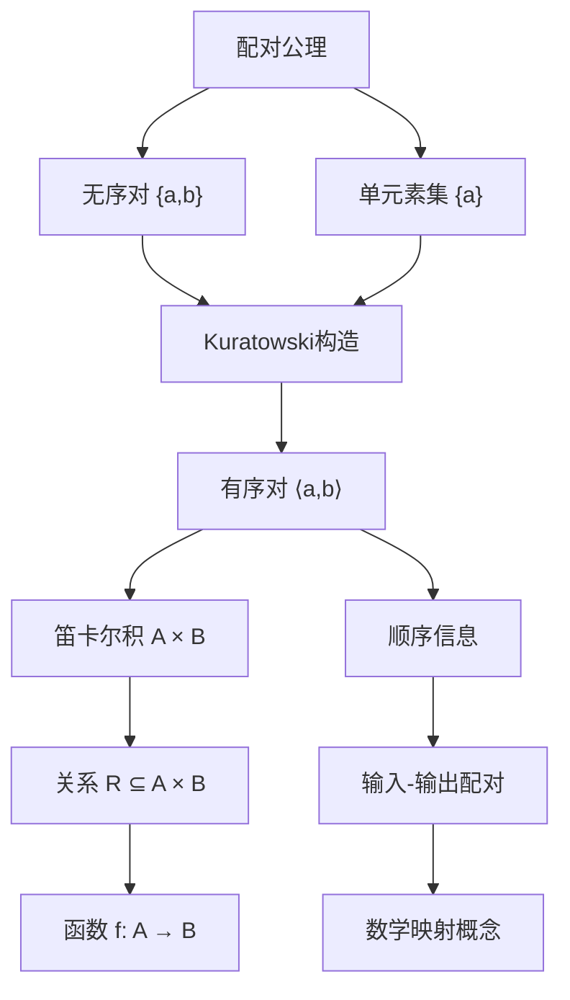
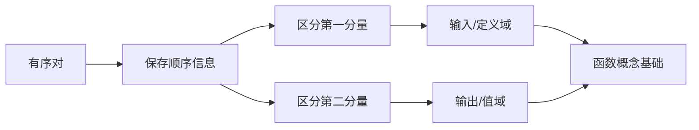
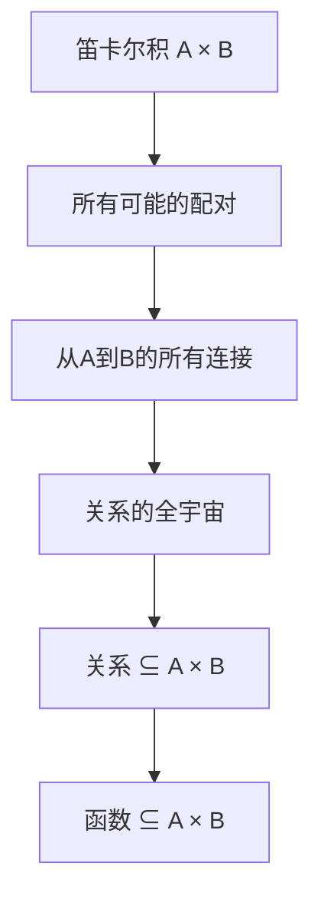
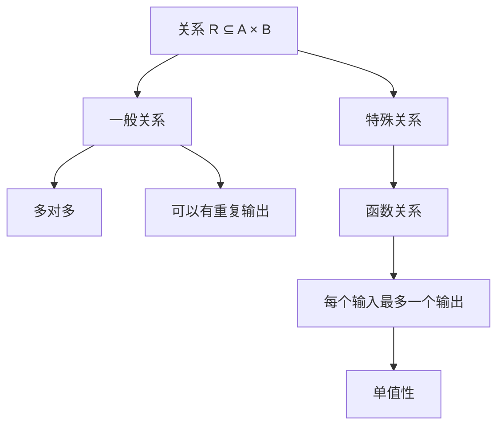
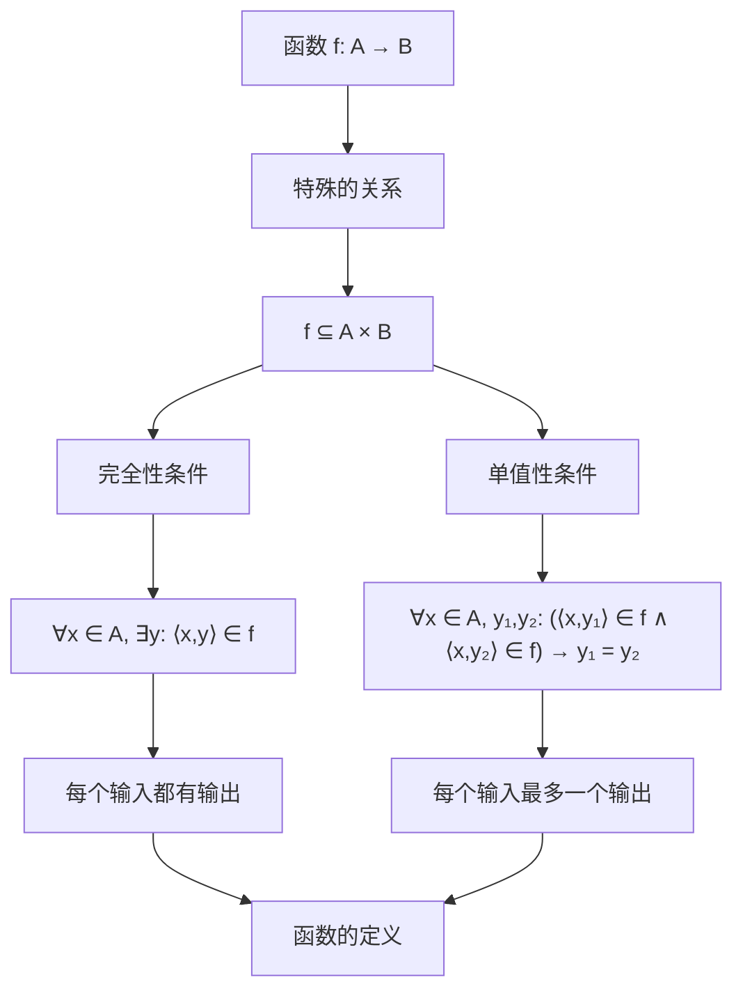
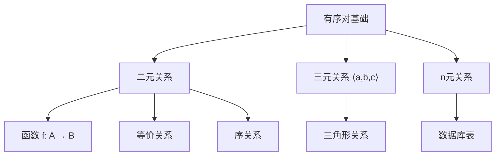
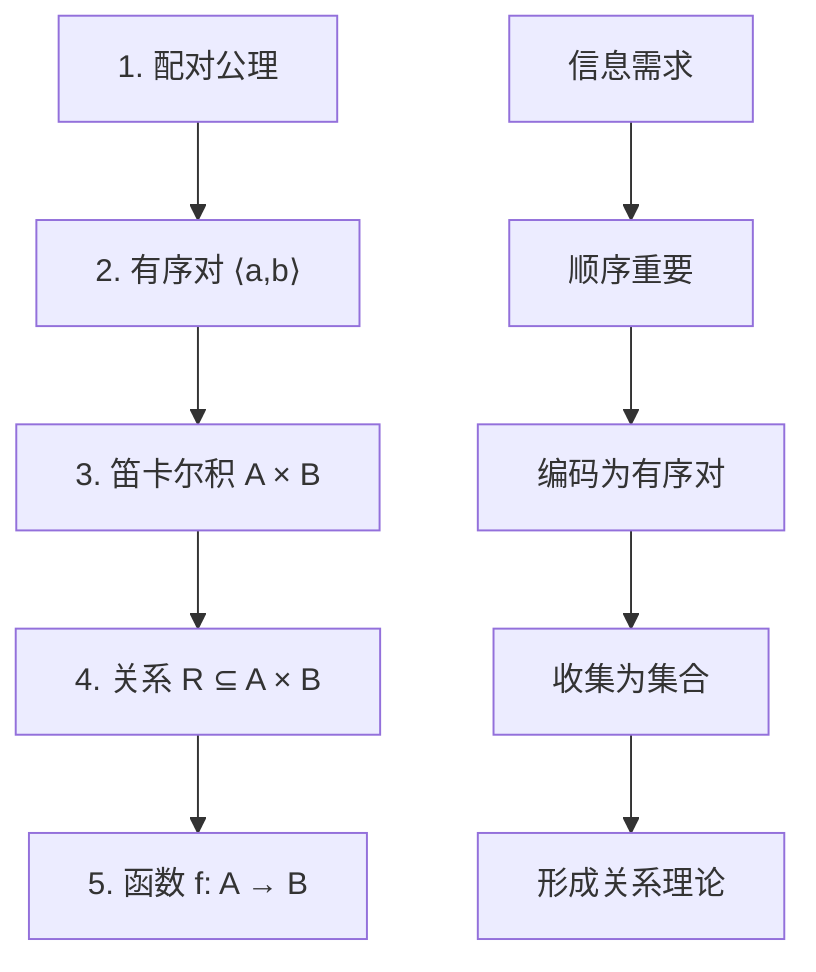
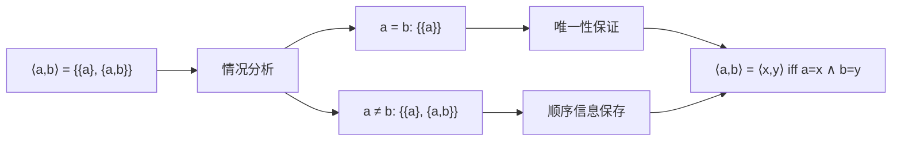
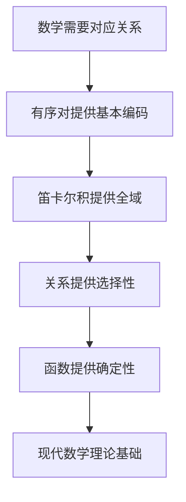

# 有序对与关系函数基础解析

## 📚 概述

**核心问题**: 为什么有序对是关系和函数基础？它与笛卡尔积又是什么关系？

**答案**: 有序对提供了"顺序信息"的数学表示，笛卡尔积是所有可能有序对的集合，关系是笛卡尔积的子集，函数是满足特殊条件的关系。这形成了现代数学中关系和函数理论的基石。

---

## 🏗️ 概念层次结构



---

## 1. **有序对：顺序的数学化**

### 1.1 为什么需要有序对？

**问题**: 无序对 `{a,b}` 无法区分顺序：
- `{3,5} = {5,3}` （无序性）
- 但在很多数学概念中，顺序很重要：
  - 坐标点 `(3,5)` ≠ `(5,3)`
  - 函数关系 `f(x) = y` 中 `x` 是输入，`y` 是输出

**解决方案**: Kuratowski有序对定义：
$$\langle a,b \rangle = \{\{a\}, \{a,b\}\}$$

**中文读法**: 有序对⟨a,b⟩等于集合{单元素集{a}, 无序对{a,b}}。

### 1.2 有序对的关键性质

**特征化性质**:
$$\langle a,b \rangle = \langle x,y \rangle \iff a = x \land b = y$$

**中文读法**: 有序对⟨a,b⟩等于有序对⟨x,y⟩当且仅当a等于x且b等于y。

**证明思路**:
```
情况1: a = b 时，⟨a,b⟩ = {{a},{a,b}} = {{a}}
情况2: a ≠ b 时，⟨a,b⟩ = {{a},{a,b}} 
通过分析这两种情况可以严格证明特征化性质
```

### 1.3 有序对的核心价值



---

## 2. **笛卡尔积：所有可能的配对**

### 2.1 定义与构造

**笛卡尔积**:
$$A \times B = \{p : \exists x \in A \exists y \in B \, p = \langle x,y \rangle\}$$

**中文读法**: A×B等于集合{p : 存在x属于A且存在y属于B使得p等于有序对⟨x,y⟩}。

**具体例子**:

- $A = \{1,2\}$, $B = \{a,b\}$
- $A \times B = \{\langle 1,a \rangle, \langle 1,b \rangle, \langle 2,a \rangle, \langle 2,b \rangle\}$

### 2.2 笛卡尔积的意义



**几何直观**:

- $\mathbb{R} \times \mathbb{R} = \mathbb{R}^2$ （平面上所有点）
- 每个点 `⟨x,y⟩` 代表一个坐标
- 函数图像是这个平面的特殊子集

### 2.3 大小关系

$$|A \times B| = |A| \cdot |B|$$

**例子**:

- $|\{1,2\} \times \{a,b,c\}| = 2 \times 3 = 6$
- $|\mathbb{N} \times \mathbb{N}| = \aleph_0$ （可数无穷）

---

## 3. **关系：有选择性的配对**

### 3.1 关系的定义

**关系**:
$$R \subseteq A \times B$$

**中文读法**: 关系R是A×B的子集。

**直观理解**: 关系是从笛卡尔积中"挑选"出来的有序对集合。

### 3.2 关系的类型



**例子**:

- **一般关系**: "小于" $< \subseteq \mathbb{N} \times \mathbb{N}$
  - $\{⟨1,2⟩, ⟨1,3⟩, ⟨2,3⟩, ⟨2,4⟩, ...\}$
  - 一个输入可以对应多个输出

- **函数关系**: $f = \{⟨1,2⟩, ⟨2,4⟩, ⟨3,6⟩\}$ （$f(x) = 2x$）
  - 每个输入最多对应一个输出

### 3.3 关系的运算

**定义域**: $\text{dom}(R) = \{x : \exists y \, \langle x,y \rangle \in R\}$

**值域**: $\text{ran}(R) = \{y : \exists x \, \langle x,y \rangle \in R\}$

**复合**: $(S \circ R) = \{\langle x,z \rangle : \exists y (\langle x,y \rangle \in R \land \langle y,z \rangle \in S)\}$

---

## 4. **函数：单值关系**

### 4.1 函数的精确定义

**函数**: 
$$f: A \to B \text{ 当且仅当 } f \subseteq A \times B \land \forall x \in A \exists! y \in B \, \langle x,y \rangle \in f$$

**中文读法**: f是从A到B的函数当且仅当f是A×B的子集且对A中每个x都存在唯一的y属于B使得⟨x,y⟩属于f。

### 4.2 函数的本质



### 4.3 函数记号的意义

**传统记号**: $f(x) = y$

**集合论解释**: $\langle x,y \rangle \in f$

**等价性**: $f(x) = y \iff \langle x,y \rangle \in f$

---

## 5. **为什么有序对是基础？**

### 5.1 信息编码能力


**例子**:

- **物理**: 时间 → 位置关系编码为 `{⟨t₁,x₁⟩, ⟨t₂,x₂⟩, ...}`
- **计算**: 程序函数编码为 `{⟨input₁,output₁⟩, ⟨input₂,output₂⟩, ...}`
- **几何**: 函数图像编码为 `{⟨x,f(x)⟩ : x ∈ domain}`

### 5.2 统一的理论框架

**好处**:

1. **统一性**: 所有关系概念都基于有序对
2. **可操作性**: 可以用集合运算处理关系
3. **可扩展性**: 可以定义高阶关系（n元关系）



### 5.3 现代数学的需求

**抽象代数**: 群、环、域的运算都是函数
**分析学**: 连续性、可微性都依赖函数概念
**拓扑学**: 连续映射是拓扑空间间的函数
**逻辑学**: 解释函数、真值函数

---

## 6. **概念关系总结**

### 6.1 层次关系



### 6.2 依赖关系

| 概念 | 定义基础 | 核心特征 | 数学意义 |
|------|----------|----------|----------|
| **有序对** | 配对公理 + Kuratowski构造 | 保存顺序信息 | 关系表示的原子单位 |
| **笛卡尔积** | 有序对 + 分离公理 | 所有可能配对 | 关系定义的全域 |
| **关系** | 笛卡尔积的子集 | 选择性配对 | 一般的对应关系 |
| **函数** | 特殊关系 | 单值完全关系 | 确定性映射 |

### 6.3 应用实例

**微积分中的函数**:
```
f(x) = x² 在集合论中表示为：
f = {⟨x, x²⟩ : x ∈ ℝ} ⊆ ℝ × ℝ
```

**线性代数中的线性变换**:
```
T: ℝ² → ℝ² 表示为：
T = {⟨⟨x,y⟩, ⟨ax+by, cx+dy⟩⟩ : ⟨x,y⟩ ∈ ℝ²}
```

**数据库中的关系**:
```
学生-成绩关系：
R = {⟨张三, 95⟩, ⟨李四, 87⟩, ⟨王五, 92⟩}
```

---

## 7. **深入理解要点**

### 7.1 为什么不直接定义函数？

**历史问题**: 早期数学中，函数概念基于"变化量依赖关系"，不够精确

**现代解决**: 通过有序对→笛卡尔积→关系→函数的层次化定义，提供了：

- **精确性**: 完全形式化的定义
- **统一性**: 所有类型的对应关系统一处理
- **可操作性**: 可以用集合论工具分析

### 7.2 有序对构造的天才之处

**Kuratowski构造的巧妙**:

- 用无序集合构造有序结构
- 满足有序对的核心性质
- 在ZFC框架内完全可定义



### 7.3 现代数学的基石地位

**所有数学分支都依赖于此**:

- **代数**: 群的运算表、环的加法乘法
- **几何**: 坐标系统、变换
- **分析**: 函数的极限、连续性
- **概率**: 随机变量、分布函数
- **计算机科学**: 算法、数据结构

---

## 🎯 总结

**核心洞察**: 有序对是关系和函数基础，因为它提供了数学中最基本的"对应关系"表示方法。笛卡尔积收集所有可能的有序对，关系从中选择特定的配对，函数进一步要求每个输入最多有一个输出。

这个层次化的构造不仅解决了数学严格性的问题，更重要的是为现代数学提供了统一的理论框架，使得所有的对应、映射、变换概念都有了坚实的集合论基础。

