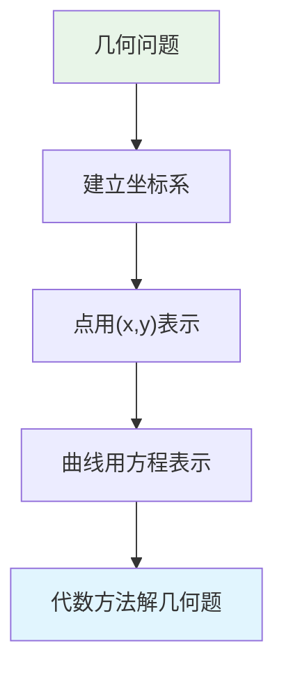
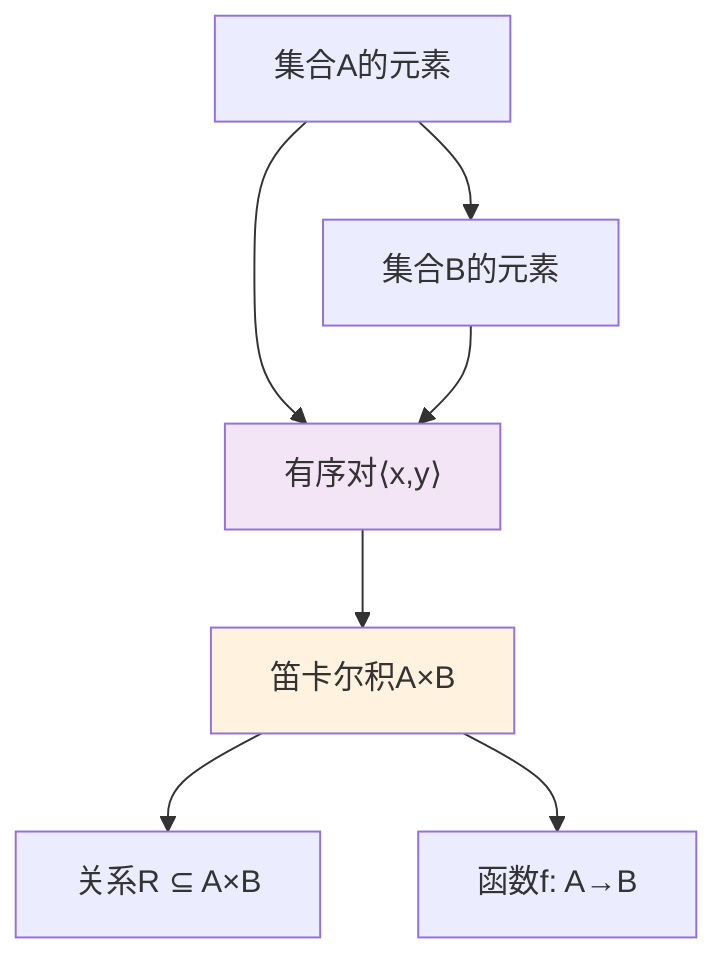
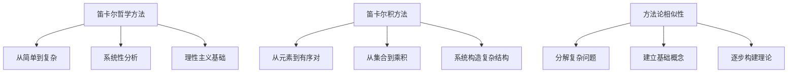
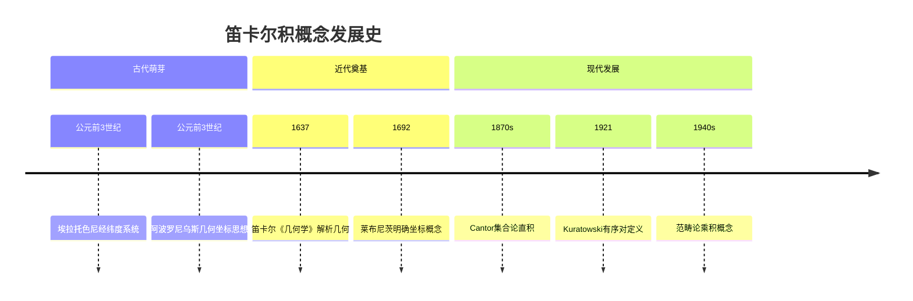

# 笛卡尔积的历史起源与概念发展

## 引言

笛卡尔积是现代数学中的基础概念，但很多人不知道这个概念是如何产生的，为什么叫"笛卡尔积"。本文将详细追溯笛卡尔积的历史来源、概念发展和深层哲学意义。

---

## 1. 现代定义回顾

### 1.1 集合论定义

**笛卡尔积**：给定两个集合A和B，它们的笛卡尔积定义为：
$$A \times B = \{(x,y) : x \in A \land y \in B\}$$

或者用有序对的形式：
$$A \times B = \{\langle x,y \rangle : x \in A \land y \in B\}$$

### 1.2 具体例子

- 如果 $A = \{1,2\}$，$B = \{a,b\}$
- 那么 $A \times B = \{(1,a), (1,b), (2,a), (2,b)\}$

### 1.3 几何直观

- $\mathbb{R} \times \mathbb{R} = \mathbb{R}^2$ 表示平面上所有点
- 每个点 $(x,y)$ 代表一个坐标位置

---

## 2. 历史起源：René Descartes (1596-1650)

### 2.1 笛卡尔的生平背景

**René Descartes**（勒内·笛卡尔）：
- **生卒年**：1596年3月31日 - 1650年2月11日
- **出生地**：法国拉海（现改名为笛卡尔镇以纪念他）
- **教育**：耶稣会拉弗莱什学院
- **特点**：身体虚弱，老师允许他睡到上午晚些时候
- **职业**：哲学家、数学家、物理学家

### 2.2 《La Géométrie》的诞生 (1637)

#### 历史背景
- 1637年，笛卡尔发表《方法论》
- 包含三个附录：光学、气象学、**几何学**
- 《几何学》(La Géométrie) 奠定了解析几何基础

#### 核心贡献
1. **代数记号系统**：
   - 用 a, b, c 表示已知量（常数）
   - 用 x, y, z 表示未知量（变量）
   - 这个传统延续至今

2. **几何代数化**：
   - 将几何问题转化为代数方程
   - 用方程描述曲线
   - 例如：圆的方程 $x^2 + y^2 = r^2$

### 2.3 著名的"苍蝇传说"

#### 传说内容
根据传说，笛卡尔躺在床上观察天花板上爬行的苍蝇，思考如何用数字描述苍蝇的位置：
- 选择天花板的一个角作为参考点
- 水平方向数瓷砖数量
- 垂直方向数瓷砖数量
- 两个数字就能精确描述苍蝇位置

#### 历史真实性
- 这个传说虽然生动，但缺乏史料证实
- 更可能是后人为了便于理解而创造的故事
- 笛卡尔的真实贡献在于系统的数学方法

### 2.4 重要澄清

**笛卡尔本人的局限**：
1. 没有明确使用"坐标"(coordinate)概念
2. 只是将 x, y 视为可变的长度
3. 没有建立现代意义的坐标系
4. 没有定义笛卡尔积

---

## 3. 概念发展：从坐标到笛卡尔积

### 3.1 Gottfried Leibniz 的贡献 (1692)

**莱布尼茨的系统化**：
- 1692年发表论文，首次明确使用：
  - **coordinata** (坐标)
  - **abscissa** (横坐标)
  - **ordinata** (纵坐标)
  - **functiones** (函数)

**意义**：真正建立了现代坐标系概念

### 3.2 早期先驱

#### 埃拉托色尼 (约公元前276-194年)
- **贡献**：创建世界地图，使用经纬度系统
- **意义**：这是最早的正交坐标系应用
- **特点**：球面坐标投影到平面，形成笛卡尔坐标系

#### 阿波罗尼乌斯 (约公元前262-190年)
- **著作**：《圆锥曲线论》
- **贡献**：几何学中的坐标思想萌芽
- **局限**：没有发展成系统理论

### 3.3 19世纪集合论革命

#### Georg Cantor (1845-1918)
- **贡献**：系统化集合理论
- **创新**：引入集合的直积概念
- **影响**：为笛卡尔积提供集合论基础

#### 集合论发展
- **无限集合**：$\mathbb{N} \times \mathbb{N}$ 的可数性
- **基数理论**：$|A \times B| = |A| \cdot |B|$
- **拓扑应用**：乘积拓扑空间

### 3.4 20世纪公理化

#### 有序对的严格定义
**Kuratowski构造** (1921)：
$$\langle x,y \rangle = \{\{x\}, \{x,y\}\}$$

**重要性质**：
- $\langle x,y \rangle = \langle u,v \rangle \iff x = u \land y = v$
- 保证有序对的唯一性和顺序性

#### ZFC公理系统
- **配对公理**：保证 $\{x,y\}$ 的存在
- **分离公理**：定义笛卡尔积
- **替换公理**：构造无限笛卡尔积

---

## 4. 概念演进的三个层次

### 4.1 几何层面 (17世纪)

**特点**：
- **目标**：用数字描述几何图形
- **方法**：建立参考系，用数对表示位置
- **成果**：解析几何的诞生

### 4.2 集合论层面 (19-20世纪)

**特点**：
- **目标**：严格定义数学对象
- **方法**：用集合语言重新表述
- **成果**：现代笛卡尔积定义

### 4.3 应用层面 (现代)

**关系理论**：
- 二元关系：$R \subseteq A \times B$
- 等价关系、序关系、函数关系

**函数定义**：
- 函数 $f: A \to B$ 本质上是 $A \times B$ 的特殊子集
- 满足单值性：$\forall x \in A, \exists! y \in B, (x,y) \in f$

**拓扑学**：
- 乘积拓扑：$(X \times Y, \tau_X \times \tau_Y)$
- Tychonoff定理

**代数结构**：
- 直积群：$(G \times H, \cdot)$
- 直积环、直积模

---

## 5. 为什么叫"笛卡尔积"？

### 5.1 哲学方法论的对应

#### 笛卡尔哲学的四个原则（《方法论》1637）

1. **明证性原则**：只接受清楚明白的真理
2. **分析原则**：将复杂问题分解为简单部分
3. **综合原则**：从简单到复杂，逐步构建知识
4. **枚举原则**：全面检查，确保不遗漏

#### 笛卡尔积方法的对应

### 5.2 哲学与数学的深层联系

#### 认识论对应
- **自我（ego）** ↔ **原点（origin）**
- **上帝（无限）** ↔ **坐标轴（无限延伸）**
- **世界（可认识）** ↔ **坐标空间（可描述）**

#### 构造方法对应
1. **起点确定**：选择最可靠的基础（自我/原点）
2. **系统扩展**：通过确定的方法扩展（理性/坐标）
3. **普遍描述**：覆盖整个认识对象（世界/空间）

### 5.3 现代数学中的体现

**统一性**：笛卡尔积为现代数学提供统一框架
- 关系、函数、拓扑、代数都基于笛卡尔积
- 体现了笛卡尔"统一科学"的理想

**系统性**：从简单到复杂的构造方法
- 元素 → 有序对 → 关系 → 函数 → 复杂结构
- 符合笛卡尔的方法论原则

---

## 6. 现代发展与应用

### 6.1 范畴论中的乘积

**范畴论观点**：
- 笛卡尔积是范畴中的乘积对象
- 具有泛性质（universal property）
- 推广到任意范畴

### 6.2 计算机科学应用

**数据结构**：
- 记录类型：不同类型的笛卡尔积
- 数据库：关系表是笛卡尔积的子集
- 程序语言：元组、结构体

**图形学**：
- 坐标变换
- 3D建模
- 计算机动画

### 6.3 物理学应用

**相空间**：
- 位置空间 × 动量空间
- 量子力学中的希尔伯特空间
- 统计力学中的相空间积分

---

## 7. 学习要点总结

### 7.1 历史发展脉络

### 7.2 核心概念理解

1. **定义本质**：所有可能的有序配对
2. **构造方法**：有序对的集合
3. **哲学意义**：系统性组合的体现
4. **应用价值**：现代数学的基础工具

### 7.3 常见误解澄清

**误解1**：笛卡尔直接发明了笛卡尔积
- **真相**：笛卡尔建立了坐标系思想，笛卡尔积是后续发展

**误解2**：笛卡尔积只是几何概念
- **真相**：它是纯集合论概念，有广泛应用

**误解3**：有序对就是集合 {x,y}
- **真相**：有序对保持顺序，{x,y} = {y,x} 但 ⟨x,y⟩ ≠ ⟨y,x⟩

### 7.4 深入思考问题

1. 为什么需要有序对而不是无序对？
2. 笛卡尔积与函数概念有什么关系？
3. 如何理解笛卡尔积的哲学意义？
4. 笛卡尔积在现代数学中扮演什么角色？

---

## 8. 参考文献与延伸阅读

### 8.1 经典文献
- Descartes, R. (1637). *La Géométrie*
- Leibniz, G.W. (1692). "De linea ex lineis numero infinitis..."
- Cantor, G. (1874). "Über eine Eigenschaft des Inbegriffes..."

### 8.2 现代教材
- Halmos, P. *Naive Set Theory*
- Kuratowski, K. *Introduction to Set Theory and Topology*
- Mac Lane, S. *Categories for the Working Mathematician*

### 8.3 哲学研究
- 关于笛卡尔方法论与数学方法的关系
- 解析几何的认识论意义
- 现代数学基础的哲学思考

---

## 结语

笛卡尔积的概念虽然以笛卡尔命名，但它的发展经历了从几何直观到抽象集合论的漫长历程。理解这个概念的历史起源，不仅有助于掌握其数学内容，更能体会数学概念发展的深层逻辑和哲学意义。

笛卡尔积体现了数学的美妙之处：从最简单的元素出发，通过系统的方法，构建出复杂而优美的理论体系。这正是笛卡尔哲学方法在数学中的完美体现，也是它被冠以"笛卡尔"之名的深层原因。

---

*本文档是集合论学习系列的一部分，建议结合其他相关文档一起学习。* 