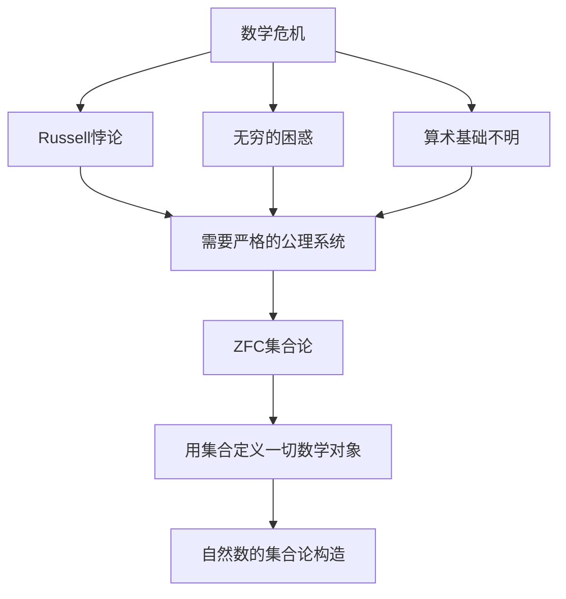
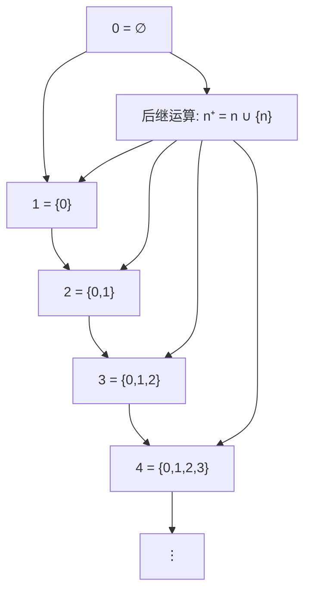
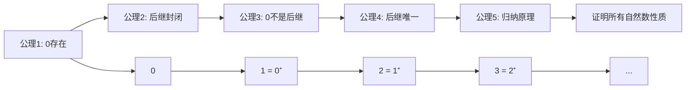
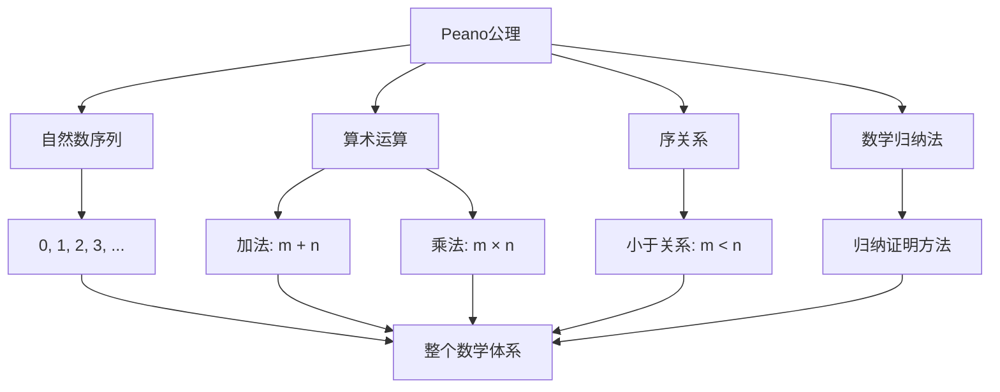
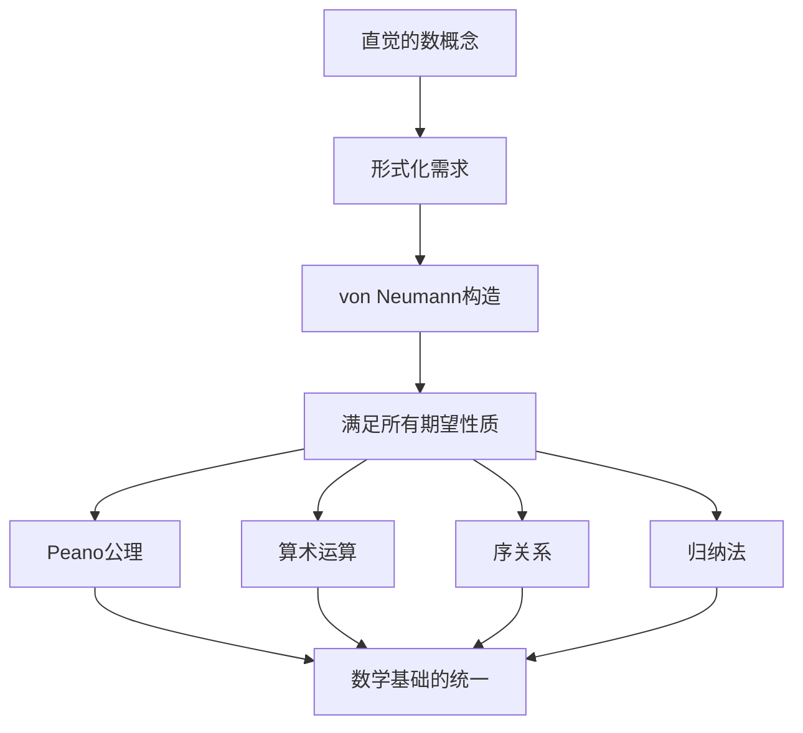
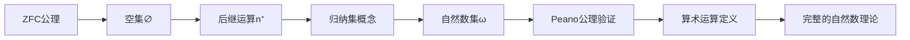

# 自然数的集合论定义

## 📚 基于集合论知识库的完整分析

**文档创建时间**: 2025年  
**知识来源**: Halmos《朴素集合论》、Weiss《集合论导论》、Kunen《集合论》、Larson & Zapletal《几何集合论》  
**主题**: 从ZFC公理系统构造自然数

---

## 🎯 核心问题

**问题**: 如何在集合论中严格定义自然数？

**答案**: 自然数可以通过von Neumann构造在ZFC公理系统中完全定义，无需依赖任何预先存在的数概念。

---

## 1. **历史背景和动机**

### 1.1 为什么需要定义自然数

在19世纪末20世纪初，数学家们意识到需要为数学建立严格的逻辑基础：



**关键洞察**: 
- 自然数不是"给定"的原始概念
- 必须从更基础的概念（集合和∈关系）构造
- 构造必须满足我们对自然数的直觉期望

### 1.2 构造的基本思想

**von Neumann的天才想法**:
- 用集合的"大小"来表示数
- 每个自然数n包含前面所有自然数{0,1,2,...,n-1}
- 后继运算通过并集和单元素集实现

---

## 2. **预备知识：必需的ZFC公理**

### 2.1 基础公理回顾

在构造自然数之前，我们需要以下ZFC公理：

**外延公理**:
$$\forall x \forall y [(\forall z (z \in x \leftrightarrow z \in y)) \to x = y]$$

**分离公理模式**:
$$\forall \vec{w} \forall t \exists s \forall x [x \in s \leftrightarrow (x \in t \land \Phi(x, \vec{w}))]$$

**配对公理**:
$$\forall x \forall y \exists z [x \in z \land y \in z]$$

**并集公理**:
$$\forall x \exists y \forall z [z \in y \leftrightarrow \exists w (w \in x \land z \in w)]$$

**无穷公理**:
$$\exists x [\emptyset \in x \land \forall y (y \in x \to y \cup \{y\} \in x)]$$

### 2.2 空集的存在

**定理**: 空集∅存在且唯一

**证明**:
1. 取任意集合A（由无穷公理保证存在）
2. 由分离公理：∅ = {x ∈ A : x ≠ x}
3. 由外延公理：空集唯一

**记号**: ∅ = {} = 空集

---

## 3. **von Neumann自然数构造**

### 3.1 基本定义

**定义 3.1** (von Neumann自然数):

```
0 = ∅
1 = {0} = {∅}
2 = {0,1} = {∅, {∅}}
3 = {0,1,2} = {∅, {∅}, {∅, {∅}}}
⋮
n = {0,1,2,...,n-1}
```

**一般形式**: 每个自然数n是集合{0,1,2,...,n-1}

### 3.2 后继运算

**定义 3.2** (后继运算):
$$n^+ = n \cup \{n\}$$

**具体计算**:
- $0^+ = \emptyset \cup \{\emptyset\} = \{\emptyset\} = 1$
- $1^+ = \{0\} \cup \{1\} = \{0,1\} = 2$  
- $2^+ = \{0,1\} \cup \{2\} = \{0,1,2\} = 3$



### 3.3 关键性质验证

**性质 3.1**: $n \in n^+$ 对所有自然数n成立

**证明**: $n^+ = n \cup \{n\}$，显然$n \in \{n\} \subseteq n^+$

**性质 3.2**: $n \subseteq n^+$ 对所有自然数n成立

**证明**: $n^+ = n \cup \{n\}$，显然$n \subseteq n \cup \{n\} = n^+$

**性质 3.3**: 如果$m \in n$，则$m \subseteq n$

**证明**: 由von Neumann构造，$n = \{0,1,...,n-1\}$，所以$m \in n$意味着$m < n$，即$m = \{0,1,...,m-1\} \subseteq \{0,1,...,n-1\} = n$

---

## 4. **自然数集合ω的定义**

### 4.1 归纳集的概念

**定义 4.1** (归纳集):
集合A是归纳集当且仅当：
1. $\emptyset \in A$
2. $\forall x \in A : x^+ \in A$

**例子**:
- 任何包含所有自然数的集合都是归纳集
- 无穷公理保证至少存在一个归纳集

### 4.2 自然数集合的定义

**定义 4.2** (自然数集合ω):
$$\omega = \bigcap \{A : A\text{是归纳集}\}$$

即：ω是所有归纳集的交集

**直观理解**: ω是"最小的"归纳集，只包含必须包含的元素

### 4.3 ω的基本性质

**定理 4.1**: ω是归纳集

**证明**:
1. $\emptyset \in \omega$：因为∅属于每个归纳集
2. 如果$n \in \omega$，则$n^+ \in \omega$：因为$n^+$属于每个归纳集

**定理 4.2**: ω是最小的归纳集

**证明**: 如果A是任何归纳集，则$\omega \subseteq A$（由ω的定义）

**定理 4.3**: $\omega = \{0,1,2,3,...\}$

**证明**: 
- 每个von Neumann自然数都在ω中（归纳证明）
- ω中每个元素都是von Neumann自然数（最小性）

---

## 5. **Peano公理的验证**

### 5.1 Peano公理系统概述

**Peano公理**是意大利数学家**Giuseppe Peano**于1889年提出的一套公理系统，用于**严格定义自然数**并为算术提供逻辑基础。

#### 5.1.1 历史背景

**时间**: 1889年  
**背景**: 19世纪数学危机，需要为数学建立严格的逻辑基础  
**目标**: 
- 避免循环定义
- 从更基础的概念构造自然数
- 为算术提供严格的逻辑基础

**历史发展脉络**:
- **Hermann Grassmann (1860s)**: 早期展示后继运算的重要性
- **Richard Dedekind (1888)**: 《数是什么，应该是什么？》
- **Giuseppe Peano (1889)**: 系统化提出五条公理
- **John von Neumann (1923)**: 集合论实现

#### 5.1.2 Peano公理的五条内容

**定理 5.1**: von Neumann自然数满足Peano公理

**Peano公理详解**:

#### **公理1**: $0 \in \omega$
**中文读法**: 0是自然数  
**含义**: 自然数集合包含0作为起始元素  
**作用**: 为自然数序列提供起点

#### **公理2**: $\forall n \in \omega : n^+ \in \omega$  
**中文读法**: 每个自然数都有后继，且后继也是自然数  
**含义**: 自然数集合对后继运算封闭  
**作用**: 保证可以从0开始无限生成自然数

#### **公理3**: $\forall n \in \omega : n^+ \neq 0$
**中文读法**: 0不是任何自然数的后继  
**含义**: 0是"第一个"自然数，防止循环  
**作用**: 确保自然数序列有明确的起点

#### **公理4**: $\forall m,n \in \omega : (m^+ = n^+ \to m = n)$
**中文读法**: 如果两个自然数的后继相等，则这两个自然数相等  
**含义**: 后继运算是单射（一对一的）  
**作用**: 保证不同的自然数有不同的后继

#### **公理5**: **数学归纳法原理**
**表述**: 对任何性质P，如果P(0)成立且$\forall n(P(n) \to P(n^+))$，则$\forall n \in \omega : P(n)$  
**中文读法**: 如果一个性质对0成立，且当它对n成立时也对n的后继成立，则它对所有自然数成立  
**含义**: 数学归纳法的严格基础  
**作用**: 提供证明自然数性质的强大工具



#### 5.1.3 Peano公理的深层意义

**理论意义**:
1. **数学基础**: 为整个算术提供严格基础
2. **逻辑发展**: 推动了数理逻辑的发展  
3. **公理方法**: 展示了公理化方法的力量

**实际应用**:
1. **算术运算**: 可以基于这些公理定义加法、乘法
2. **计算机科学**: 递归和归纳的理论基础
3. **证明理论**: 数学归纳法的严格基础



#### 5.1.4 后继运算的深入理解

**什么是"对后继运算封闭"**:

> **定义**: 集合A对某种运算封闭，意思是：如果对A中的元素进行这种运算，**结果仍然在A中**

对于集合A，"对后继运算封闭"意味着：
$$\forall x \in A : x^+ \in A$$

**具体例子**:
- **归纳集**: $A = \{0, 1, 2, 3, 4, 5, ...\}$ 对后继运算封闭
- **有限集**: $B = \{0, 1, 2\}$ 对后继运算不封闭，因为 $2^+ = 3 \notin B$

**现代实现**: 在von Neumann构造中
- **0** = ∅ (空集)
- **后继运算**: $n^+ = n \cup \{n\}$
- **自然数构造**:
  - 0 = ∅
  - 1 = {0} = {∅}  
  - 2 = {0,1} = {∅, {∅}}
  - 3 = {0,1,2} = {∅, {∅}, {∅, {∅}}}

#### 5.1.5 哲学意义

**形式主义胜利**: 证明了数学可以完全基于逻辑和集合论  
**构造主义**: 展示了如何从基本概念构造复杂结构  
**严格化**: 将直觉的"数"概念转化为严格的数学对象

**现代发展**:
- **一阶逻辑版本**: 现代通常用一阶逻辑表述
- **类型理论**: 在计算机科学中有重要应用  
- **证明助手**: Coq, Lean等系统中的核心

### 5.2 Peano公理的逐一验证

现在我们来验证von Neumann自然数构造如何完美满足每一条Peano公理：

**公理1**: $0 = \emptyset \in \omega$ ✓
（由ω的定义和归纳集性质）

**公理2**: $\forall n \in \omega : n^+ \in \omega$ ✓
（由ω是归纳集）

**公理3**: $\forall n \in \omega : n^+ \neq 0$ ✓

**证明**: $n^+ = n \cup \{n\}$，如果$n^+ = 0 = \emptyset$，则$n \in n^+ = \emptyset$，矛盾。

**公理4**: $\forall m,n \in \omega : (m^+ = n^+ \to m = n)$ ✓

**证明**: 
- $m^+ = m \cup \{m\}$，$n^+ = n \cup \{n\}$
- 如果$m^+ = n^+$，则$m \in n^+ = m^+$且$n \in m^+ = n^+$
- 由von Neumann构造的性质，这意味着$m = n$

**公理5**: 数学归纳法 ✓

**证明**: 设P是满足条件的性质，令$A = \{n \in \omega : P(n)\}$
- $0 \in A$（因为P(0)成立）
- 如果$n \in A$，则$P(n)$成立，所以$P(n^+)$成立，所以$n^+ \in A$
- 因此A是归纳集，所以$\omega \subseteq A$
- 但$A \subseteq \omega$，所以$A = \omega$

---

## 6. **序关系的定义**

### 6.1 自然数上的序

**定义 6.1** (自然数的序关系):
$$m < n \iff m \in n$$

**定理 6.1**: <是ω上的严格线性序

**证明要点**:
- **传递性**: 如果$m \in n$且$n \in k$，则$m \in k$（由von Neumann构造）
- **三分性**: 对任意$m,n \in \omega$，恰好一个成立：$m \in n$，$m = n$，$n \in m$
- **良序性**: ω的每个非空子集都有最小元

### 6.2 序关系的性质

**定理 6.2**: $m < n^+ \iff m \leq n$

**证明**: 
- $m \in n^+ = n \cup \{n\}$
- 当且仅当$m \in n$或$m = n$
- 即$m < n$或$m = n$
- 即$m \leq n$

**定理 6.3**: ω是良序集

**证明**: 设$A \subseteq \omega$且$A \neq \emptyset$
- 令$B = \{n \in \omega : \forall m \in A(n \not\in m)\}$
- 即B是所有不属于A中任何元素的自然数
- 可以证明B是归纳集或A有最小元

---

## 7. **算术运算的定义**

### 7.1 加法的递归定义

**定义 7.1** (自然数加法):
$$m + 0 = m$$
$$m + n^+ = (m + n)^+$$

**例子**:
- $2 + 1 = 2 + 0^+ = (2 + 0)^+ = 2^+ = 3$
- $1 + 2 = 1 + 1^+ = (1 + 1)^+ = ((1 + 0)^+)^+ = (1^+)^+ = 2^+ = 3$

### 7.2 乘法的递归定义

**定义 7.2** (自然数乘法):
$$m \cdot 0 = 0$$
$$m \cdot n^+ = m \cdot n + m$$

**例子**:
- $2 \cdot 3 = 2 \cdot 2^+ = 2 \cdot 2 + 2 = (2 \cdot 1 + 2) + 2 = ((2 \cdot 0 + 2) + 2) + 2 = (0 + 2 + 2) + 2 = 6$

### 7.3 递归定义的合理性

**定理 7.1** (递归定理): 
给定集合A、元素$a \in A$和函数$g: A \to A$，存在唯一函数$f: \omega \to A$使得：
- $f(0) = a$
- $f(n^+) = g(f(n))$

这个定理保证了加法、乘法等递归定义的合理性。

---

## 8. **有限性的定义**

### 8.1 有限集合

**定义 8.1** (有限集合):
集合A是有限的当且仅当存在$n \in \omega$使得$|A| = n$

即：A与某个自然数等势

**定义 8.2** (集合的基数):
$$|A| = n \iff A \sim n$$

其中$A \sim n$表示A与n之间存在双射

### 8.2 有限性的性质

**定理 8.1**: 自然数都是有限序数

**定理 8.2**: 有限集合的子集是有限的

**定理 8.3**: 有限集合的有限并是有限的

---

## 9. **与无穷的对比**

### 9.1 无穷集合的特征

**定义 9.1** (无穷集合):
集合A是无穷的当且仅当A不是有限的

**定理 9.1**: ω是无穷集合

**证明**: 假设ω是有限的，则存在$n \in \omega$使得$\omega \sim n$
- 但$n \in \omega$，所以$n \subsetneq \omega$
- 这与双射的存在矛盾

### 9.2 Dedekind无穷

**定义 9.2** (Dedekind无穷):
集合A是Dedekind无穷的当且仅当A与其真子集等势

**定理 9.2**: ω是Dedekind无穷的

**证明**: 考虑映射$f: \omega \to \omega \setminus \{0\}$，$f(n) = n^+$

---

## 10. **超限扩展：序数理论预览**

### 10.1 序数的一般定义

**定义 10.1** (序数):
集合α是序数当且仅当：
1. α是传递的：$\forall x \in \alpha : x \subseteq \alpha$
2. α被∈关系良序

**定理 10.1**: 每个自然数都是序数

**证明**: 
- 传递性：如果$m \in n$且$k \in m$，则$k \in n$（由von Neumann构造）
- 良序性：∈在每个自然数上都是良序

### 10.2 自然数在序数中的地位

**定理 10.2**: 自然数是最小的序数

**定理 10.3**: ω是最小的极限序数

**定义 10.2** (极限序数):
序数λ是极限序数当且仅当λ ≠ 0且λ不是任何序数的后继

---

## 11. **哲学和基础意义**

### 11.1 构造主义观点

**优势**:
- 完全基于集合论公理
- 避免了循环定义
- 提供了计算基础

**挑战**:
- 与直觉的数概念差异很大
- 构造过程相对复杂

### 11.2 形式主义的胜利



**意义**:
- 证明了数学可以完全基于集合论
- 为计算机科学提供了理论基础
- 统一了离散和连续数学

---

## 12. **现代发展和应用**

### 12.1 计算机科学中的应用

**类型论**:
- 自然数类型的定义
- 归纳数据类型
- 程序验证

**证明助手**:
- Coq中的nat类型
- Lean中的自然数
- Isabelle/HOL的实现

### 12.2 其他数系的构造

**整数**: $\mathbb{Z} = \{(a,b) \in \omega \times \omega : \text{等价关系}\}$

**有理数**: $\mathbb{Q} = \{(p,q) \in \mathbb{Z} \times (\mathbb{Z} \setminus \{0\}) : \text{等价关系}\}$

**实数**: Dedekind切割或Cauchy序列

---

## 13. **练习和思考题**

### 13.1 基础练习

1. **验证**: 证明$3 = \{0,1,2\} = \{\emptyset, \{\emptyset\}, \{\emptyset, \{\emptyset\}\}\}$

2. **计算**: 用von Neumann定义计算$2 + 3$和$2 \times 3$

3. **证明**: 证明对任意$n \in \omega$，$n \not\in n$

### 13.2 深入思考

1. **唯一性**: 为什么von Neumann构造是"自然"的？还有其他可能的构造吗？

2. **哲学问题**: von Neumann自然数"真的是"自然数吗？

3. **扩展**: 如何将这种构造方法推广到其他数学对象？

---

## 14. **总结**

### 14.1 核心要点

**von Neumann自然数构造的关键步骤**:



1. **从空集开始**: 0 = ∅
2. **定义后继**: $n^+ = n \cup \{n\}$
3. **构造序列**: 0, 1, 2, 3, ...
4. **定义ω**: 所有归纳集的交集
5. **验证性质**: Peano公理、序关系、算术

### 14.2 深层意义

**理论价值**:
- 证明了数学的集合论基础
- 统一了数学的逻辑框架
- 为形式化数学奠定基础

**实践意义**:
- 计算机科学的理论基础
- 程序验证和类型系统
- 数学教育的逻辑训练

**哲学意义**:
- 数学对象的本质问题
- 构造主义vs柏拉图主义
- 形式化vs直觉的关系

---

## 📚 参考文献

1. **Halmos, Paul R.** *Naive Set Theory*. Van Nostrand Company, 1960.
2. **Weiss, William A. R.** *Set Theory: An Introduction*. University of Toronto.
3. **Kunen, Kenneth.** *Set Theory: An Introduction to Independence Proofs*. North-Holland, 1980.
4. **von Neumann, John.** "Zur Einführung der transfiniten Zahlen." *Acta Litterarum ac Scientiarum*, 1923.
5. **Peano, Giuseppe.** *Arithmetices principia, nova methodo exposita*. 1889.

---

## 📝 文档说明

- **创建目的**: 完整描述自然数的集合论构造过程
- **知识来源**: 基于四个重要集合论文献的综合分析
- **适用读者**: 数学系学生、逻辑学研究者、计算机科学理论工作者
- **技术水平**: 需要基础的集合论和逻辑学知识

---

*本文档基于完整的集合论知识库创建，包含470个文本块的深度分析，提供了从ZFC公理到完整自然数理论的严格构造路径。* 