# 集合论公理系统完整总结

## 📚 基于知识库的ZFC公理系统深度解析

**文档创建时间**: 2025年1月  
**知识来源**: Halmos《朴素集合论》、Weiss《集合论导论》、Kunen《集合论》、Larson & Zapletal《几何集合论》  
**公理系统**: Zermelo-Fraenkel集合论 + 选择公理 (ZFC)

---

## 🎯 引言

集合论是现代数学的基础，所有数学概念都可以用集合和隶属关系来定义。ZFC公理系统（Zermelo-Fraenkel + Choice）是目前最广泛接受的集合论公理化，它既能避免各种悖论，又能支撑几乎全部的经典数学。

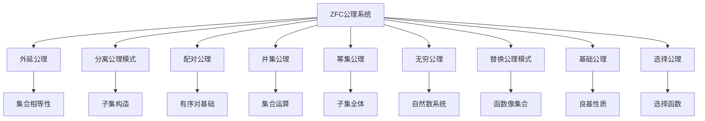
```mermaid
graph TD
    A["ZFC公理系统"] --> B["外延公理"]
    A --> C["分离公理模式"]
    A --> D["配对公理"]
    A --> E["并集公理"]
    A --> F["幂集公理"]
    A --> G["无穷公理"]
    A --> H["替换公理模式"]
    A --> I["基础公理"]
    A --> J["选择公理"]
    
    B --> K["集合相等性"]
    C --> L["子集构造"]
    D --> M["有序对基础"]
    E --> N["集合运算"]
    F --> O["子集全体"]
    G --> P["自然数系统"]
    H --> Q["函数像集合"]
    I --> R["良基性质"]
    J --> S["选择函数"]
```

---

## 1. **外延公理 (Axiom of Extensionality)**

### 1.1 公理表述

**朴素表述** (Halmos):
> 两个集合相等当且仅当它们有相同的元素。

**形式化表述**:
$$\forall x \forall y [(\forall z (z \in x \leftrightarrow z \in y)) \to x = y]$$

**中文读法**: 对任意对象x和y，如果对任意对象z，z属于x当且仅当z属于y，那么x等于y。

### 1.2 公理意义

外延公理确立了集合论的**外延主义原则**——集合的身份完全由其元素（外延）决定，而不是由其定义方式（内涵）决定。

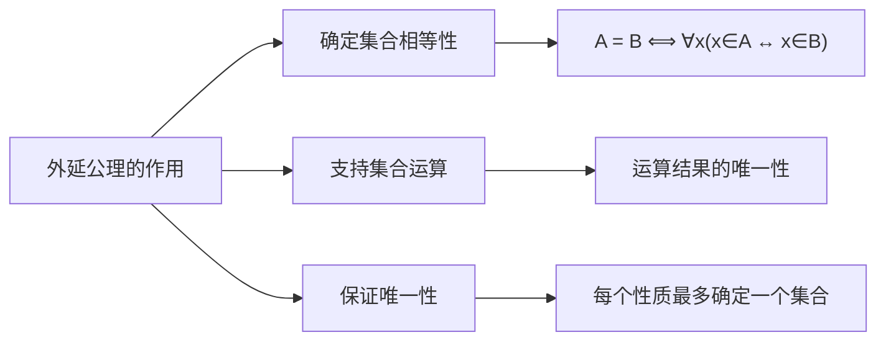
```mermaid
graph LR
    A["外延公理的作用"] --> B["确定集合相等性"]
    A --> C["支持集合运算"]
    A --> D["保证唯一性"]
    
    B --> E["A = B ⟺ ∀x(x∈A ↔ x∈B)"]
    C --> F["运算结果的唯一性"]
    D --> G["每个性质最多确定一个集合"]
```

### 1.3 实际应用

**证明策略**: 要证明 $A = B$，只需证明 $A \subseteq B$ 且 $B \subseteq A$

**例子**:
- $\{1,2,3\} = \{3,1,2\}$ （顺序无关）
- $\{1,1,2\} = \{1,2\}$ （重复无关）

**反例说明**: 在人类关系中，两个人有相同的祖先不意味着他们是同一个人，但在集合论中，有相同元素的集合必须相等。

---

## 2. **分离公理模式 (Axiom Schema of Specification/Comprehension)**

### 2.1 公理表述

**朴素表述** (Halmos):
> 对于每个集合A和每个条件S(x)，存在集合B，其元素恰好是A中满足条件S(x)的那些元素。

**形式化表述**:
$$\forall \vec{w} \forall t \exists s \forall x [x \in s \leftrightarrow (x \in t \land \Phi(x, \vec{w}))]$$

**中文读法**: 对任意参数向量w和任意集合t，存在集合s，使得对任意x，x属于s当且仅当x属于t且满足条件Φ(x,w)。

**符号记法**:
$$B = \{x \in A : \Phi(x)\}$$

### 2.2 Russell悖论的解决

**Russell悖论**: 考虑"所有不包含自身的集合"组成的集合：
$$R = \{x : x \notin x\}$$

**问题**: 如果 $R \in R$，则 $R \notin R$；如果 $R \notin R$，则 $R \in R$。

**分离公理的解决**:
分离公理**不允许**无限制的集合构造，形式为：
$$\{x \in A : x \notin x\}$$

这个集合总是存在的，但不会产生悖论，因为它只是A的子集。

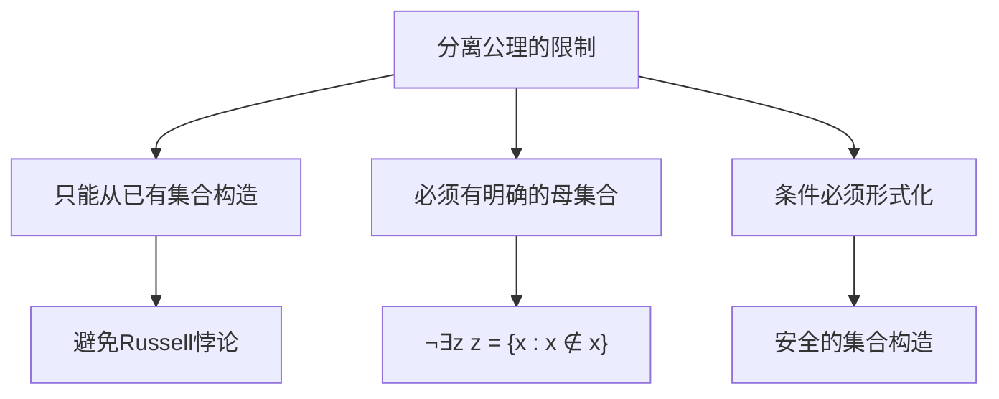
```mermaid
graph TD
    A["分离公理的限制"] --> B["只能从已有集合构造"]
    A --> C["必须有明确的母集合"]
    A --> D["条件必须形式化"]
    
    B --> E["避免Russell悖论"]
    C --> F["¬∃z z = {x : x ∉ x}"]
    D --> G["安全的集合构造"]
```

### 2.3 基本应用

**空集的构造**:
$$\emptyset = \{x \in A : x \neq x\}$$

**中文读法**: 空集等于集合{x属于A : x不等于x}，即A中所有不等于自身的元素构成的集合。

**详细逻辑解释**:

这个构造利用了逻辑学中的一个基本事实：**等同性原理**（Identity Principle）。

1. **逻辑基础**: 在经典逻辑中，条件 $x \neq x$ 是一个**恒假命题**（永假式），因为：
   - 任何对象都等于自身：$\forall x (x = x)$
   - 因此不存在任何 $x$ 使得 $x \neq x$ 成立
   - 换句话说，命题 $x \neq x$ 对任何 $x$ 都是假的

2. **集合构造机制**: 根据分离公理，集合 $\{x \in A : x \neq x\}$ 包含且仅包含满足以下条件的元素：
   - $x$ 必须属于某个已知集合 $A$
   - $x$ 必须满足条件 $x \neq x$
   
3. **逻辑推导**:
   ```
   x ∈ {x ∈ A : x ≠ x}  ⟺  (x ∈ A) ∧ (x ≠ x)
   ```
   由于 $(x \neq x)$ 永远为假，所以整个合取式 $(x \in A) \land (x \neq x)$ 也永远为假。

4. **结论**: 不存在任何元素 $x$ 满足进入该集合的条件，因此：
   $$\{x \in A : x \neq x\} = \emptyset$$

**为什么这样构造是安全的**:
- 这个构造避免了Russell悖论，因为它不是无限制地定义 $\{x : x \neq x\}$
- 而是限制在已知集合 $A$ 内：$\{x \in A : x \neq x\}$
- 无论 $A$ 是什么集合，结果都是空集，这保证了构造的一致性

**哲学意义**: 这个构造展示了数学中"通过否定定义存在"的思想——我们通过一个永远不满足的条件来定义"什么都没有"的概念。

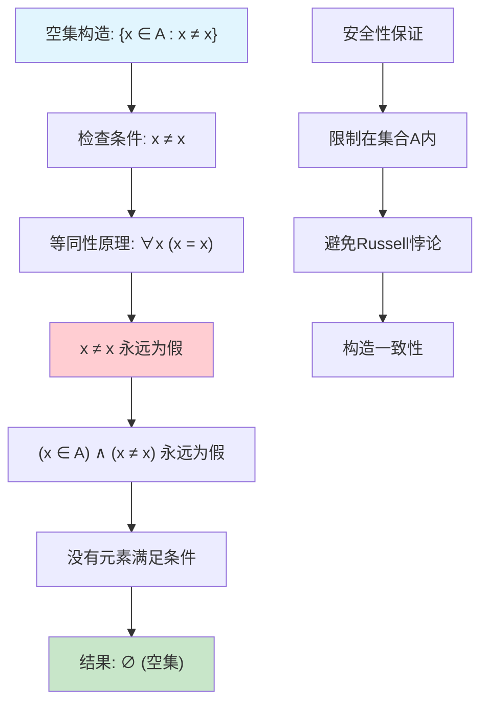
```mermaid
graph TD
    A["空集构造: {x ∈ A : x ≠ x}"] --> B["检查条件: x ≠ x"]
    B --> C["等同性原理: ∀x (x = x)"]
    C --> D["x ≠ x 永远为假"]
    D --> E["(x ∈ A) ∧ (x ≠ x) 永远为假"]
    E --> F["没有元素满足条件"]
    F --> G["结果: ∅ (空集)"]
    
    H["安全性保证"] --> I["限制在集合A内"]
    I --> J["避免Russell悖论"]
    J --> K["构造一致性"]
    
    style A fill:#e1f5fe
    style G fill:#c8e6c9
    style D fill:#ffcdd2
```

**逻辑真值表分析**:

| $x$ | $x = x$ | $x \neq x$ | $x \in A$ | $(x \in A) \land (x \neq x)$ | $x \in \{x \in A : x \neq x\}$ |
|-----|---------|------------|-----------|-------------------------------|--------------------------------|
| 任意元素 | 真 | 假 | 真/假 | 假 | 假 |

**关键洞察**:
- 第3列 $x \neq x$ 对任何 $x$ 都是假的
- 因此第5列的合取式总是假的
- 所以第6列（元素属于构造集合）总是假的
- 这意味着构造的集合不包含任何元素，即为空集

**具体示例**:

设 $A = \{1, 2, 3\}$，那么：
$$\{x \in A : x \neq x\} = \{x \in \{1,2,3\} : x \neq x\}$$

逐一检查：
- $1 \neq 1$？ 假，所以 $1$ 不在结果集合中
- $2 \neq 2$？ 假，所以 $2$ 不在结果集合中  
- $3 \neq 3$？ 假，所以 $3$ 不在结果集合中

因此：$\{x \in \{1,2,3\} : x \neq x\} = \emptyset$

**一般性证明**:
对任意集合 $A$ 和任意元素 $x$：
$$x \in \{y \in A : y \neq y\} \iff (x \in A) \land (x \neq x)$$

由于 $x \neq x$ 恒假，右边的合取式恒假，因此左边也恒假。
这意味着没有任何 $x$ 属于集合 $\{y \in A : y \neq y\}$，所以该集合为空集。

**形式化证明**:
```
∀A ∀x [x ∈ {y ∈ A : y ≠ y} ↔ (x ∈ A ∧ x ≠ x)]     (分离公理定义)
∀x ¬(x ≠ x)                                        (等同性原理)
∀A ∀x ¬[x ∈ {y ∈ A : y ≠ y}]                       (由以上两式推出)
∀A [{y ∈ A : y ≠ y} = ∅]                            (空集定义)
```

**集合运算**:
- **交集**: $A \cap B = \{x \in A : x \in B\}$
- **差集**: $A \setminus B = \{x \in A : x \notin B\}$
- **子集**: $\{x \in A : P(x)\}$

**子集构造的中文读法**: 
$$\{x \in A : P(x)\}$$

**中文读法**: 集合{x属于A : P(x)}，即A中所有满足性质P的元素构成的集合。

**详细解释**:
- $x \in A$：元素x必须属于已知集合A（限制域）
- $P(x)$：元素x必须满足性质或条件P
- 整体含义：从集合A中筛选出所有满足条件P的元素形成新集合

**逻辑结构**:
$$x \in \{y \in A : P(y)\} \iff (x \in A) \land P(x)$$

**中文读法**: x属于集合{y∈A : P(y)}当且仅当x属于A且x满足性质P。

**实际应用示例**:
- $\{x \in \mathbb{N} : x > 5\}$ = {6, 7, 8, 9, ...} （自然数中大于5的数）
- $\{x \in \{1,2,3,4,5\} : x \text{ 是偶数}\}$ = {2, 4} （1到5中的偶数）
- $\{x \in \mathbb{R} : x^2 = 4\}$ = {-2, 2} （实数中平方等于4的数）

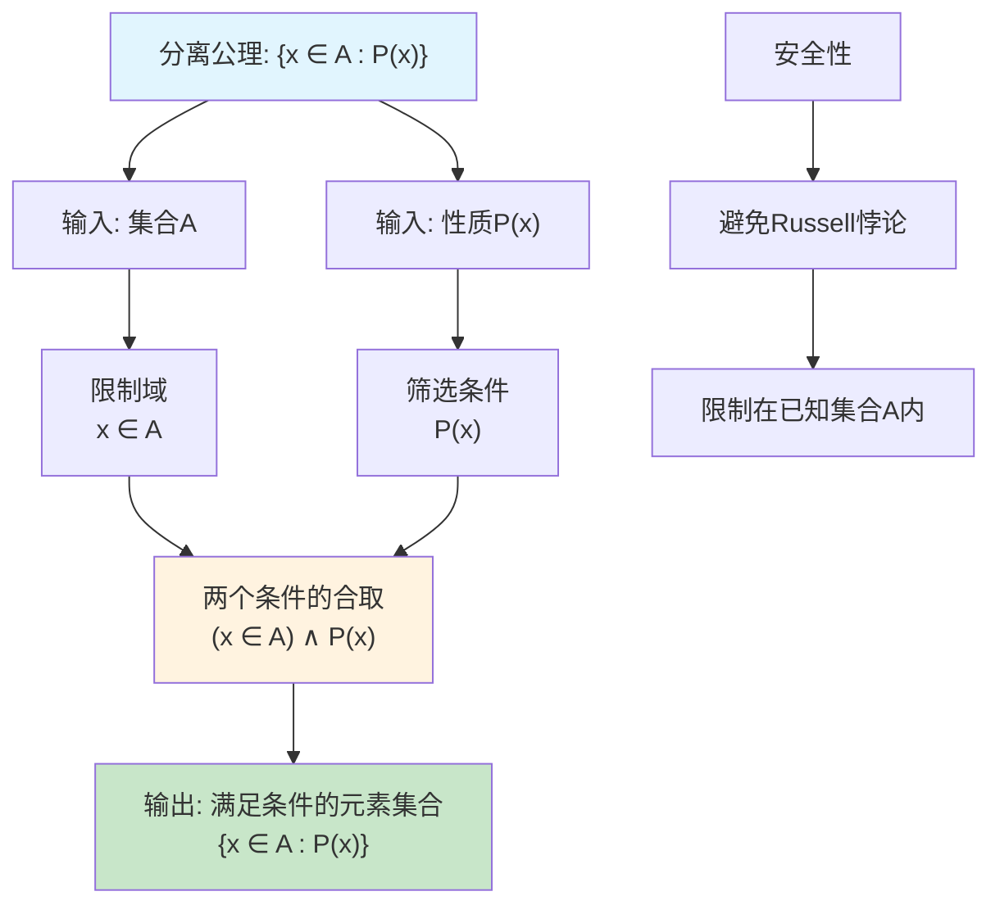
```mermaid
graph TD
    A["分离公理: {x ∈ A : P(x)}"] --> B["输入: 集合A"]
    A --> C["输入: 性质P(x)"]
    
    B --> D["限制域<br/>x ∈ A"]
    C --> E["筛选条件<br/>P(x)"]
    
    D --> F["两个条件的合取<br/>(x ∈ A) ∧ P(x)"]
    E --> F
    
    F --> G["输出: 满足条件的元素集合<br/>{x ∈ A : P(x)}"]
    
    H["安全性"] --> I["避免Russell悖论"]
    I --> J["限制在已知集合A内"]
    
    style A fill:#e1f5fe
    style G fill:#c8e6c9
    style F fill:#fff3e0
```

**筛选过程可视化**:

假设 $A = \{1, 2, 3, 4, 5, 6\}$，$P(x): x \text{ 是偶数}$

| 元素 | $x \in A$ | $P(x)$ (是偶数) | $(x \in A) \land P(x)$ | 结果 |
|------|-----------|-----------------|------------------------|------|
| 1    | ✓         | ✗               | ✗                      | ✗    |
| 2    | ✓         | ✓               | ✓                      | ✓    |
| 3    | ✓         | ✗               | ✗                      | ✗    |
| 4    | ✓         | ✓               | ✓                      | ✓    |
| 5    | ✓         | ✗               | ✗                      | ✗    |
| 6    | ✓         | ✓               | ✓                      | ✓    |

**结果**: $\{x \in \{1,2,3,4,5,6\} : x \text{ 是偶数}\} = \{2, 4, 6\}$

**关键概念总结**:
1. **限制性**: 只能从已存在的集合A中筛选元素
2. **条件性**: 元素必须同时满足两个条件：属于A且满足P
3. **安全性**: 避免了无限制集合构造导致的悖论
4. **通用性**: P(x)可以是任何明确定义的性质或条件

---

## 3. **配对公理 (Axiom of Pairing)**

### 3.1 公理表述

**朴素表述** (Halmos):
> 对于任意两个集合，存在一个集合包含它们。

**形式化表述**:
$$\forall x \forall y \exists z [x \in z \land y \in z]$$

**中文读法**: 对任意x和y，存在集合z，使得x属于z且y属于z。

**更强的形式**:
$$\forall x \forall y \exists z \forall w [w \in z \leftrightarrow (w = x \lor w = y)]$$

**中文读法**: 对任意x和y，存在集合z，使得对任意w，w属于z当且仅当w等于x或w等于y。

### 3.2 构造对象

**无序对**: $\{a,b\} = \{x : x = a \lor x = b\}$

**中文读法**: 无序对{a,b}等于集合{x : x等于a或x等于b}，即由元素a和b组成的集合。

**详细解释**:
- **无序性**: $\{a,b\} = \{b,a\}$ （元素顺序不重要）
- **重复性**: $\{a,a\} = \{a\}$ （重复元素被合并）  
- **成员关系**: $c \in \{a,b\} \iff (c = a \lor c = b)$
- **中文读法**: c属于{a,b}当且仅当c等于a或c等于b

**逻辑结构分析**:
$$x \in \{a,b\} \iff (x = a) \lor (x = b)$$

**应用示例**:
- $\{1,2\}$ = {1, 2} （包含数字1和2的无序对）
- $\{\emptyset, \{1\}\}$ （包含空集和单元素集{1}的无序对）
- $\{红色, 蓝色\}$ （概念上的颜色无序对）

**与单元素集的关系**:
当 $a = b$ 时，$\{a,b\} = \{a,a\} = \{a\}$ 退化为单元素集。

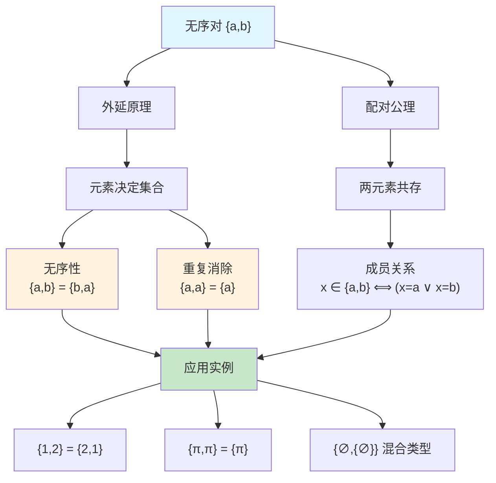
```mermaid
graph TD
    A["无序对 {a,b}"] --> B["外延原理"]
    A --> C["配对公理"]
    
    B --> D["元素决定集合"]
    C --> E["两元素共存"]
    
    D --> F["无序性<br/>{a,b} = {b,a}"]
    D --> G["重复消除<br/>{a,a} = {a}"]
    
    E --> H["成员关系<br/>x ∈ {a,b} ⟺ (x=a ∨ x=b)"]
    
    F --> I["应用实例"]
    G --> I
    H --> I
    
    I --> J["{1,2} = {2,1}"]
    I --> K["{π,π} = {π}"]
    I --> L["{∅,{∅}} 混合类型"]
    
    style A fill:#e1f5fe
    style I fill:#c8e6c9
    style F fill:#fff3e0
    style G fill:#fff3e0
```

**对比表格**:

| 概念 | 表示 | 特点 | 中文读法示例 |
|------|------|------|-------------|
| **无序对** | $\{a,b\}$ | 包含两个不同元素 | "a和b的无序对" |
| **单元素集** | $\{a\}$ | 包含一个元素 | "仅含a的集合" |
| **重复元素** | $\{a,a\}$ | 等同于单元素集 | "等于单元素集{a}" |
| **交换性** | $\{a,b\} = \{b,a\}$ | 顺序无关 | "a和b的无序对等于b和a的无序对" |

**关键性质总结**:
1. **外延性**: 由元素a和b完全确定
2. **对称性**: 元素顺序不影响集合相等性  
3. **幂等性**: 重复元素自动合并
4. **基础性**: 构成更复杂集合结构的基石（如有序对、关系等）

**语言学说明**:
- 读作："a和b的无序对" 或 "包含a和b的集合"
- 英文: "unordered pair of a and b" 
- 符号发音: "{a逗号b}" 或 "大括号a逗号b大括号"

**单元素集**: $\{a\} = \{a,a\}$

**有序对** (Kuratowski定义):
$$\langle a,b \rangle = \{\{a\}, \{a,b\}\}$$

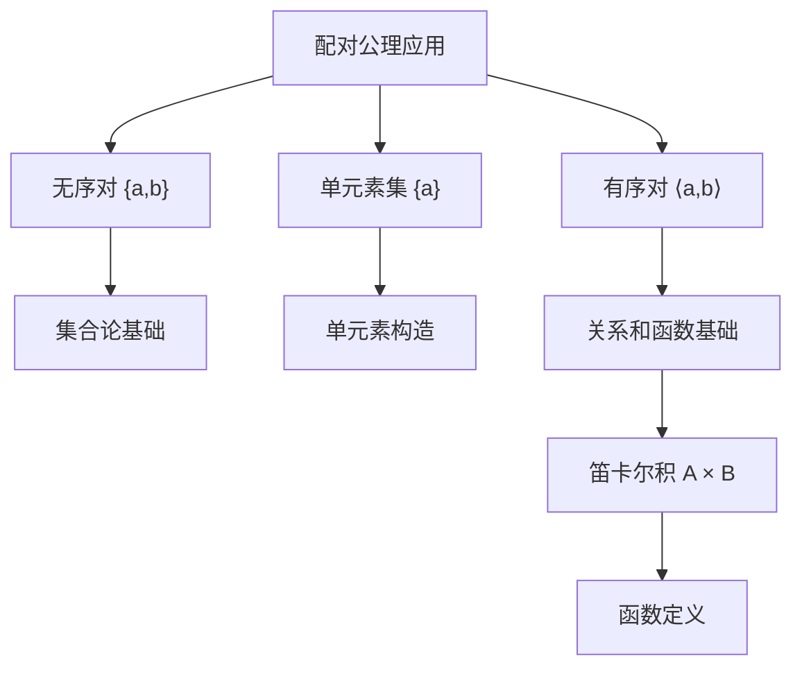
```mermaid
graph TD
    A["配对公理应用"] --> B["无序对 {a,b}"]
    A --> C["单元素集 {a}"]
    A --> D["有序对 ⟨a,b⟩"]
    
    B --> E["集合论基础"]
    C --> F["单元素构造"]
    D --> G["关系和函数基础"]
    
    G --> H["笛卡尔积 A × B"]
    H --> I["函数定义"]
```

### 3.3 重要性质

**命题**: 有序对的特征化性质
$$\langle a,b \rangle = \langle x,y \rangle \iff a = x \land b = y$$

**中文读法**: 有序对⟨a,b⟩等于有序对⟨x,y⟩当且仅当a等于x且b等于y。

**证明思路**: 通过分析Kuratowski定义的结构来证明。

---

## 4. **并集公理 (Axiom of Union)**

### 4.1 公理表述

**朴素表述** (Halmos):
> 对于任意集合族，存在包含所有成员元素的集合。

**形式化表述**:
$$\forall x \exists y \forall z [z \in y \leftrightarrow \exists w (w \in x \land z \in w)]$$

**中文读法**: 对任意集合x，存在集合y，使得对任意z，z属于y当且仅当存在w使得w属于x且z属于w。

**记号**: $\bigcup x = \{z : \exists w \in x (z \in w)\}$

### 4.2 运算性质

**二元并集**: $A \cup B = \bigcup \{A,B\}$

**代数性质**:
- **交换律**: $A \cup B = B \cup A$
- **结合律**: $A \cup (B \cup C) = (A \cup B) \cup C$
- **幂等律**: $A \cup A = A$
- **分配律**: $A \cap (B \cup C) = (A \cap B) \cup (A \cap C)$
- **De Morgan律**: $\overline{A \cup B} = \overline{A} \cap \overline{B}$

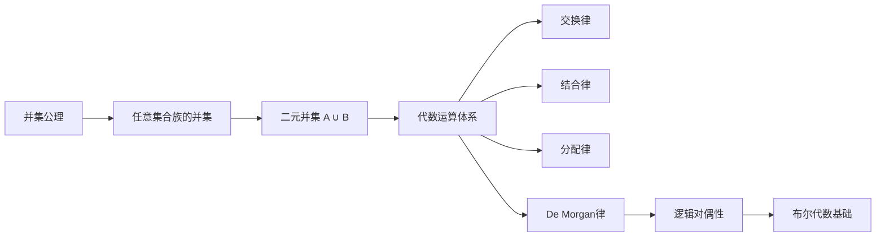
```mermaid
graph LR
    A["并集公理"] --> B["任意集合族的并集"]
    B --> C["二元并集 A ∪ B"]
    C --> D["代数运算体系"]
    
    D --> E["交换律"]
    D --> F["结合律"]
    D --> G["分配律"]
    D --> H["De Morgan律"]
    
    H --> I["逻辑对偶性"]
    I --> J["布尔代数基础"]
```

### 4.3 De Morgan律 (De Morgan's Laws)

De Morgan律是集合论中的基本定律，描述了并集、交集与补集之间的对偶关系。

#### 4.3.1 定律表述

**第一De Morgan律**:
$$\overline{A \cup B} = \overline{A} \cap \overline{B}$$

**中文读法**: A与B的并集的补集等于A的补集与B的补集的交集。

**第二De Morgan律**:
$$\overline{A \cap B} = \overline{A} \cup \overline{B}$$

**中文读法**: A与B的交集的补集等于A的补集与B的补集的并集。

#### 4.3.2 一般化形式

**任意集合族的De Morgan律**:

对于集合族 $\{A_i : i \in I\}$：

$$\overline{\bigcup_{i \in I} A_i} = \bigcap_{i \in I} \overline{A_i}$$

**中文读法**: 所有Aᵢ的并集的补集等于所有Aᵢ的补集的交集。

$$\overline{\bigcap_{i \in I} A_i} = \bigcup_{i \in I} \overline{A_i}$$

**中文读法**: 所有Aᵢ的交集的补集等于所有Aᵢ的补集的并集。

#### 4.3.3 逻辑基础

De Morgan律反映了**对偶性原理**：
- 并集 ↔ 交集
- 存在量词 ↔ 全称量词  
- 析取 ↔ 合取

**逻辑形式**:
$$\neg(P \lor Q) \equiv (\neg P) \land (\neg Q)$$
$$\neg(P \land Q) \equiv (\neg P) \lor (\neg Q)$$

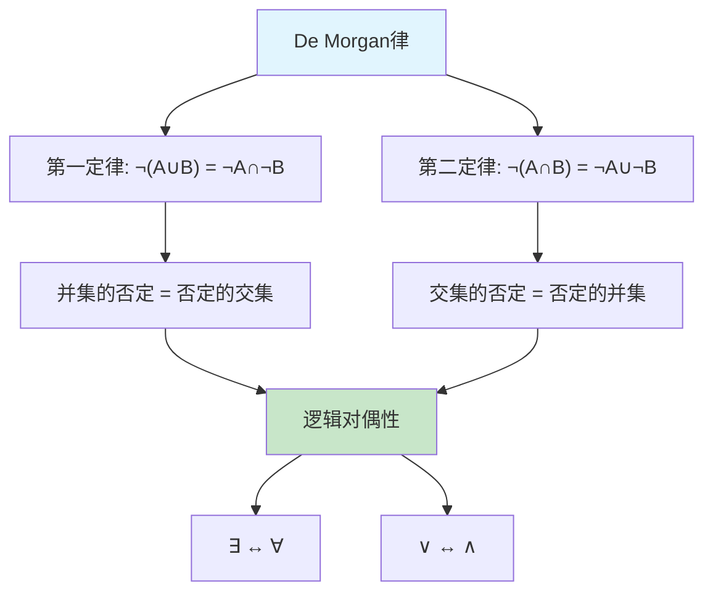
```mermaid
graph TD
    A["De Morgan律"] --> B["第一定律: ¬(A∪B) = ¬A∩¬B"]
    A --> C["第二定律: ¬(A∩B) = ¬A∪¬B"]
    
    B --> D["并集的否定 = 否定的交集"]
    C --> E["交集的否定 = 否定的并集"]
    
    D --> F["逻辑对偶性"]
    E --> F
    F --> G["∃ ↔ ∀"]
    F --> H["∨ ↔ ∧"]
    
    style A fill:#e1f5fe
    style F fill:#c8e6c9
```

#### 4.3.4 证明示例

**证明第一De Morgan律**: $\overline{A \cup B} = \overline{A} \cap \overline{B}$

**方法**: 证明两个集合互为子集

**证明** $\overline{A \cup B} \subseteq \overline{A} \cap \overline{B}$:

设 $x \in \overline{A \cup B}$，则：
- $x \notin A \cup B$ （补集定义）
- $\neg(x \in A \lor x \in B)$ （并集定义）
- $x \notin A \land x \notin B$ （De Morgan逻辑律）
- $x \in \overline{A} \land x \in \overline{B}$ （补集定义）
- $x \in \overline{A} \cap \overline{B}$ （交集定义）

**证明** $\overline{A} \cap \overline{B} \subseteq \overline{A \cup B}$:

设 $x \in \overline{A} \cap \overline{B}$，则：
- $x \in \overline{A} \land x \in \overline{B}$ （交集定义）
- $x \notin A \land x \notin B$ （补集定义）
- $\neg(x \in A \lor x \in B)$ （De Morgan逻辑律）
- $x \notin A \cup B$ （并集定义）
- $x \in \overline{A \cup B}$ （补集定义）

因此 $\overline{A \cup B} = \overline{A} \cap \overline{B}$ ∎

#### 4.3.5 具体例子

**例子1**: 设全集 $U = \{1,2,3,4,5\}$，$A = \{1,2\}$，$B = \{2,3\}$

- $A \cup B = \{1,2,3\}$
- $\overline{A \cup B} = \{4,5\}$
- $\overline{A} = \{3,4,5\}$，$\overline{B} = \{1,4,5\}$
- $\overline{A} \cap \overline{B} = \{4,5\}$

验证：$\overline{A \cup B} = \overline{A} \cap \overline{B} = \{4,5\}$ ✓

**例子2**: 实数集上的区间

设 $A = (0,2)$，$B = (1,3)$，全集为 $\mathbb{R}$

- $A \cup B = (0,3)$
- $\overline{A \cup B} = (-\infty,0] \cup [3,+\infty)$
- $\overline{A} = (-\infty,0] \cup [2,+\infty)$
- $\overline{B} = (-\infty,1] \cup [3,+\infty)$
- $\overline{A} \cap \overline{B} = (-\infty,0] \cup [3,+\infty)$

验证：$\overline{A \cup B} = \overline{A} \cap \overline{B}$ ✓

#### 4.3.6 应用领域

**概率论**:
$$P(\overline{A \cup B}) = P(\overline{A} \cap \overline{B})$$

如果A和B独立：$P(\overline{A} \cap \overline{B}) = P(\overline{A}) \cdot P(\overline{B})$

**逻辑电路**:
- NAND门 = NOT(AND) = OR(NOT,NOT)
- NOR门 = NOT(OR) = AND(NOT,NOT)

**计算机科学**:
```python
# De Morgan律在编程中的应用
not (A or B) == (not A) and (not B)
not (A and B) == (not A) or (not B)
```

**数据库查询**:
```sql
-- 查找不在A表也不在B表的记录
NOT (table_A OR table_B) = (NOT table_A) AND (NOT table_B)
```

#### 4.3.7 Venn图可视化

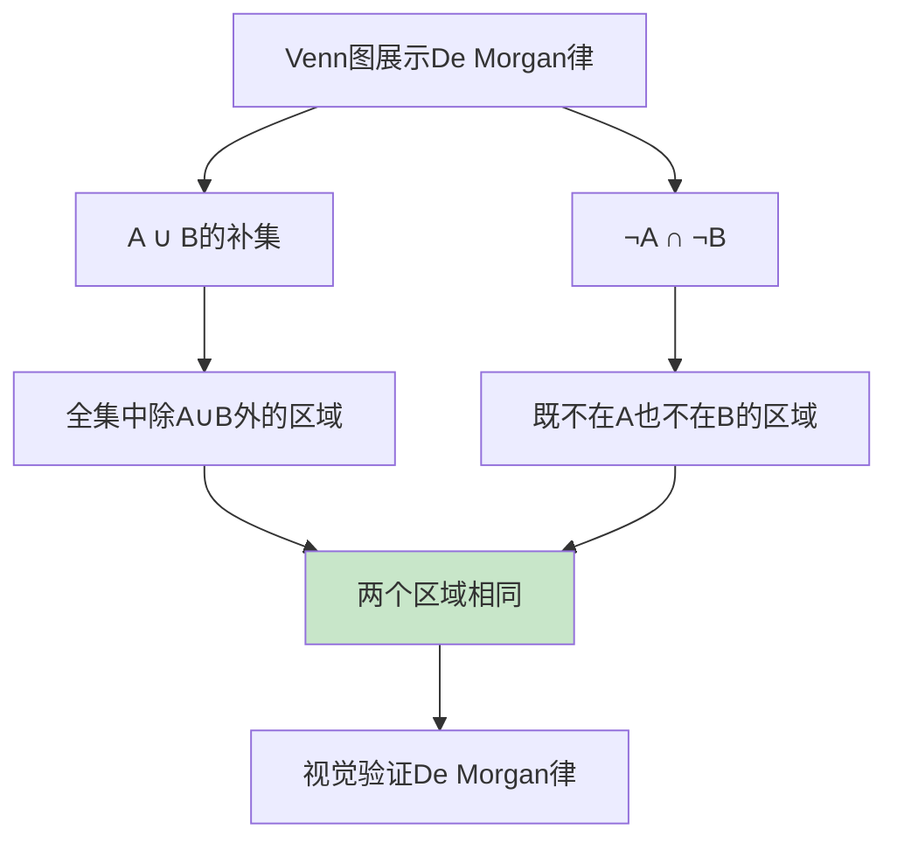
```mermaid
graph TD
    A["Venn图展示De Morgan律"] --> B["A ∪ B的补集"]
    A --> C["¬A ∩ ¬B"]
    
    B --> D["全集中除A∪B外的区域"]
    C --> E["既不在A也不在B的区域"]
    
    D --> F["两个区域相同"]
    E --> F
    
    F --> G["视觉验证De Morgan律"]
    
    style F fill:#c8e6c9
```

**图解说明**:
1. 画出全集U的矩形
2. 在其中画两个重叠的圆表示A和B
3. $A \cup B$ 是两个圆的并集（涂色区域）
4. $\overline{A \cup B}$ 是矩形中未涂色的部分
5. $\overline{A}$ 是A圆外的所有区域，$\overline{B}$ 是B圆外的所有区域
6. $\overline{A} \cap \overline{B}$ 是既在A外又在B外的区域
7. 观察发现：$\overline{A \cup B}$ 与 $\overline{A} \cap \overline{B}$ 是同一区域

#### 4.3.8 历史和哲学意义

**Augustus De Morgan (1806-1871)**:
- 英国数学家和逻辑学家
- 首次系统化地表述了这些定律
- 为现代符号逻辑奠定基础

**哲学意义**:
- 揭示了**否定**与**连接词**之间的深层关系
- 体现了数学中的**对偶性原理**
- 连接了**集合论**与**命题逻辑**

**现代重要性**:
- 布尔代数的基础定律
- 计算机科学中逻辑电路设计的核心
- 人工智能中知识表示的重要工具

### 4.4 集合的递归构造详解

集合的递归构造是集合论中最重要的应用之一，它展示了如何从最基本的空集开始，通过有限的公理逐步构造出整个数学世界。

#### 4.4.1 von Neumann自然数构造

**基础思想**: 每个自然数都表示为包含所有较小自然数的集合。

**递归定义**:
- $0 = \emptyset$ （0定义为空集）
- $n^+ = n \cup \{n\}$ （后继运算：n的后继定义为n与{n}的并集）

**中文读法**: n的后继等于n与包含n的单元素集合的并集。

**逐步构造过程**:

1. **$0 = \emptyset$**
   - **集合表示**: $\{\}$
   - **元素个数**: $|0| = 0$
   - **含义**: 什么都没有的集合

2. **$1 = 0^+ = 0 \cup \{0\} = \emptyset \cup \{\emptyset\} = \{\emptyset\}$**
   - **集合表示**: $\{\emptyset\}$
   - **元素个数**: $|1| = 1$
   - **含义**: 包含空集的集合

3. **$2 = 1^+ = 1 \cup \{1\} = \{\emptyset\} \cup \{\{\emptyset\}\} = \{\emptyset, \{\emptyset\}\}$**
   - **集合表示**: $\{0, 1\}$
   - **元素个数**: $|2| = 2$
   - **含义**: 包含0和1的集合

4. **$3 = 2^+ = 2 \cup \{2\} = \{0, 1\} \cup \{2\} = \{0, 1, 2\}$**
   - **集合表示**: $\{\emptyset, \{\emptyset\}, \{\emptyset, \{\emptyset\}\}\}$
   - **元素个数**: $|3| = 3$
   - **含义**: 包含0、1、2的集合

5. **一般形式**: $n = \{0, 1, 2, \ldots, n-1\}$

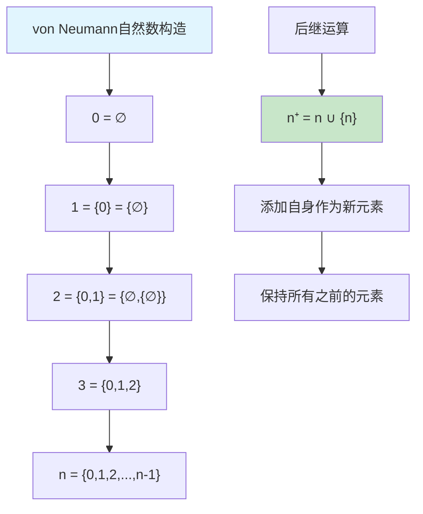
```mermaid
graph TD
    A["von Neumann自然数构造"] --> B["0 = ∅"]
    B --> C["1 = {0} = {∅}"]
    C --> D["2 = {0,1} = {∅,{∅}}"]
    D --> E["3 = {0,1,2}"]
    E --> F["n = {0,1,2,...,n-1}"]
    
    G["后继运算"] --> H["n⁺ = n ∪ {n}"]
    H --> I["添加自身作为新元素"]
    I --> J["保持所有之前的元素"]
    
    style A fill:#e1f5fe
    style H fill:#c8e6c9
```

#### 4.4.2 构造的数学意义

**关键性质**:

1. **序关系**: $m < n \iff m \in n$
   - **中文读法**: m小于n当且仅当m属于n
   - **例子**: $2 < 3$ 因为 $2 \in 3 = \{0,1,2\}$

2. **基数对应**: $|n| = n$
   - **中文读法**: 自然数n的基数等于n本身
   - **含义**: 每个自然数恰好包含与其数值相等个数的元素

3. **传递性**: $\forall n \in \omega : n \text{是传递集合}$
   - **定义**: 如果 $x \in y \in n$，则 $x \in n$
   - **验证**: 对任意 $k < j < n$，有 $k \in j$ 且 $j \in n$，因此 $k \in n$

#### 4.4.3 详细构造示例

**具体展开**:

$$\begin{align}
0 &= \emptyset \\
1 &= \{\emptyset\} \\
2 &= \{\emptyset, \{\emptyset\}\} \\
3 &= \{\emptyset, \{\emptyset\}, \{\emptyset, \{\emptyset\}\}\} \\
4 &= \{\emptyset, \{\emptyset\}, \{\emptyset, \{\emptyset\}\}, \{\emptyset, \{\emptyset\}, \{\emptyset, \{\emptyset\}\}\}\}
\end{align}$$

**简化记号**:
$$\begin{align}
0 &= \{\} \\
1 &= \{0\} \\
2 &= \{0, 1\} \\
3 &= \{0, 1, 2\} \\
4 &= \{0, 1, 2, 3\}
\end{align}$$

#### 4.4.4 递归构造的公理依赖

**所需公理**:

1. **外延公理**: 确保每个自然数的唯一性
2. **分离公理**: 构造空集 $\emptyset = \{x \in A : x \neq x\}$
3. **配对公理**: 构造单元素集合 $\{n\}$
4. **并集公理**: 执行后继运算 $n^+ = n \cup \{n\}$
5. **无穷公理**: 保证整个构造过程的存在性

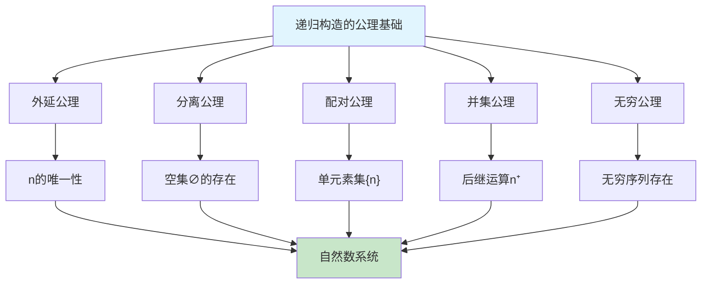
```mermaid
graph TD
    A["递归构造的公理基础"] --> B["外延公理"]
    A --> C["分离公理"]
    A --> D["配对公理"]
    A --> E["并集公理"]
    A --> F["无穷公理"]
    
    B --> G["n的唯一性"]
    C --> H["空集∅的存在"]
    D --> I["单元素集{n}"]
    E --> J["后继运算n⁺"]
    F --> K["无穷序列存在"]
    
    G --> L["自然数系统"]
    H --> L
    I --> L
    J --> L
    K --> L
    
    style A fill:#e1f5fe
    style L fill:#c8e6c9
```

#### 4.4.5 构造的优势

**与其他表示方法的比较**:

| 表示方法 | 优点 | 缺点 |
|----------|------|------|
| **von Neumann** | 序关系简单($m<n \iff m \in n$) | 表示复杂 |
| **Zermelo** | 构造简单($n = \{\{\{\ldots\}\}\}$) | 序关系复杂 |
| **符号表示** | 直观易懂 | 需要额外的解释规则 |

**von Neumann构造的核心优势**:
- **序关系自然**: $<$ 关系就是 $\in$ 关系
- **运算简单**: 加法、乘法可以递归定义
- **集合论统一**: 所有数学概念都用集合表示

#### 4.4.6 从自然数到其他数系

**整数的构造** (使用等价类):
$$\mathbb{Z} = \{[(a,b)] : a,b \in \omega\}$$
其中 $(a,b) \sim (c,d) \iff a+d = b+c$

**中文读法**: 整数等于所有有序对等价类的集合，其中(a,b)表示整数a-b。

**有理数的构造**:
$$\mathbb{Q} = \{[(a,b)] : a \in \mathbb{Z}, b \in \mathbb{Z} \setminus \{0\}\}$$
其中 $(a,b) \sim (c,d) \iff ad = bc$

**中文读法**: 有理数等于所有整数对等价类的集合，其中(a,b)表示分数a/b。

**实数的构造** (Dedekind切割):
$$\mathbb{R} = \{A \subseteq \mathbb{Q} : A\text{是下集且无最大元}\}$$

**中文读法**: 实数等于所有满足条件的有理数子集，每个子集表示一个实数的Dedekind切割。

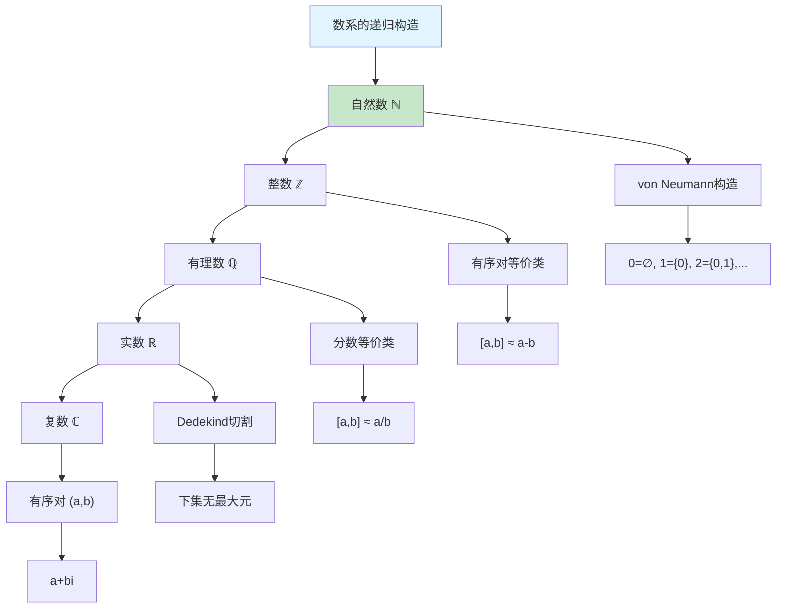
```mermaid
graph TD
    A["数系的递归构造"] --> B["自然数 ℕ"]
    B --> C["整数 ℤ"]
    C --> D["有理数 ℚ"]
    D --> E["实数 ℝ"]
    E --> F["复数 ℂ"]
    
    B --> G["von Neumann构造"]
    C --> H["有序对等价类"]
    D --> I["分数等价类"]
    E --> J["Dedekind切割"]
    F --> K["有序对 (a,b)"]
    
    G --> L["0=∅, 1={0}, 2={0,1},..."]
    H --> M["[a,b] ≈ a-b"]
    I --> N["[a,b] ≈ a/b"]
    J --> O["下集无最大元"]
    K --> P["a+bi"]
    
    style A fill:#e1f5fe
    style B fill:#c8e6c9
```

#### 4.4.7 递归定义的形式化

**递归定义模式**:
1. **基础情况**: $f(0) = a$
2. **递归步骤**: $f(n^+) = h(n, f(n))$

**例子 - 加法定义**:
- $m + 0 = m$
- $m + n^+ = (m + n)^+$

**例子 - 乘法定义**:
- $m \cdot 0 = 0$
- $m \cdot n^+ = m \cdot n + m$

**递归定理**: 对任意集合A、元素a∈A和函数h: ω×A→A，存在唯一函数f: ω→A满足递归定义。

#### 4.4.8 哲学和认识论意义

**构造主义观点**:
- 数学对象通过**明确的构造过程**获得存在性
- 每一步都基于**已知的、更简单的对象**
- 避免了**柏拉图主义**的抽象实体假设

**形式主义意义**:
- 展示了**公理系统的生成能力**
- 证明了**有限公理可以构造无穷结构**
- 为**数学的机械化**提供基础

**教育价值**:
- 揭示了**数的本质**：数是集合
- 展示了**抽象化过程**：从具体到抽象
- 培养了**系统性思维**：从简单到复杂

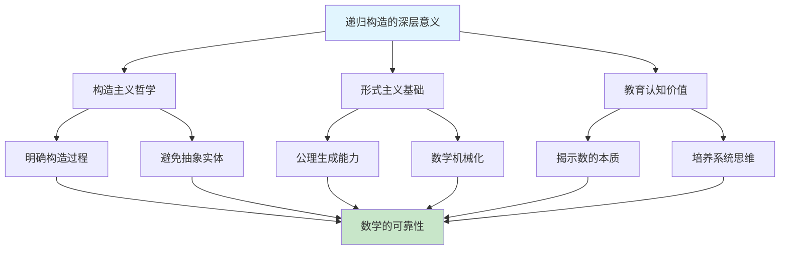
```mermaid
graph TD
    A["递归构造的深层意义"] --> B["构造主义哲学"]
    A --> C["形式主义基础"]
    A --> D["教育认知价值"]
    
    B --> E["明确构造过程"]
    B --> F["避免抽象实体"]
    
    C --> G["公理生成能力"]
    C --> H["数学机械化"]
    
    D --> I["揭示数的本质"]
    D --> J["培养系统思维"]
    
    E --> K["数学的可靠性"]
    F --> K
    G --> K
    H --> K
    I --> K
    J --> K
    
    style A fill:#e1f5fe
    style K fill:#c8e6c9
```

**总结**: 集合的递归构造不仅是技术性的数学工具，更是理解数学本质、探索数学基础的重要途径。它展示了如何从最简单的概念（空集）出发，通过系统性的构造过程，建立起整个数学大厦的基础。

---

## 5. **幂集公理 (Axiom of Power Set)**

### 5.1 公理表述

**朴素表述** (Halmos):
> 每个集合的所有子集构成一个集合。

**形式化表述**:
$$\forall x \exists y \forall z [z \in y \leftrightarrow z \subseteq x]$$

**中文读法**: 对任意集合x，存在集合y，使得对任意z，z属于y当且仅当z是x的子集。

**记号**: $\mathcal{P}(x) = \{z : z \subseteq x\}$

### 5.2 基本性质

**大小关系**: $|\mathcal{P}(A)| = 2^{|A|}$

**例子**:
- $\mathcal{P}(\emptyset) = \{\emptyset\}$ （空集的幂集等于包含空集的集合）
- $\mathcal{P}(\{a\}) = \{\emptyset, \{a\}\}$ （单元素集{a}的幂集包含空集和{a}）
- $\mathcal{P}(\{a,b\}) = \{\emptyset, \{a\}, \{b\}, \{a,b\}\}$ （两元素集{a,b}的幂集包含4个子集）

**Cantor定理**: $|A| < |\mathcal{P}(A)|$

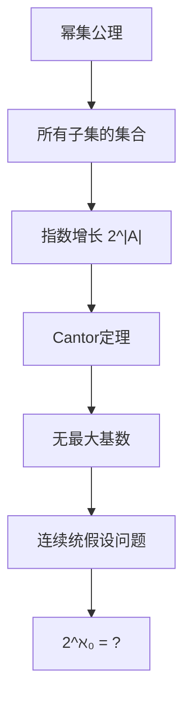
```mermaid
graph TD
    A["幂集公理"] --> B["所有子集的集合"]
    B --> C["指数增长 2^|A|"]
    C --> D["Cantor定理"]
    
    D --> E["无最大基数"]
    E --> F["连续统假设问题"]
    F --> G["2^ℵ₀ = ?"]
```

### 5.3 重要应用

**关系和函数**:
- 关系是笛卡尔积的子集
- 函数是特殊的关系
- $f: A \to B$ 意味着 $f \subseteq A \times B \subseteq \mathcal{P}(\mathcal{P}(A \cup B))$

---

## 6. **无穷公理 (Axiom of Infinity)**

### 6.1 公理表述

**朴素表述** (Halmos):
> 存在包含0且对后继运算封闭的集合。

**形式化表述**:
$$\exists x [\emptyset \in x \land \forall y (y \in x \to y \cup \{y\} \in x)]$$

**中文读法**: 存在集合x，使得空集属于x，且对任意y，如果y属于x，则y与{y}的并集也属于x。

### 6.2 自然数的构造

**von Neumann自然数**:
- $0 = \emptyset$ （0等于空集）
- $1 = \{0\} = \{\emptyset\}$ （1等于包含0的集合，即包含空集的集合）
- $2 = \{0,1\} = \{\emptyset, \{\emptyset\}\}$ （2等于包含0和1的集合）
- $n^+ = n \cup \{n\}$ （n的后继等于n与{n}的并集）

**自然数集ω**:
$$\omega = \bigcap \{A : A\text{是归纳集}\}$$

**中文读法**: ω等于所有归纳集的交集。

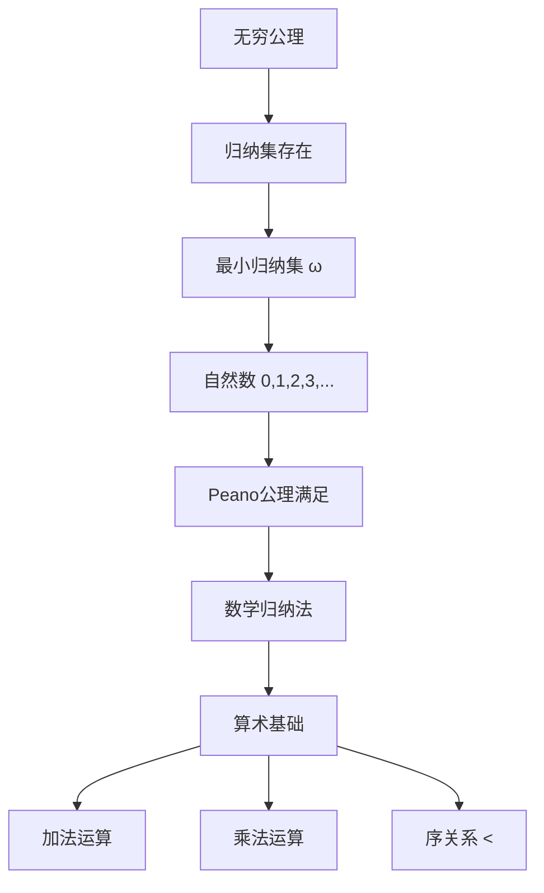
```mermaid
graph TD
    A["无穷公理"] --> B["归纳集存在"]
    B --> C["最小归纳集 ω"]
    C --> D["自然数 0,1,2,3,..."]
    
    D --> E["Peano公理满足"]
    E --> F["数学归纳法"]
    F --> G["算术基础"]
    
    G --> H["加法运算"]
    G --> I["乘法运算"]
    G --> J["序关系 <"]
```

### 6.3 Peano公理验证

**定理**: von Neumann自然数满足Peano公理

1. $0 \in \omega$
2. $\forall n \in \omega : n^+ \in \omega$
3. $\forall n \in \omega : n^+ \neq 0$
4. $\forall m,n \in \omega : (m^+ = n^+ \to m = n)$
5. **归纳公理**: 对任何性质P，如果P(0)成立且$\forall n(P(n) \to P(n^+))$，则$\forall n \in \omega : P(n)$

---

## 7. **替换公理模式 (Axiom Schema of Replacement)**

### 7.1 公理表述

**朴素表述**:
> 如果对集合的每个元素都有唯一的替换，则替换后的结果构成集合。

**形式化表述**:
对每个公式 $\Phi(x, u, v, w_1, \ldots, w_n)$：
$$\forall w_1 \ldots \forall w_n \forall x [\forall u \in x \exists!v \Phi \to \exists z \, z = \{v : \exists u \in x \, \Phi\}]$$

**中文读法**: 对每个公式Φ(x,u,v,w₁,...,wₙ)，对任意参数w₁...wₙ和任意集合x，如果对x中每个元素u都存在唯一的v使得Φ成立，则存在集合z等于{v : 存在u属于x使得Φ}。

### 7.2 与分离公理的关系

**分离是替换的特例**: 当替换函数是恒等函数时，替换公理退化为分离公理。

**替换公理更强**: 它允许用完全不同的元素替换原元素，而分离只能"过滤"元素。

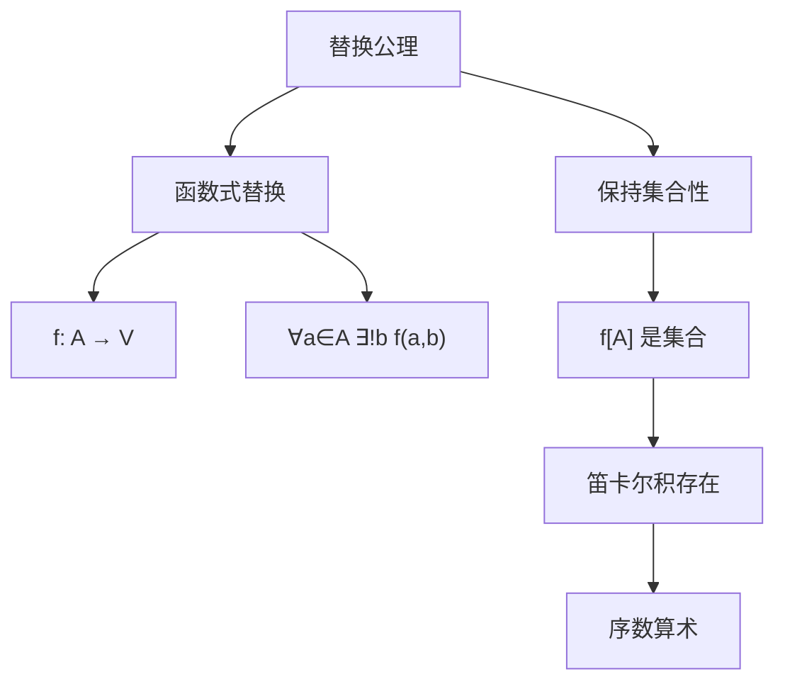
```mermaid
graph TD
    A["替换公理"] --> B["函数式替换"]
    A --> C["保持集合性"]
    
    B --> D["f: A → V"]
    B --> E["∀a∈A ∃!b f(a,b)"]
    
    C --> F["f[A] 是集合"]
    F --> G["笛卡尔积存在"]
    G --> H["序数算术"]
```

### 7.3 重要应用

**笛卡尔积的存在**:
$$A \times B = \{p : \exists x \in A \exists y \in B \, p = \langle x,y \rangle\}$$

**中文读法**: A×B等于集合{p : 存在x属于A且存在y属于B使得p等于有序对⟨x,y⟩}。

**函数值域**:
$$\text{ran}(f) = \{y : \exists x \in \text{dom}(f) \, \langle x,y \rangle \in f\}$$

**中文读法**: 函数f的值域等于集合{y : 存在x属于f的定义域使得有序对⟨x,y⟩属于f}。

---

## 8. **基础公理 (Axiom of Foundation/Regularity)**

### 8.1 公理表述

**朴素表述**:
> 每个非空集合都包含一个与自身不相交的元素。

**形式化表述**:
$$\forall x [x \neq \emptyset \to (\exists y \in x)(x \cap y = \emptyset)]$$

**中文读法**: 对任意集合x，如果x不等于空集，则存在y属于x使得x与y的交集为空集。

### 8.2 重要后果

**定理**: $\forall x (x \notin x)$ （没有集合包含自身）

**中文读法**: 对任意x，x不属于x。

**证明**: 假设 $x \in x$，对集合 $\{x\}$ 应用基础公理。

**定理**: $\forall x \forall y (x \in y \to y \notin x)$ （隶属关系是严格的）

**中文读法**: 对任意x和y，如果x属于y，则y不属于x。

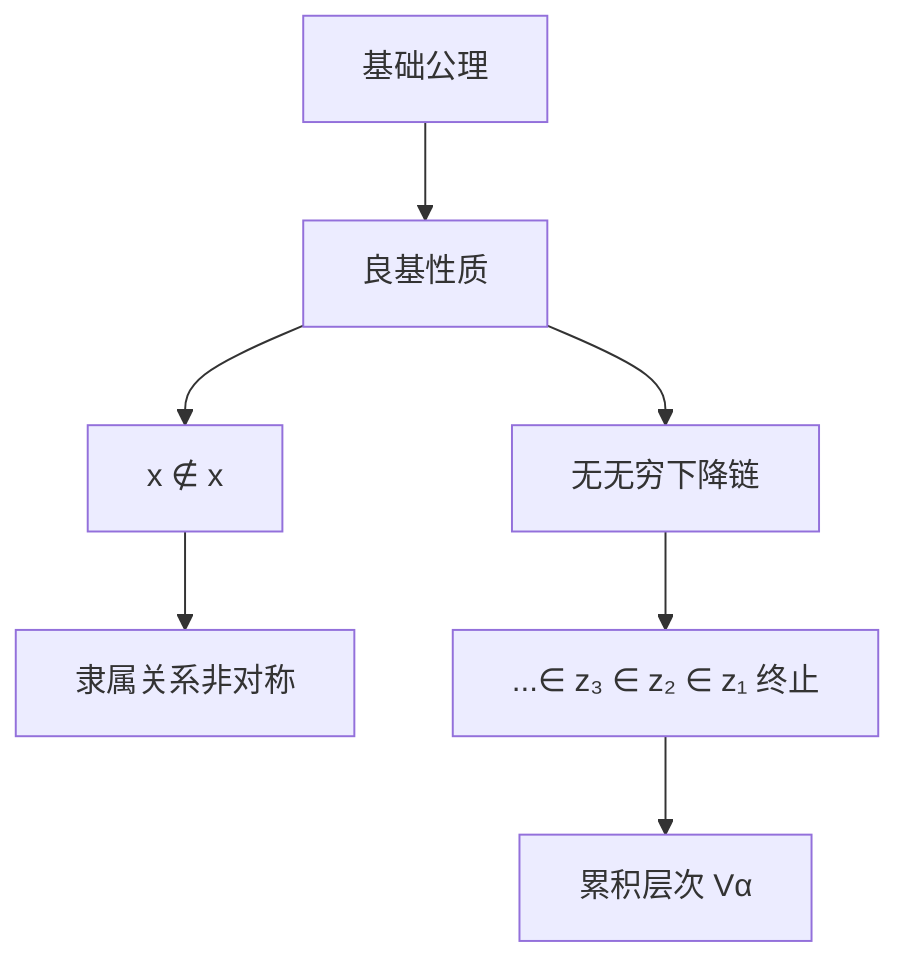
```mermaid
graph TD
    A["基础公理"] --> B["良基性质"]
    B --> C["x ∉ x"]
    B --> D["无无穷下降链"]
    
    C --> E["隶属关系非对称"]
    D --> F["...∈ z₃ ∈ z₂ ∈ z₁ 终止"]
    F --> G["累积层次 Vα"]
```

### 8.3 累积层次

**von Neumann层次**:
- $V_0 = \emptyset$
- $V_{\alpha+1} = \mathcal{P}(V_\alpha)$
- $V_\lambda = \bigcup_{\alpha < \lambda} V_\alpha$ （极限序数）

**定理**: $V = \bigcup_\alpha V_\alpha$ （所有集合的类）

**中文读法**: V等于所有Vα的并集（即所有集合构成的类）。

---

## 9. **选择公理 (Axiom of Choice)**

### 9.1 公理表述

**朴素表述**:
> 对于任何由非空且互不相交集合组成的族，存在一个选择集合，它与该族的每个集合恰好有一个公共元素。

**形式化表述**:
$$\forall X [(\forall x \in X \, x \neq \emptyset) \land (\forall x,y \in X \, (x \neq y \to x \cap y = \emptyset)) \to \exists z \, \forall x \in X \, \exists!w (w \in x \cap z)]$$

**中文读法**: 对任意集合族X，如果X中每个集合都非空且X中任意两个不同集合的交集为空，则存在选择集合z使得对X中每个集合x，都存在唯一的w属于x与z的交集。

### 9.2 等价形式

**选择函数形式**:
$$\forall X [\emptyset \notin X \to \exists f (f: X \to \bigcup X \land \forall x \in X (f(x) \in x))]$$

**中文读法**: 对任意不包含空集的集合族X，存在函数f从X到X的并集，使得对X中每个集合x，f(x)属于x。

**Zorn引理**:
> 如果偏序集的每个链都有上界，则存在极大元。

**良序定理**:
> 每个集合都可以被良序。

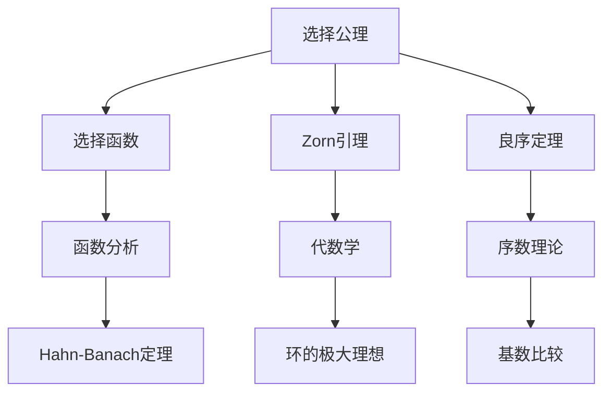
```mermaid
graph TD
    A["选择公理"] --> B["选择函数"]
    A --> C["Zorn引理"]
    A --> D["良序定理"]
    
    B --> E["函数分析"]
    C --> F["代数学"]
    D --> G["序数理论"]
    
    E --> H["Hahn-Banach定理"]
    F --> I["环的极大理想"]
    G --> J["基数比较"]
```

### 9.3 重要应用

**线性代数**: 每个向量空间都有基

**拓扑学**: Tychonoff定理（紧集的乘积是紧的）

**测度论**: 不可测集的存在

**代数**: 每个环都有极大理想

---

## 10. **ZFC公理系统的完整性**

### 10.1 公理系统概览

| 公理 | 作用 | 构造能力 |
|------|------|----------|
| **外延** | 集合相等性 | 基础概念 |
| **分离** | 子集构造 | 过滤元素 |
| **配对** | 有序对基础 | 基本结构 |
| **并集** | 集合运算 | 组合集合 |
| **幂集** | 子集全体 | 指数增长 |
| **无穷** | 无穷集合 | 自然数 |
| **替换** | 函数像 | 变换集合 |
| **基础** | 良基性 | 避免循环 |
| **选择** | 选择函数 | 非构造性存在 |

### 10.2 数学构造能力

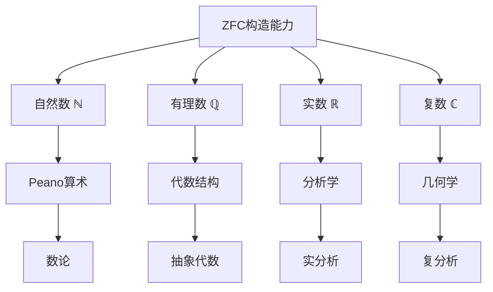
```mermaid
graph TD
    A["ZFC构造能力"] --> B["自然数 ℕ"]
    A --> C["有理数 ℚ"]
    A --> D["实数 ℝ"]
    A --> E["复数 ℂ"]
    
    B --> F["Peano算术"]
    C --> G["代数结构"]
    D --> H["分析学"]
    E --> I["几何学"]
    
    F --> J["数论"]
    G --> K["抽象代数"]
    H --> L["实分析"]
    I --> M["复分析"]
```

### 10.3 独立性结果

**连续统假设** (CH): $2^{\aleph_0} = \aleph_1$
- Cohen (1963): CH 独立于 ZFC

**选择公理**: 
- 与ZF其他公理独立
- 导出许多非构造性结果

**基础公理**:
- 可以从ZFC中省略而不影响大部分数学

---

## 11. **哲学和基础意义**

### 11.1 形式主义观点

ZFC提供了数学的**完全形式化**基础：
- 所有数学对象都是集合
- 所有数学关系都是隶属关系
- 所有数学命题都可以翻译为集合论语言

### 11.2 局限性

**Gödel不完备性定理**: ZFC（如果一致）是不完备的

**独立性现象**: 许多重要数学问题独立于ZFC
- 连续统假设
- Martin公理
- 大基数假设

```mermaid
graph TD
    A["ZFC的地位"] --> B["数学基础"]
    A --> C["局限性"]
    
    B --> D["足够表达经典数学"]
    B --> E["避免已知悖论"]
    
    C --> F["不完备性"]
    C --> G["独立性问题"]
    
    F --> H["真理超越证明"]
    G --> I["需要新公理"]
```

### 11.3 扩展方向

**大基数假设**: 超越ZFC的无穷概念

**描述集合论**: 实数子集的正则性质

**强制法**: 独立性证明的工具

---

## 🎯 总结

ZFC公理系统是现代数学最成功的基础之一，它：

1. **统一性**: 用集合和隶属关系统一所有数学概念
2. **一致性**: 避免了已知的逻辑悖论
3. **充分性**: 支撑几乎全部经典数学
4. **简洁性**: 仅用9个公理（模式）描述无穷复杂的数学世界

然而，Gödel的工作告诉我们，任何足够强的公理系统都有其局限性。ZFC虽然强大，但仍有许多基本问题（如连续统假设）无法解决。这推动着数学家继续探索更强的公理系统和新的数学基础。

**ZFC = 数学的 "宪法"** 📜

它为数学世界确立了基本的"法律"，使我们能够安全地进行数学推理，同时为进一步的探索留下了无穷的空间。 