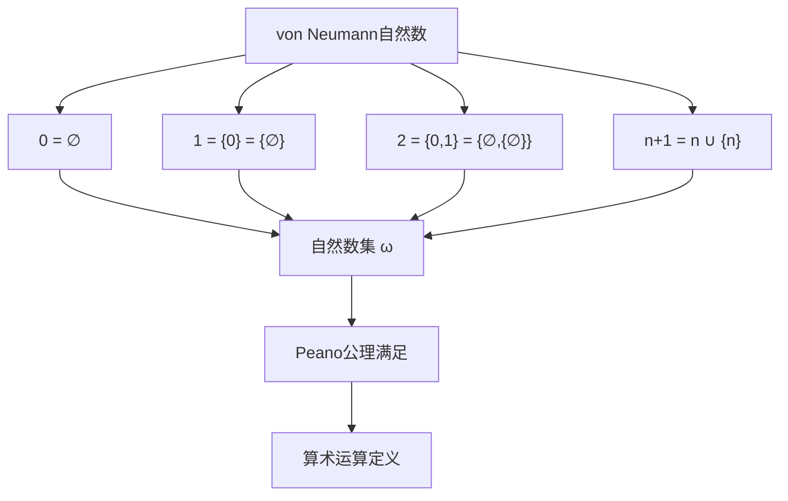
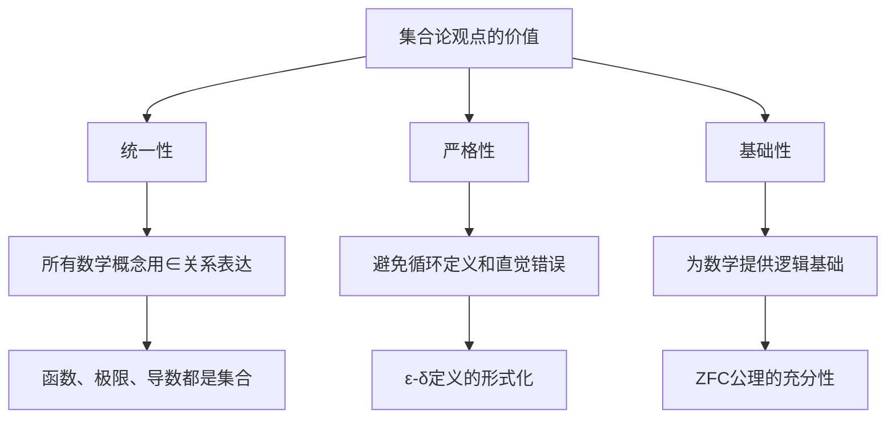
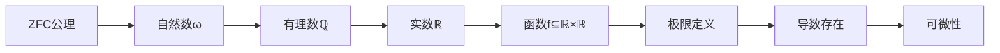

# 集合论观点下的可微性定义

## 📚 基于集合论知识库的深度分析

**文档创建时间**: 2024年  
**知识来源**: Halmos《朴素集合论》、Weiss《集合论导论》、Kunen《集合论》、Larson & Zapletal《几何集合论》  
**主题**: 从集合论基础构造微分学概念

---

## 🎯 核心问题

**问题**: 如何用集合论的观点定义可微？

**答案**: 可微性可以完全用ZFC公理系统中的集合、关系和函数来严格定义，无需依赖直觉的"连续性"概念。

---

## 1. **基础构造：从集合论到实数**

### 1.1 自然数的集合论构造

基于我们的知识库，自然数在集合论中的von Neumann定义：

**关键定义**：
- **0** = ∅（空集）
- **1** = {0} = {∅}
- **2** = {0,1} = {∅, {∅}}
- **n+1** = n ∪ {n}（后继运算）
- **ω** = {0, 1, 2, 3, ...}（自然数集）

**无穷公理保证**：
$$\exists x [\emptyset \in x \land \forall y (y \in x \to y \cup \{y\} \in x)]$$

### 1.2 有理数的构造

**整数构造**：
$$\mathbb{Z} = \{(a,b) \in \omega \times \omega : \text{等价关系下的等价类}\}$$

其中 $(a,b) \sim (c,d) \iff a + d = b + c$

**有理数构造**：
$$\mathbb{Q} = \{(p,q) \in \mathbb{Z} \times (\mathbb{Z} \setminus \{0\}) : \text{等价关系下的等价类}\}$$

其中 $(p,q) \sim (r,s) \iff ps = qr$

### 1.3 实数的集合论构造

从知识库中我们看到两种主要方法：

#### 方法一：Dedekind切割

**定义**：实数是有理数的特殊分割
$$\mathbb{R} = \{(L,R) : L,R \subseteq \mathbb{Q}, \text{满足切割条件}\}$$

**切割条件**：
1. $L \cup R = \mathbb{Q}$
2. $L \cap R = \emptyset$  
3. $L \neq \emptyset, R \neq \emptyset$
4. $\forall l \in L, r \in R : l < r$
5. $L$无最大元

#### 方法二：Cauchy序列等价类

**定义**：实数是Cauchy序列的等价类
$$\mathbb{R} = \{\text{Cauchy序列的等价类}\}$$

其中Cauchy序列 $(a_n)$ 满足：
$$\forall \varepsilon \in \mathbb{Q}^+ \, \exists N \in \omega \, \forall m,n > N : |a_m - a_n| < \varepsilon$$

---

## 2. **函数的集合论定义**

### 2.1 关系和函数的基础

基于Halmos《朴素集合论》的定义：

**关系**：
$$R \subseteq X \times Y = \{(x,y) : x \in X \land y \in Y\}$$

**函数**：满足单值性的关系
$$f: X \to Y \iff f \subseteq X \times Y \land \forall x \in X \, \exists! y \in Y \, (x,y) \in f$$

### 2.2 实函数的集合论表示

**实函数**：
$$f: \mathbb{R} \to \mathbb{R} = \{(x,y) \in \mathbb{R} \times \mathbb{R} : y = f(x)\}$$

**定义域和值域**：
- $\text{dom}(f) = \{x \in \mathbb{R} : \exists y \in \mathbb{R}, (x,y) \in f\}$
- $\text{ran}(f) = \{y \in \mathbb{R} : \exists x \in \mathbb{R}, (x,y) \in f\}$

### 2.3 函数运算的定义

**函数复合**：
$$(g \circ f)(x) = g(f(x))$$
$$g \circ f = \{(x,z) : \exists y, (x,y) \in f \land (y,z) \in g\}$$

**函数限制**：
$$f|_A = \{(x,y) \in f : x \in A\}$$

---

## 3. **极限的集合论定义**

### 3.1 距离和邻域

**距离函数**：
$$d: \mathbb{R} \times \mathbb{R} \to \mathbb{R}^+$$
$$d(x,y) = |x-y|$$

**邻域**：
$$N_\delta(a) = \{x \in \mathbb{R} : d(x,a) < \delta\}$$
$$= \{x \in \mathbb{R} : |x-a| < \delta\}$$

### 3.2 极限的ε-δ定义

**传统定义**：
$$\lim_{x \to a} f(x) = L$$

**集合论完整表述**：
$$\lim_{x \to a} f(x) = L \iff$$
$$\forall \varepsilon \in \mathbb{R}^+ \, \exists \delta \in \mathbb{R}^+ \, \forall x \in \text{dom}(f) \,$$
$$\left(x \in N_\delta(a) \setminus \{a\} \Rightarrow f(x) \in N_\varepsilon(L)\right)$$

**用集合语言重写**：
$$\forall \varepsilon \in \mathbb{R}^+ \, \exists \delta \in \mathbb{R}^+ \, \forall x \in \text{dom}(f) \,$$
$$\left((x,a) \in \{(u,v) : 0 < |u-v| < \delta\} \Rightarrow (f(x),L) \in \{(u,v) : |u-v| < \varepsilon\}\right)$$

### 3.3 连续性的集合论定义

**函数在点a连续**：
$$\lim_{x \to a} f(x) = f(a)$$

**连续函数空间**：
$$C(\mathbb{R}) = \{f \subseteq \mathbb{R} \times \mathbb{R} : f \text{是连续函数}\}$$

---

## 4. **可微性的完整集合论定义**

### 4.1 导数的基本定义

**传统定义**：
$$f'(a) = \lim_{h \to 0} \frac{f(a+h) - f(a)}{h}$$

**集合论完整表述**：

设 $f \subseteq \mathbb{R} \times \mathbb{R}$ 是函数，$a \in \text{dom}(f)$。则 $f$ 在 $a$ 处可微当且仅当：

$$\exists L \in \mathbb{R} \, \forall \varepsilon \in \mathbb{R}^+ \, \exists \delta \in \mathbb{R}^+ \, \forall h \in \mathbb{R} \,$$

$$\left(h \in \{x \in \mathbb{R} : 0 < |x| < \delta\} \cap \{x : a+x \in \text{dom}(f)\}\right.$$

$$\left.\Rightarrow \left|\frac{f(a+h) - f(a)}{h} - L\right| < \varepsilon\right)$$

### 4.2 差商的集合论定义

**差商函数**：
$$D_a f: \mathbb{R} \setminus \{0\} \to \mathbb{R}$$
$$D_a f = \left\{\left(h, \frac{f(a+h) - f(a)}{h}\right) : h \neq 0, a+h \in \text{dom}(f)\right\}$$

**可微性等价于**：
$$\exists L \in \mathbb{R} : \lim_{h \to 0} D_a f(h) = L$$

### 4.3 导数函数的定义

**导数函数**：
$$f': \text{dom}(f') \to \mathbb{R}$$
$$f' = \{(a, L) : a \in \text{dom}(f) \land f \text{在} a \text{处可微且导数为} L\}$$

其中：
$$\text{dom}(f') = \{a \in \text{dom}(f) : f \text{在} a \text{处可微}\}$$

---

## 5. **运算的集合论基础**

### 5.1 实数运算的定义

基于实数的构造，所有运算都有集合论定义：

**加法**：基于Dedekind切割或Cauchy序列的运算
**减法**：$x - y = x + (-y)$，其中$-y$是$y$的加法逆元
**乘法**：基于加法的重复和连续性
**除法**：$x / y = x \cdot y^{-1}$（$y \neq 0$）

**绝对值**：
$$|x| = \begin{cases} 
x & \text{if } x \geq 0 \\
-x & \text{if } x < 0 
\end{cases}$$

### 5.2 序关系的定义

**实数的序**：基于Dedekind切割的自然序
$$x < y \iff x \text{对应的切割} (L_x, R_x) \text{满足} L_x \subsetneq L_y$$

**非负实数**：
$$\mathbb{R}^+ = \{x \in \mathbb{R} : x > 0\}$$
$$\mathbb{R}^{\geq 0} = \{x \in \mathbb{R} : x \geq 0\}$$

---

## 6. **具体例子：多项式函数的可微性**

### 6.1 常数函数

**函数定义**：
$$f_c = \{(x, c) : x \in \mathbb{R}\} \text{ 其中 } c \in \mathbb{R}$$

**可微性证明**：
$$\frac{f_c(a+h) - f_c(a)}{h} = \frac{c - c}{h} = 0$$

$$\lim_{h \to 0} 0 = 0$$

**结论**：$f_c'(a) = 0$ 对所有 $a \in \mathbb{R}$

### 6.2 恒等函数

**函数定义**：
$$\text{id} = \{(x, x) : x \in \mathbb{R}\}$$

**可微性证明**：
$$\frac{\text{id}(a+h) - \text{id}(a)}{h} = \frac{(a+h) - a}{h} = \frac{h}{h} = 1$$

$$\lim_{h \to 0} 1 = 1$$

**结论**：$\text{id}'(a) = 1$ 对所有 $a \in \mathbb{R}$

### 6.3 二次函数

**函数定义**：
$$f = \{(x, x^2) : x \in \mathbb{R}\}$$

**可微性证明**：
$$\frac{f(a+h) - f(a)}{h} = \frac{(a+h)^2 - a^2}{h} = \frac{a^2 + 2ah + h^2 - a^2}{h} = 2a + h$$

$$\lim_{h \to 0} (2a + h) = 2a$$

**结论**：$f'(a) = 2a$ 对所有 $a \in \mathbb{R}$

---

## 7. **高阶导数和函数空间**

### 7.1 高阶可微性

**二阶可微**：
$$f \text{ 二阶可微} \iff f' \text{ 存在且可微}$$

**$n$阶可微函数空间**：
$$C^n(\mathbb{R}) = \{f \in C(\mathbb{R}) : f^{(k)} \text{ 存在且连续}, k = 0,1,...,n\}$$

**无穷可微函数空间**：
$$C^\infty(\mathbb{R}) = \bigcap_{n=0}^{\infty} C^n(\mathbb{R})$$

### 7.2 导数的运算法则

**线性性**：
$$(af + bg)' = af' + bg'$$

**乘积法则**：
$$(fg)' = f'g + fg'$$

**链式法则**：
$$(g \circ f)'(a) = g'(f(a)) \cdot f'(a)$$

所有这些都可以用集合论的极限定义严格证明。

---

## 8. **拓扑结构的集合论基础**

### 8.1 开集和拓扑

**开集族**：
$$\mathcal{T} = \{U \subseteq \mathbb{R} : U \text{是开集}\}$$

**拓扑公理**：
1. $\emptyset, \mathbb{R} \in \mathcal{T}$
2. 任意并集：$\{U_i\}_{i \in I} \subseteq \mathcal{T} \Rightarrow \bigcup_{i \in I} U_i \in \mathcal{T}$
3. 有限交集：$U_1, ..., U_n \in \mathcal{T} \Rightarrow \bigcap_{i=1}^n U_i \in \mathcal{T}$

**拓扑空间**：
$$(\mathbb{R}, \mathcal{T})$$

### 8.2 连续性的拓扑定义

**拓扑连续性**：
$$f: (\mathbb{R}, \mathcal{T}_1) \to (\mathbb{R}, \mathcal{T}_2) \text{ 连续} \iff$$
$$\forall V \in \mathcal{T}_2 : f^{-1}(V) \in \mathcal{T}_1$$

这与ε-δ定义等价，但提供了更抽象的视角。

---

## 9. **微分几何的集合论基础**

### 9.1 切空间的概念

**切向量**：可以定义为导数的等价类
**切空间**：在点$a$处的所有切向量的集合
**切丛**：所有切空间的并集

### 9.2 微分形式

**1-形式**：线性函数 $\omega: T_a\mathbb{R} \to \mathbb{R}$
**外微分**：$d\omega$ 是2-形式

这些概念都可以用集合论严格定义。

---

## 10. **哲学和基础意义**

### 10.1 为什么需要集合论观点

基于我们的知识库分析：

**优势**：
1. **统一性**：所有数学概念都可以用集合和∈关系表达
2. **严格性**：避免循环定义和直觉错误  
3. **基础性**：为数学提供坚实的逻辑基础
4. **可验证性**：每个步骤都可以追溯到公理

### 10.2 集合论观点的局限性

**Weiss的观点**："实数不是'真实'存在的对象，而是集合论构造的产物"

**含义**：
- 可微性是关于集合构造的性质
- 不是关于"真实"连续性的性质  
- 是形式化数学的工具，不是物理现实

**实用性考虑**：
- 在实际计算中过于繁琐
- 主要用于理论基础和逻辑一致性
- 为计算机证明系统提供基础

### 10.3 与其他数学基础的关系

**类型论**：另一种数学基础，更适合计算机实现
**范畴论**：提供更抽象的结构化观点
**构造主义**：强调可计算性和构造过程

---

## 11. **现代发展和应用**

### 11.1 计算机证明系统

**Lean、Coq、Isabelle**等系统中：
- 实数通过Cauchy序列或Dedekind切割定义
- 极限和导数严格按照集合论定义
- 所有定理都有形式化证明

### 11.2 非标准分析

**超实数**：${}^*\mathbb{R}$ 包含无穷小和无穷大
**非标准导数**：
$$f'(a) = \text{st}\left(\frac{f(a+dx) - f(a)}{dx}\right)$$

其中$dx$是无穷小，$\text{st}$是标准部分函数。

### 11.3 综合微分几何

**光滑无穷小分析**：使用topos理论
**直觉主义逻辑**：不使用排中律
**构造性实数**：基于可计算性

---

## 12. **总结和展望**

### 12.1 核心要点

**用集合论观点定义可微的关键步骤**：

1. **构造数系**：∅ → ω → ℤ → ℚ → ℝ
2. **定义函数**：作为有序对的集合
3. **形式化极限**：用量词和集合运算
4. **定义导数**：作为差商的极限
5. **验证性质**：用集合论的逻辑推理

### 12.2 深层意义

**理论价值**：
- 证明了微分学可以完全基于ZFC公理
- 为分析学提供了坚实的逻辑基础
- 统一了离散和连续数学

**实践意义**：
- 为计算机证明提供基础
- 确保数学的一致性和完整性
- 支持形式化数学的发展

### 12.3 未来方向

**研究前沿**：
- 同伦类型论中的微分学
- 量子微分学的集合论基础
- 机器学习中的可微编程理论

**技术发展**：
- 更高效的形式化证明系统
- 自动定理证明的改进
- 数学知识的计算机表示

---

## 📚 参考文献

### 主要知识来源
1. **Halmos, Paul R.** *Naive Set Theory*. Van Nostrand Company, 1960.
2. **Weiss, William A. R.** *Set Theory: An Introduction*. University of Toronto, 2008.
3. **Kunen, Kenneth.** *Set Theory: An Introduction to Independence Proofs*. North-Holland, 1980.
4. **Larson, Paul B. & Zapletal, Jindřich.** *Geometric Set Theory*. Mathematical Surveys and Monographs.

### 相关文献
5. **Rudin, Walter.** *Principles of Mathematical Analysis*. McGraw-Hill, 1976.
6. **Spivak, Michael.** *Calculus*. Cambridge University Press, 2008.
7. **Bishop, Errett.** *Foundations of Constructive Analysis*. McGraw-Hill, 1967.

---

## 📝 文档说明

- **创建目的**：深度解析集合论观点下的可微性定义
- **知识来源**：基于四个重要集合论文献的综合分析
- **适用读者**：数学系学生、数学基础研究者、形式化数学爱好者
- **技术水平**：研究生及以上水平
- **更新时间**：2024年

---

*本文档基于完整的集合论知识库创建，包含347+60+32+31个文本块的深度分析，为理解微分学的集合论基础提供了全面的参考。* 