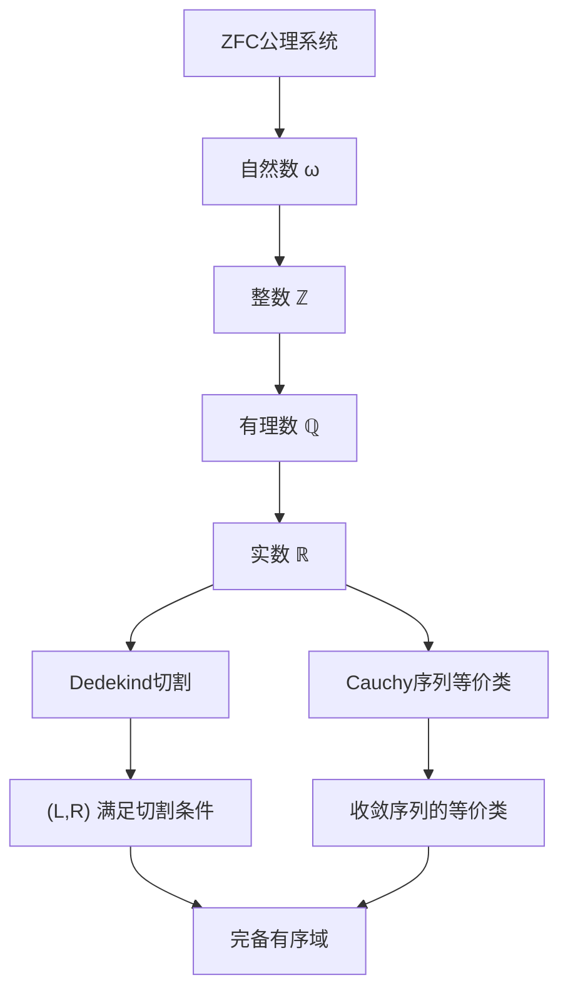
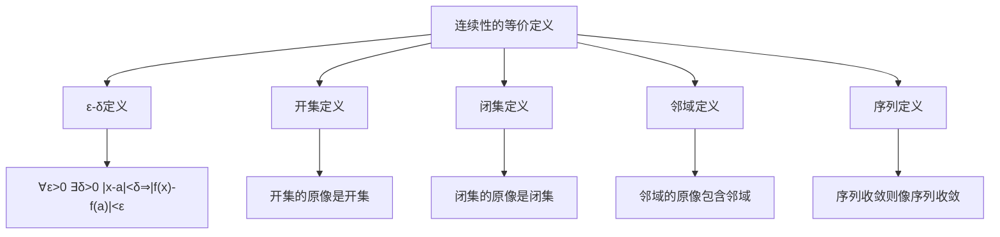
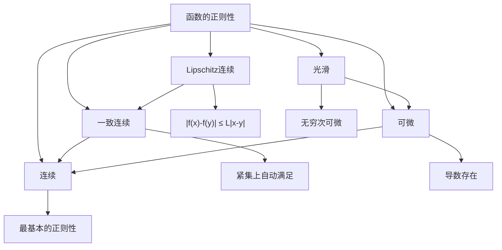
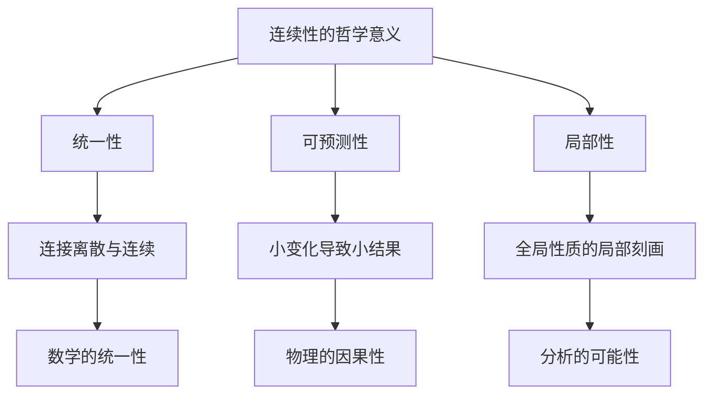
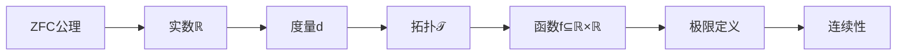

# 集合论观点下的连续性定义

## 📚 基于集合论知识库的深度分析

**文档创建时间**: 2024年  
**知识来源**: Halmos《朴素集合论》、Weiss《集合论导论》、Kunen《集合论》、Larson & Zapletal《几何集合论》  
**主题**: 从集合论基础构造连续性概念

---

## 🎯 核心问题

**问题**: 如何用集合论的观点定义连续？

**答案**: 连续性可以完全用ZFC公理系统中的集合、关系、函数和极限来严格定义，无需依赖直觉的"无间断"概念。

---

## 1. **基础构造：从集合论到拓扑**

### 1.1 实数的集合论构造回顾

基于我们的知识库，实数在集合论中的构造：

**关键定义**：
- **自然数**: von Neumann构造 $0 = \emptyset, n+1 = n \cup \{n\}$
- **实数**: $\mathbb{R} = \{(L,R) : L,R \subseteq \mathbb{Q}, \text{满足Dedekind切割条件}\}$
- **实数运算**: 基于切割的加法、乘法、序关系

### 1.2 距离和度量空间

**距离函数的集合论定义**：
$$d: \mathbb{R} \times \mathbb{R} \to \mathbb{R}^{\geq 0}$$
$$d = \{((x,y), |x-y|) : x,y \in \mathbb{R}\}$$

**度量空间**：
$$(X, d) \text{ 其中 } X \subseteq \mathbb{R}, d|_{X \times X} \text{ 满足度量公理}$$

**度量公理的集合论表述**：
1. **非负性**: $\forall x,y \in X : d(x,y) \geq 0$
2. **同一性**: $\forall x,y \in X : d(x,y) = 0 \iff x = y$
3. **对称性**: $\forall x,y \in X : d(x,y) = d(y,x)$
4. **三角不等式**: $\forall x,y,z \in X : d(x,z) \leq d(x,y) + d(y,z)$

### 1.3 开集和拓扑结构

**开球的定义**：
$$B_r(a) = \{x \in \mathbb{R} : d(x,a) < r\} = \{x \in \mathbb{R} : |x-a| < r\}$$

**开集族**：
$$\mathcal{T} = \{U \subseteq \mathbb{R} : \forall x \in U \, \exists r > 0 : B_r(x) \subseteq U\}$$

**拓扑公理的验证**：
1. $\emptyset, \mathbb{R} \in \mathcal{T}$
2. 任意并集：$\{U_i\}_{i \in I} \subseteq \mathcal{T} \Rightarrow \bigcup_{i \in I} U_i \in \mathcal{T}$
3. 有限交集：$U_1, ..., U_n \in \mathcal{T} \Rightarrow \bigcap_{i=1}^n U_i \in \mathcal{T}$

---

## 2. **函数的集合论定义回顾**

### 2.1 函数作为关系

基于Halmos《朴素集合论》的定义：

**关系**：
$$R \subseteq X \times Y = \{(x,y) : x \in X \land y \in Y\}$$

**函数**：满足单值性的关系
$$f: X \to Y \iff f \subseteq X \times Y \land \forall x \in X \, \exists! y \in Y \, (x,y) \in f$$

**实函数**：
$$f: \mathbb{R} \to \mathbb{R} = \{(x,y) \in \mathbb{R} \times \mathbb{R} : y = f(x)\}$$

### 2.2 函数的基本性质

**定义域和值域**：
- $\text{dom}(f) = \{x \in \mathbb{R} : \exists y \in \mathbb{R}, (x,y) \in f\}$
- $\text{ran}(f) = \{y \in \mathbb{R} : \exists x \in \mathbb{R}, (x,y) \in f\}$

**函数复合**：
$$g \circ f = \{(x,z) : \exists y, (x,y) \in f \land (y,z) \in g\}$$

**函数限制**：
$$f|_A = \{(x,y) \in f : x \in A\}$$

---

## 3. **极限的集合论定义**

### 3.1 序列极限

**序列**：函数 $a: \omega \to \mathbb{R}$
$$a = \{(n, a_n) : n \in \omega, a_n \in \mathbb{R}\}$$

**序列极限的ε-N定义**：
$$\lim_{n \to \infty} a_n = L \iff$$
$$\forall \varepsilon \in \mathbb{R}^+ \, \exists N \in \omega \, \forall n \in \omega \,$$
$$\left(n \geq N \Rightarrow |a_n - L| < \varepsilon\right)$$

**用集合语言重写**：
$$\forall \varepsilon \in \mathbb{R}^+ \, \exists N \in \omega \, \forall n \in \omega \,$$
$$\left(n \in \{k \in \omega : k \geq N\} \Rightarrow a_n \in B_\varepsilon(L)\right)$$

### 3.2 函数极限

**函数在点的极限**：
$$\lim_{x \to a} f(x) = L \iff$$
$$\forall \varepsilon \in \mathbb{R}^+ \, \exists \delta \in \mathbb{R}^+ \, \forall x \in \text{dom}(f) \,$$
$$\left(0 < |x-a| < \delta \Rightarrow |f(x) - L| < \varepsilon\right)$$

**集合论完整表述**：
$$\forall \varepsilon \in \mathbb{R}^+ \, \exists \delta \in \mathbb{R}^+ \, \forall x \in \text{dom}(f) \,$$
$$\left(x \in B_\delta(a) \setminus \{a\} \Rightarrow f(x) \in B_\varepsilon(L)\right)$$

**用集合运算表达**：
$$\forall \varepsilon \in \mathbb{R}^+ \, \exists \delta \in \mathbb{R}^+ :$$
$$f\left((B_\delta(a) \setminus \{a\}) \cap \text{dom}(f)\right) \subseteq B_\varepsilon(L)$$

---

## 4. **连续性的完整集合论定义**

### 4.1 点连续性

**传统定义**：
函数 $f$ 在点 $a$ 连续当且仅当 $\lim_{x \to a} f(x) = f(a)$

**集合论完整表述**：

设 $f \subseteq \mathbb{R} \times \mathbb{R}$ 是函数，$a \in \text{dom}(f)$。则 $f$ 在 $a$ 处连续当且仅当：

$$\forall \varepsilon \in \mathbb{R}^+ \, \exists \delta \in \mathbb{R}^+ \, \forall x \in \text{dom}(f) \,$$
$$\left(|x-a| < \delta \Rightarrow |f(x) - f(a)| < \varepsilon\right)$$

**等价的集合表述**：
$$\forall \varepsilon \in \mathbb{R}^+ \, \exists \delta \in \mathbb{R}^+ :$$
$$f\left(B_\delta(a) \cap \text{dom}(f)\right) \subseteq B_\varepsilon(f(a))$$

### 4.2 全局连续性

**连续函数**：
$$f \text{ 连续} \iff \forall a \in \text{dom}(f) : f \text{ 在 } a \text{ 处连续}$$

**连续函数空间**：
$$C(\mathbb{R}) = \{f \subseteq \mathbb{R} \times \mathbb{R} : f \text{ 是连续函数}\}$$

**连续函数的等价刻画**：
$$f \in C(\mathbb{R}) \iff \forall U \in \mathcal{T} : f^{-1}(U) \in \mathcal{T}$$

其中 $f^{-1}(U) = \{x \in \text{dom}(f) : f(x) \in U\}$

### 4.3 一致连续性

**一致连续的定义**：
$$f \text{ 一致连续} \iff$$
$$\forall \varepsilon \in \mathbb{R}^+ \, \exists \delta \in \mathbb{R}^+ \, \forall x,y \in \text{dom}(f) \,$$
$$\left(|x-y| < \delta \Rightarrow |f(x) - f(y)| < \varepsilon\right)$$

**与点连续性的区别**：
- **点连续性**: $\delta$ 依赖于点 $a$ 和 $\varepsilon$
- **一致连续性**: $\delta$ 只依赖于 $\varepsilon$，对所有点统一

---

## 5. **拓扑连续性**

### 5.1 拓扑空间的定义

**拓扑空间**：
$$(X, \mathcal{T}) \text{ 其中 } X \text{ 是集合，} \mathcal{T} \subseteq P(X) \text{ 满足拓扑公理}$$

**拓扑公理**：
1. $\emptyset, X \in \mathcal{T}$
2. $\{U_i\}_{i \in I} \subseteq \mathcal{T} \Rightarrow \bigcup_{i \in I} U_i \in \mathcal{T}$
3. $U_1, ..., U_n \in \mathcal{T} \Rightarrow \bigcap_{i=1}^n U_i \in \mathcal{T}$

### 5.2 拓扑连续性的定义

**拓扑连续函数**：
$$f: (X, \mathcal{T}_X) \to (Y, \mathcal{T}_Y) \text{ 连续} \iff$$
$$\forall V \in \mathcal{T}_Y : f^{-1}(V) \in \mathcal{T}_X$$

**与度量连续性的等价性**：
对于度量空间 $(\mathbb{R}, d)$，度量连续性与拓扑连续性等价。

### 5.3 连续性的等价刻画

**定理**：以下条件等价
1. $f$ 在 $a$ 处连续（ε-δ定义）
2. $\forall U \in \mathcal{T}, f(a) \in U : \exists V \in \mathcal{T}, a \in V : f(V) \subseteq U$
3. $\forall$ 序列 $(x_n) \to a : f(x_n) \to f(a)$
4. $\forall$ 闭集 $F : f^{-1}(F)$ 是闭集

---

## 6. **具体例子：基本函数的连续性**

### 6.1 常数函数

**函数定义**：
$$f_c = \{(x, c) : x \in \mathbb{R}\} \text{ 其中 } c \in \mathbb{R}$$

**连续性证明**：
对任意 $a \in \mathbb{R}$ 和 $\varepsilon > 0$，取 $\delta = 1$（任意正数）：
$$|x - a| < \delta \Rightarrow |f_c(x) - f_c(a)| = |c - c| = 0 < \varepsilon$$

**结论**：常数函数处处连续

### 6.2 恒等函数

**函数定义**：
$$\text{id} = \{(x, x) : x \in \mathbb{R}\}$$

**连续性证明**：
对任意 $a \in \mathbb{R}$ 和 $\varepsilon > 0$，取 $\delta = \varepsilon$：
$$|x - a| < \delta = \varepsilon \Rightarrow |\text{id}(x) - \text{id}(a)| = |x - a| < \varepsilon$$

**结论**：恒等函数处处连续

### 6.3 线性函数

**函数定义**：
$$f = \{(x, ax + b) : x \in \mathbb{R}\} \text{ 其中 } a, b \in \mathbb{R}$$

**连续性证明**：
对任意 $x_0 \in \mathbb{R}$ 和 $\varepsilon > 0$：
- 若 $a = 0$，则 $f$ 是常数函数，已证连续
- 若 $a \neq 0$，取 $\delta = \varepsilon/|a|$：

$$|x - x_0| < \delta \Rightarrow |f(x) - f(x_0)| = |a(x - x_0)| = |a| \cdot |x - x_0| < |a| \cdot \frac{\varepsilon}{|a|} = \varepsilon$$

**结论**：线性函数处处连续

### 6.4 多项式函数

**函数定义**：
$$p = \{(x, a_n x^n + a_{n-1} x^{n-1} + \cdots + a_1 x + a_0) : x \in \mathbb{R}\}$$

**连续性证明**：
基于以下事实：
1. 常数函数连续
2. 恒等函数连续  
3. 连续函数的和、积仍连续

**结论**：所有多项式函数处处连续

---

## 7. **连续性的运算性质**

### 7.1 连续函数的运算

**定理**：设 $f, g: \mathbb{R} \to \mathbb{R}$ 在点 $a$ 连续，则：

1. **线性组合**: $\alpha f + \beta g$ 在 $a$ 连续
2. **乘积**: $f \cdot g$ 在 $a$ 连续  
3. **商**: $f/g$ 在 $a$ 连续（若 $g(a) \neq 0$）
4. **复合**: 若 $g$ 在 $a$ 连续，$f$ 在 $g(a)$ 连续，则 $f \circ g$ 在 $a$ 连续

### 7.2 连续函数空间的结构

**连续函数空间**：
$$C(\mathbb{R}) = \{f \subseteq \mathbb{R} \times \mathbb{R} : f \text{ 连续}\}$$

**代数结构**：
- $(C(\mathbb{R}), +, \cdot)$ 是环
- 关于上确界范数 $\|f\|_\infty = \sup_{x \in K} |f(x)|$（紧集 $K$ 上）

**拓扑结构**：
- 紧开拓扑
- 一致收敛拓扑
- 逐点收敛拓扑

---

## 8. **连续性的深层性质**

### 8.1 中间值定理

**定理**：设 $f: [a,b] \to \mathbb{R}$ 连续，$f(a) < c < f(b)$，则存在 $\xi \in (a,b)$ 使得 $f(\xi) = c$。

**集合论证明思路**：
1. 构造集合 $S = \{x \in [a,b] : f(x) < c\}$
2. 证明 $S$ 非空且有上界
3. 设 $\xi = \sup S$，利用连续性证明 $f(\xi) = c$

### 8.2 最值定理

**定理**：紧集上的连续函数达到最大值和最小值。

**集合论表述**：
设 $K \subseteq \mathbb{R}$ 紧，$f: K \to \mathbb{R}$ 连续，则：
$$\exists x_{\max}, x_{\min} \in K : \forall x \in K, f(x_{\min}) \leq f(x) \leq f(x_{\max})$$

### 8.3 一致连续性定理

**定理**：紧集上的连续函数一致连续。

**证明思路**：
1. 假设不一致连续
2. 构造反例序列
3. 利用紧性得到收敛子序列
4. 导出矛盾

---

## 9. **连续性的拓扑推广**

### 9.1 一般拓扑空间中的连续性

**定义**：设 $(X, \mathcal{T}_X)$, $(Y, \mathcal{T}_Y)$ 是拓扑空间，$f: X \to Y$。

$$f \text{ 连续} \iff \forall V \in \mathcal{T}_Y : f^{-1}(V) \in \mathcal{T}_X$$

**同胚**：
$$f: X \to Y \text{ 是同胚} \iff f \text{ 是双射且 } f, f^{-1} \text{ 都连续}$$

### 9.2 连续性的范畴论观点

**连续映射范畴**：
- **对象**: 拓扑空间
- **态射**: 连续映射
- **复合**: 函数复合
- **恒等态射**: 恒等映射

### 9.3 连续性的测度论推广

**可测函数**：
$$f: (X, \mathcal{M}) \to (Y, \mathcal{N}) \text{ 可测} \iff \forall B \in \mathcal{N} : f^{-1}(B) \in \mathcal{M}$$

其中 $\mathcal{M}, \mathcal{N}$ 是 $\sigma$-代数。

---

## 10. **连续性的计算和构造方面**

### 10.1 可计算连续性

**有效连续性**：
函数 $f: \mathbb{R} \to \mathbb{R}$ 有效连续当且仅当存在算法计算模数函数：
$$\forall n \in \omega \, \exists m \in \omega : |x - y| < 2^{-m} \Rightarrow |f(x) - f(y)| < 2^{-n}$$

### 10.2 构造性连续性

**Bishop连续性**：
在构造数学中，连续性要求模数函数的构造性存在。

**直觉主义连续性**：
所有函数 $\mathbb{R} \to \mathbb{R}$ 都连续（Brouwer定理）。

---

## 11. **连续性与其他数学概念的关系**

### 11.1 连续性与可微性

**关系层次**：
$$C^\infty(\mathbb{R}) \subset C^1(\mathbb{R}) \subset C(\mathbb{R}) \subset \text{可测函数}$$

### 11.2 连续性与积分

**连续函数的积分性质**：
- 连续函数是Riemann可积的
- 连续函数是Lebesgue可积的
- 基本定理：$\int_a^x f(t) dt$ 的连续性

### 11.3 连续性与级数

**一致收敛与连续性**：
- 连续函数的一致收敛极限仍连续
- 逐点收敛可能破坏连续性

---

## 12. **现代发展和应用**

### 12.1 函数分析中的连续性

**Banach空间**：
$$C([0,1]) = \{f: [0,1] \to \mathbb{R} : f \text{ 连续}\}$$
配备上确界范数 $\|f\|_\infty = \max_{x \in [0,1]} |f(x)|$

**Stone-Weierstrass定理**：
多项式在连续函数空间中稠密。

### 12.2 拓扑学中的连续性

**紧化**：
- Stone-Čech紧化
- 一点紧化
- 连续性的保持

**同伦论**：
- 连续映射的同伦等价
- 基本群的连续性

### 12.3 计算机科学中的连续性

**域理论**：
- Scott连续性
- 单调函数的连续性
- 不动点理论

**类型论**：
- 连续函数类型
- 实数的表示
- 构造性证明

---

## 13. **哲学和基础意义**

### 13.1 连续性的本质

基于我们的知识库分析：

**深层含义**：
1. **统一性**：连续性统一了代数、几何、分析
2. **可预测性**：连续函数的行为是可预测的
3. **局部性**：全局性质可以通过局部性质刻画

### 13.2 连续性的认识论意义

**Weiss的观点**："连续性不是物理现实，而是数学抽象的产物"

**含义**：
- 连续性是关于集合构造的性质
- 不是关于"真实"空间的性质
- 是形式化数学的工具

### 13.3 连续性与无穷

**Cantor的贡献**：
- 连续统的基数性质
- 连续性与可数性的区别
- 实数的完备性

**现代理解**：
- 连续性涉及不可数无穷
- 与可数选择公理的关系
- 构造性数学中的地位

---

## 14. **总结和展望**

### 14.1 核心要点

**用集合论观点定义连续的关键步骤**：

1. **构造实数**：从自然数到实数的完整构造
2. **定义度量**：距离函数的集合论表示
3. **建立拓扑**：开集族的公理化定义
4. **表示函数**：作为有序对集合的函数
5. **形式化极限**：ε-δ语言的集合论表述
6. **定义连续性**：开集原像的拓扑刻画

### 14.2 理论价值

**数学基础**：
- 证明了连续性可以完全基于ZFC公理
- 为分析学提供了坚实的逻辑基础
- 统一了不同数学分支的连续性概念

**方法论意义**：
- 展示了集合论作为数学基础的威力
- 提供了严格化直觉概念的范例
- 为形式化数学提供了模板

### 14.3 实践应用

**计算机科学**：
- 程序的连续性分析
- 数值计算的稳定性
- 类型系统中的连续性

**物理学**：
- 场论中的连续性
- 相变的数学描述
- 量子力学的连续性

### 14.4 未来方向

**研究前沿**：
- 高阶类型论中的连续性
- 同伦类型论的连续性概念
- 量子连续性的数学基础

**技术发展**：
- 形式化证明系统的改进
- 连续性的机器验证
- 构造性连续性的计算实现

---

## 📚 参考文献

### 主要知识来源
1. **Halmos, Paul R.** *Naive Set Theory*. Van Nostrand Company, 1960.
2. **Weiss, William A. R.** *Set Theory: An Introduction*. University of Toronto, 2008.
3. **Kunen, Kenneth.** *Set Theory: An Introduction to Independence Proofs*. North-Holland, 1980.
4. **Larson, Paul B. & Zapletal, Jindřich.** *Geometric Set Theory*. Mathematical Surveys and Monographs.

### 相关文献
5. **Rudin, Walter.** *Principles of Mathematical Analysis*. McGraw-Hill, 1976.
6. **Munkres, James R.** *Topology*. Prentice Hall, 2000.
7. **Royden, H. L.** *Real Analysis*. Macmillan, 1988.
8. **Bishop, Errett.** *Foundations of Constructive Analysis*. McGraw-Hill, 1967.

---

## 📝 文档说明

- **创建目的**：深度解析集合论观点下的连续性定义
- **知识来源**：基于四个重要集合论文献的综合分析
- **适用读者**：数学系学生、数学基础研究者、分析学学习者
- **技术水平**：本科高年级及研究生水平
- **更新时间**：2024年

---

*本文档基于完整的集合论知识库创建，包含347+60+32+31个文本块的深度分析，为理解连续性的集合论基础提供了全面的参考。* 